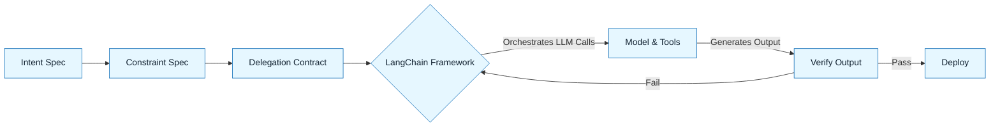

:::info[Value Proposition]
LangChain provides a comprehensive framework for building LLM-powered applications, enabling complex chains of interactions, agentic behaviors, and seamless integration with external data sources. Understanding LangChain is crucial for translating GenAI & LLM Documentation principles into scalable, production-ready AI systems, especially when orchestrating multiple prompts and tools.
:::

## Overview

LangChain is one of the most popular open-source frameworks for developing applications powered by large language models. It provides a modular architecture that simplifies the process of combining LLMs with other components, such as data sources, memory, and custom tools. Key features include "Chains" for sequencing LLM calls, "Agents" for dynamic tool use, and robust support for "Retrieval Augmented Generation (RAG)" patterns. This guide focuses on the practical aspects of using LangChain to implement structured AI applications within a GenAI & LLM Documentation context.

**Goal**: Effectively use LangChain to build multi-step LLM applications that adhere to Intent Specs, Constraint Specs, and Delegation Contracts, facilitating verifiable AI outputs.
**Anti-pattern**: Using LangChain as a black box without understanding its underlying components or the flow of data, leading to unpredictable behavior and difficulty in debugging.

---

## When to Use

| ✅ Use This Pattern When...                                 | 🚫 Do Not Use When...                                  |
| :--------------------------------------------------------- | :----------------------------------------------------- |
| Building complex LLM applications requiring multiple steps or sequential logic | The task is a single, simple prompt to an LLM where a direct API call suffices |
| Implementing Retrieval Augmented Generation (RAG) to ground LLMs in specific data | You need extremely fine-grained control over every token and every aspect of the LLM interaction for performance-critical tasks |
| Developing AI agents that dynamically select and use external tools | The development team has limited Python/TypeScript expertise and prefers visual/low-code builders for simple agents |
| Managing conversational memory for chatbots or interactive AI systems | Your application exclusively runs local LLMs without external dependencies (though LangChain can integrate) |

---

## Key Concepts in LangChain

### 1. Models (LLMs, ChatModels, Embeddings)

-   **LLMs**: Interface for text completion models (e.g., `OpenAI`).
-   **ChatModels**: Interface for chat-based models (e.g., `ChatOpenAI`, `ChatAnthropic`).
-   **Embeddings**: Used to create vector representations of text, crucial for RAG.

### 2. Prompts

-   **PromptTemplates**: Parameterized prompts that make it easy to reuse and manage prompt logic.
-   **ChatPromptTemplates**: Optimized for chat models, allowing for system, human, and AI message roles.

### 3. Chains

Sequences of calls (e.g., LLM + Parser, or LLM + Tool + LLM). The `LCEL (LangChain Expression Language)` provides a powerful way to compose these.

### 4. Agents & Tools

-   **Tools**: Functions that an LLM can call (e.g., search API, calculator).
-   **Agents**: LLMs that use a `Tool` to achieve a goal. The `Agent` uses an LLM to decide which `Tool` to use and what input to provide.

### 5. Retrievers & Document Loaders

Components for fetching and loading data from various sources (e.g., PDF, SQL, Notion), often used in RAG.

### 6. Memory

Stores and manages conversation history, allowing agents and chains to remember previous interactions.

---

## GenAI & LLM Documentation Workflow with LangChain

### 1. Define Specs (Intent, Constraint, Delegation)

Translate your Intent Spec, Constraint Spec, and Delegation Contract into LangChain components.

-   **Intent Spec**: Informs the overall chain/agent goal and success criteria.
-   **Constraint Spec**: Dictates prompt parameters, tool selection rules, and output parsers.
-   **Delegation Contract**: Influences tool access, agent behavior, and human-in-the-loop steps.

### 2. Build the Chain/Agent

Compose LangChain components (models, prompts, tools, retrievers) to create a structured workflow.

```python
# Example: Simple RAG Chain in Python
from langchain.chat_models import ChatOpenAI
from langchain.prompts import ChatPromptTemplate
from langchain.schema import StrOutputParser

# Assume a retriever is set up to get relevant documents
retriever = ...

template = """Answer the question based only on the following context:
{context}

Question: {question}
"""
prompt = ChatPromptTemplate.from_template(template)
model = ChatOpenAI()

rag_chain = (
    {"context": retriever, "question": StrOutputParser()}
    | prompt
    | model
    | StrOutputParser()
)
```

### 3. Integrate Tools & Data Sources

Connect LangChain components to your specific APIs, databases, or documents.

### 4. Test and Evaluate

Use LangChain's testing utilities and your Acceptance Criteria to validate the chain's behavior.

### 5. Observability

Integrate LangChain with tracing tools (e.g., LangSmith) for debugging and performance monitoring.



---

## Common Pitfalls

| Pitfall                   | Impact                                   | Correction                                     |
| :------------------------ | :--------------------------------------- | :--------------------------------------------- |
| **Over-complex Chains**   | Difficulty in debugging, unpredictable behavior. | Start simple; break down complex logic into smaller, testable chains. |
| **Prompt Injection via Tools** | LLM misuses tools or exposes sensitive info. | Implement strict input validation for tools; use Delegation Contracts to limit agent authority. |
| **RAG Without Contextual Filters** | Irrelevant documents lead to hallucinations. | Fine-tune your retriever; ensure retrieved documents are highly relevant to the query. |
| **Ignoring Observability** | Hard to diagnose why chains fail or perform poorly. | Integrate with tracing tools (e.g., LangSmith) from the start to visualize chain execution. |

---

## Quick Links

- LLM Frameworks Overview: [Index](/docs/04-tooling-and-frameworks/02-llm-frameworks/00-frameworks-overview)
- Prompt Engineering: [Handbook Method](/docs/01-handbook-method/prompt-engineering)
- RAG: [Handbook Method](/docs/01-handbook-method/05-rag)
- Observability & Tracing: [Tooling Guide](/docs/04-tooling-and-frameworks/02-llm-frameworks/06-observability-and-tracing)

## Next Step

Explore [LlamaIndex: Enough for Practice](./02-llamaindex-enough-for-practice.md) for its data-centric approach to LLM applications.