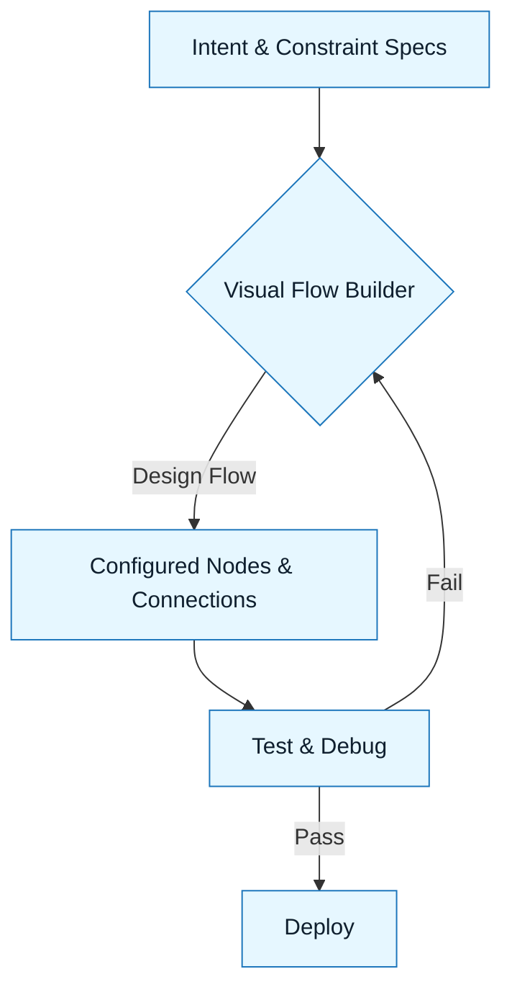

:::info[Value Proposition]
Flowise and other low-code LLM orchestration platforms democratize the creation of complex LLM applications. They provide visual, drag-and-drop interfaces to build chains, agents, and RAG pipelines without extensive coding, enabling rapid prototyping, easier collaboration, and faster deployment of AI solutions, while still allowing for the integration of structured GenAI & LLM Documentation principles.
:::

## Overview

Not all LLM applications require deep coding expertise. Low-code orchestration platforms like Flowise provide a visual builder experience, allowing users to design and deploy sophisticated LLM chains and agents using a drag-and-drop interface. These tools abstract away the complexities of API calls, framework integrations, and boilerplate code, making it accessible for product managers, business analysts, and developers to rapidly prototype and deploy AI solutions. This guide explores how to effectively use such platforms within a GenAI & LLM Documentation context.

**Goal**: Rapidly build, test, and deploy LLM applications with a visual, low-code approach, maintaining clarity and verifiability through structured documentation of components and flows.
**Anti-pattern**: Manually coding every aspect of a simple LLM chain when a visual builder could achieve the same result faster, or building complex systems visually without clear documentation of each node's purpose.

---

## When to Use

| ✅ Use This Pattern When...                                 | 🚫 Do Not Use When...                                  |
| :--------------------------------------------------------- | :----------------------------------------------------- |
| Rapidly prototyping LLM applications or proof-of-concepts  | The application requires extremely high performance optimization or low-level custom code |
| Empowering non-developers or citizen developers to build AI solutions | You need to integrate with highly specialized, internal-only tools that the platform does not support |
| Designing and visualizing complex LLM chains and agentic flows | The visual interface becomes too cluttered for extremely large or highly dynamic graphs |
| When collaboration between technical and non-technical stakeholders is crucial for defining AI logic | You are building a core LLM framework component itself, not an application on top of it |

---

## Key Concepts in Low-code Orchestration

### 1. Nodes & Components

-   **Nodes**: Represent individual functions or services in your LLM application (e.g., LLM model, prompt template, retriever, tool, memory).
-   **Components**: Pre-built, reusable blocks that encapsulate common LLM functionalities.

### 2. Canvas / Flow Builder

The visual interface where you drag, drop, and connect nodes to define the flow of your LLM application.

### 3. Chains & Workflows

Visually constructed sequences of nodes that define how information flows through your application.

### 4. Agents & Tools

Nodes representing LLMs capable of selecting and using other tool nodes to achieve a goal.

### 5. Integrations

Pre-built connectors to various LLM providers, vector databases, data loaders, and APIs.

### 6. Deployment & APIs

Platforms often provide easy deployment options, exposing your LLM application as a REST API endpoint.

---

## GenAI & LLM Documentation Workflow with Flowise/Low-Code

### 1. Define Specs (Intent, Constraint, Delegation)

Translate your GenAI & LLM Documentation Intent Spec, Constraint Spec, and Delegation Contract into the visual components and configurations of the low-code platform.

-   **Intent Spec**: Guides the overall flow design and the selection of LLM nodes.
-   **Constraint Spec**: Dictates parameters for nodes (e.g., model temperature, max tokens), security configurations, and tool permissions.
-   **Delegation Contract**: Defines how the visual agent interacts with external systems.

### 2. Design the Flow Visually

Drag and drop nodes onto the canvas to represent your LLM application logic.

-   Each node (e.g., Prompt Template, LLM, Retriever, Tool) should correspond to a part of your structured prompt or system design.
-   Use clear labels and comments within the visual builder to reflect documentation.

### 3. Configure Nodes (Integrate Specs)

Configure each node's parameters. This is where you inject the details from your Intent and Constraint Specs.

-   **Prompt Templates**: Populate with parameterized prompts from your specs.
-   **LLM Nodes**: Set model, temperature, max tokens as per constraints.
-   **Retriever Nodes**: Configure with knowledge base details and filtering from constraints.

### 4. Test and Debug Visually

Low-code platforms typically offer integrated testing and debugging environments, allowing you to trace the flow of data through your visual graph.

### 5. Document the Visual Flow

While the flow is visual, external documentation (e.g., in your `docs/` folder) should explain its purpose, key nodes, and how it maps back to your Intent/Constraint Specs.

---

## Common Pitfalls

| Pitfall                   | Impact                                   | Correction                                     |
| :------------------------ | :--------------------------------------- | :--------------------------------------------- |
| **Lack of External Documentation** | Visual flows become undocumented black boxes, hard to maintain or understand for new team members. | Supplement visual flows with written documentation (using GenAI & LLM Documentation principles) explaining purpose, logic, and specs. |
| **Over-simplifying Complex Logic** | Low-code tools might not handle highly custom or edge-case logic gracefully. | Identify limitations early; for complex parts, use custom code nodes or integrate with traditional frameworks. |
| **Vendor Lock-in**        | Difficulty migrating applications built on proprietary low-code platforms. | Understand export/import capabilities; ensure your core logic (prompts, data mapping) is portable. |
| **Ignoring Performance & Scalability** | Low-code solutions might not scale efficiently for high-traffic production environments. | Monitor resource usage; conduct performance testing; optimize critical paths with custom code if necessary. |

---

## Quick Links

- LLM Frameworks Overview: [Index](/docs/04-tooling-and-frameworks/02-llm-frameworks/00-frameworks-overview)
- Prompt Engineering: [Handbook Method](/docs/01-handbook-method/prompt-engineering)
- RAG: [Handbook Method](/docs/01-handbook-method/05-rag)
- Observability & Tracing: [Tooling Guide](/docs/04-tooling-and-frameworks/02-llm-frameworks/06-observability-and-tracing)

## Next Step

Explore [Vector Databases & Embeddings](./05-vector-databases-and-embeddings.md) as foundational components for many LLM applications.