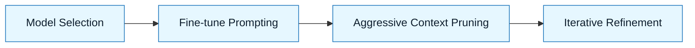

:::info[Value Proposition]
When working with **Red Zone** data (PII, secrets, core IP), you cannot send code to the cloud. Local inference allows you to execute GenAI & LLM Documentation safely on your own hardware, maintaining data privacy and reducing reliance on external services.
:::

## Overview

Most powerful LLMs are cloud-based, but for many professional development scenarios, sending proprietary code, sensitive data, or PII (Personally Identifiable Information) to external services is a non-starter due to security, privacy, or compliance concerns. Local inference involves running LLMs directly on your workstation or internal infrastructure. This approach allows you to leverage AI for GenAI & LLM Documentation tasks without compromising data sovereignty.

**Goal**: Enable secure and private AI-assisted development by keeping LLM processing local.
**Anti-pattern**: Copy-pasting sensitive code into public cloud LLMs, creating data leakage risks.

---

## When to Use

| ✅ Use This Pattern When...           | 🚫 Do Not Use When...                     |
| :------------------------------------ | :---------------------------------------- |
| Working with proprietary code or business logic | The task involves only public, non-sensitive information |
| Handling PII or other sensitive data  | You require the absolute bleeding edge of LLM performance and size |
| Compliance with data residency regulations | Your team lacks the compute resources or expertise for local model deployment |

---

## Prerequisites

:::warning[Before you start]
Local LLMs are often less powerful and less aligned than their cloud counterparts. You **MUST** adjust your expectations and prompting strategies.
:::

-   **Artifacts**: Local LLM (e.g., Llama.cpp, Ollama, private cloud instance) installed and configured.
-   **Context**: Sufficient local compute resources (CPU, RAM, GPU) to run the chosen model effectively.

---

---

## Adjusting GenAI & LLM Documentation for Local Models

Local models often have:

-   **Smaller context windows**: Requires more aggressive task decomposition and context pruning.
-   **Lower reasoning capabilities**: Demands more explicit logical steps and fewer assumptions in prompts.
-   **Less "alignment"**: May be more prone to ignoring implicit instructions or generating less helpful responses.

**GenAI & LLM Documentation Implication**: You must write **tighter constraints** and **simpler sentences** to get good results.

---

---

## The Pattern (Step-by-Step)

### Step 1: Model Selection and Setup

Choose a local LLM that balances performance with resource requirements. Install and configure it.

> **Practical Insight**: Start with smaller, highly optimized models (e.g., from the Llama family) that can run efficiently on your hardware.

### Step 2: Fine-tune Prompt Engineering

Given the limitations of local models, your prompts need to be even more precise.

> "Structure your Generation Requests with crystal-clear instructions. Use explicit step-by-step reasoning. Break down complex tasks into atomic units for the model."

### Step 3: Aggressive Context Pruning

Minimize the amount of irrelevant information fed to the model to stay within smaller context windows.

> "Only include the exact code snippets or relevant sections of specs the model needs to see. Summarize long documents before injecting them."

### Step 4: Iterative Refinement (More Iterations Expected)

Expect to iterate more frequently. Local models might require more back-and-forth to achieve desired output.

> "If the output is not satisfactory, analyze the failure. Was the prompt unclear? Was the context insufficient? Revise and re-prompt."



---

---

## Practical Example: Locally Refactoring a Function with Ollama and Aider

**Objective**: Refactor a sensitive internal utility function `src/utils/data_processor.py` using a local LLM (Ollama) via Aider.

**Task Definition:**

1.  **Model Setup**: Ollama with `llama2` model is running locally. Aider is configured to use Ollama.

2.  **Generation Request (via Aider):**
    ```bash
    aider src/utils/data_processor.py docs/01-handbook-method/02-intent-spec.md docs/01-handbook-method/03-constraint-spec.md

    # Intent Spec for data_processor.py (Local Context)
    > "Refactor the `process_sensitive_data` function in `src/utils/data_processor.py` to improve readability and maintainability. Intent is to clearly separate data validation, transformation, and storage steps. The function must not send any data outside the local machine."

    # Constraint Spec for data_processor.py (Local Context)
    > "Strictly use Python 3.9+. No new external libraries allowed. All intermediate sensitive data must be cleared from memory after processing. Do not introduce any logging that sends data to external services."

    > Plan: Refactor `process_sensitive_data` function. Break it into `validate_data`, `transform_data`, `store_data`. Do not introduce new dependencies. All processing must remain local.

    # Agent's Plan (review and accept)
    # Agent proposes changes within the file.

    > Okay, proceed.

    # Agent makes changes. Review the diff.
    ```

---

## Common Pitfalls

| Pitfall                   | Impact                                   | Correction                                     |
| :------------------------ | :--------------------------------------- | :--------------------------------------------- |
| **Overestimating Local Model Capabilities** | Poor quality outputs, frustration, wasted cycles. | Start with simpler tasks; use extremely explicit prompts. |
| **Insufficient Local Resources** | Slow performance, crashes, incomplete generations. | Invest in adequate hardware or use smaller models. |
| **Ignoring Data Exfiltration Risks (even with local models)** | Accidental exposure if local model output is copied/shared insecurely. | Implement strict human review and data handling protocols post-generation. |

---

## Quick Links

- Tooling Index: [Index](/docs/04-tooling-and-frameworks/00-tooling-index)
- CLI Agents: [Tooling Guide](/docs/04-tooling-and-frameworks/02-cli-agents)
- Responsible AI: [Data Boundaries](/docs/05-responsible-ai/data-boundaries)

## Next Step

Explore [CLI Copilots](/docs/04-tooling-and-frameworks/01-cli-copilots/00-cli-agnostic-workflow) for deeper insights into command-line AI.