# How LLMs Work (Enough for Practice)

:::info[Purpose]
Give practitioners the minimum mental model to avoid misuse, set correct expectations, and build safely with Large Language Models.
:::

## Quick Model: The Probabilistic Predictor

At their core, Large Language Models (LLMs) are sophisticated **next-token prediction engines**. They are built primarily on the Transformer architecture, specifically its decoder-only variant for generative tasks.

### Visual: Transformer Decoder Predicting Next Token

```mermaid
%%{init: { "flowchart": { "useMaxWidth": true, "nodeSpacing": 110, "rankSpacing": 110 }, "themeVariables": { "fontSize": "16px", "fontFamily": "Inter, system-ui, sans-serif", "lineColor": "#94A3B8" } }}%%
flowchart LR
    %% Wide horizontal layout with roomy spacing
    classDef input fill:#F3E8FF,stroke:#5B21B6,stroke-width:2px,color:#111;
    classDef process fill:#E0F2FE,stroke:#0369A1,stroke-width:2px,color:#0B3B5C;
    classDef output fill:#DCFCE7,stroke:#15803D,stroke-width:2px,color:#0F2F1A;

    Input["User prompt + past tokens"]:::input
    Embed["1) Embed tokens"]:::process
    Attn["2) Transformer blocks<br/>(self-attention + MLP)"]:::process
    Logits["3) Logits (scores for vocab)"]:::process
    Prob["4) Softmax (probabilities)"]:::process
    Sample["5) Sample/select next token"]:::output

    Input --> Embed --> Attn --> Logits --> Prob --> Sample
    Sample -- "append & repeat" --> Input
```



-   **Transformer Decoder**: This architecture efficiently processes input sequences, paying attention to relationships between tokens, to generate a probability distribution over the entire vocabulary for what token should come next.
-   **Training**: LLMs undergo a massive self-supervised training phase on vast amounts of text data (e.g., Common Crawl, Wikipedia, books, code). During this, they learn to predict masked tokens or the next token in a sequence. This process allows them to internalize grammar, facts, common sense (statistical patterns), and various writing styles, but it is fundamentally a pattern-fitting exercise, not symbolic reasoning or memorization.
-   **Inference**: When you provide a prompt, the model uses its learned patterns to iteratively predict the most probable next tokens. This process involves **sampling** from the predicted probability distribution. **Sampling parameters** like `temperature` and `top-p` control the randomness and diversity of the generated output.

## What to Remember

-   **Probabilistic, not authoritative**: LLM output is the most statistically likely continuation, not necessarily ground truth. Its "confidence" is a measure of probability, not factual accuracy or reasoning.
-   **Context-bound**: The model only "sees" the provided context window (input prompt + generated output so far) and its frozen training weights. It has no long-term memory or external knowledge unless explicitly provided.
-   **Tokenized**: LLMs operate on tokens (subwords, characters), not full words. This affects context length limits, cost, and how the model "perceives" input. Longer inputs cost more and risk truncation.
-   **No agency or understanding**: It does not "decide," "think," or "understand" in a human sense. It completes patterns you set; it doesn't possess intent or common sense reasoning.

## How to Apply This Knowledge (Actionable Insights)

-   **Explicitly Narrow the Distribution**: To get predictable results, your prompt must act as a powerful filter. State intent, constraints, and desired output format explicitly. Use few-shot examples to demonstrate the precise behavior you want.
-   **Curate Context**: Only provide relevant context within the model's window. Over-long or irrelevant context can dilute instructions or lead to "lost in the middle" phenomena. For external knowledge, use Retrieval Augmented Generation (RAG).
-   **Control Stochasticity**:
    -   For deterministic tasks (e.g., code generation, factual extraction), set `temperature` to a very low value (often 0 or near 0) to reduce randomness and increase predictability.
    -   For creative tasks (e.g., brainstorming, story generation), increase `temperature` to allow for more diverse and surprising outputs.
-   **Always Verify with Evidence**: Treat all LLM output as a draft. Implement validation steps (e.g., running generated code, checking facts against authoritative sources, schema validation) before accepting or deploying.
-   **Token Awareness**: Be mindful of context window limits and token costs. Design prompts and systems to be token-efficient, especially for high-volume or latency-sensitive applications.

### Code Example: Understanding Temperature's Effect (Conceptual)

Temperature is a hyperparameter that directly influences the randomness of the model's output. Higher temperature values make the output more random, creative, and "surprising," while lower values make it more deterministic and focused.

```python
import random

# Conceptual function to simulate LLM prediction
def conceptual_llm_predict(prompt, temperature=0.7):
    # In a real LLM, this involves logits, softmax, and sampling.
    # Here, we'll simulate by picking from a set of possible continuations
    # with varying "randomness".

    possible_continuations = {
        "The capital of France is": ["Paris.", "London.", "Rome."],
        "Write a poem about a cat": [
            "A furry friend, so soft and neat, sleeps all day, a purring treat.",
            "Upon the sill, a feline dream, chasing sunbeams with a gleam.",
            "Meow, meow, goes the cat, sitting on the welcome mat."
        ],
        "List three programming languages": ["Python, Java, C++.", "Ruby, Go, Swift.", "JavaScript, Rust, PHP."]
    }

    if prompt not in possible_continuations:
        return "I don't know."

    choices = possible_continuations[prompt]

    if temperature < 0.2: # Very low temp -> very deterministic
        return choices[0] # Always pick the first, most probable
    elif temperature < 0.8: # Medium temp -> some variation
        return random.choice(choices)
    else: # High temp -> more varied, potentially less coherent
        # Simulate picking from a wider, less related set for high temp
        all_options = [item for sublist in possible_continuations.values() for item in sublist]
        return random.choice(all_options)

print("--- Low Temperature (0.1) ---")
print(conceptual_llm_predict("The capital of France is", temperature=0.1))
print(conceptual_llm_predict("Write a poem about a cat", temperature=0.1))
print(conceptual_llm_predict("List three programming languages", temperature=0.1))

print("\n--- Medium Temperature (0.7) ---")
print(conceptual_llm_predict("The capital of France is", temperature=0.7))
print(conceptual_llm_predict("Write a poem about a cat", temperature=0.7))
print(conceptual_llm_predict("List three programming languages", temperature=0.7))

print("\n--- High Temperature (1.2) ---")
print(conceptual_llm_predict("The capital of France is", temperature=1.2))
print(conceptual_llm_predict("Write a poem about a cat", temperature=1.2))
print(conceptual_llm_predict("List three programming languages", temperature=1.2))
```

## Anti-Patterns

-   **Assuming model output is factual or authoritative**: Blindly trusting generations without independent verification.
-   **Relying on “it said it checked”**: The model confirming its own work provides no real guarantee of correctness.
-   **Ignoring context length**: Leading to silent truncation of critical instructions or information, resulting in unexpected behavior.
-   **Treating LLMs as traditional software**: Forgetting their probabilistic nature and expecting 100% deterministic, bug-free output from a single prompt.
-   **Failing to control stochasticity**: Using high temperatures for tasks requiring precision and determinism.
