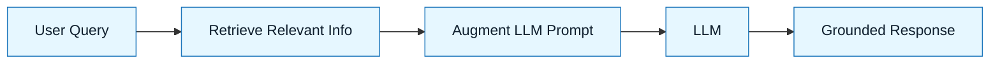

# Retrieval and Grounding (RAG)

:::info[Value Proposition]
Ground LLM responses in verifiable, up-to-date information, reducing hallucinations and improving factual accuracy. RAG (Retrieval Augmented Generation) is a key technique for ensuring LLMs operate within a defined knowledge base, making their outputs more reliable for GenAI & LLM Documentation tasks.
:::

## Overview

Large Language Models excel at generating fluent text, but they often "hallucinate" or provide information that is outdated or incorrect because their knowledge is limited to their training data. Retrieval Augmented Generation (RAG) is a technique that addresses this by enabling LLMs to retrieve relevant information from an external, authoritative knowledge base (e.g., your codebase, internal documentation, a database) and use that information to "ground" their responses. This makes LLM outputs more accurate, verifiable, and contextually relevant for GenAI & LLM Documentation.

**Goal**: Improve the factual accuracy and relevance of LLM outputs by providing up-to-date, external knowledge.
**Anti-pattern**: Relying solely on the LLM's parametric memory for factual information, leading to hallucinations and outdated advice.

---

## When to Use

| ✅ Use This Pattern When...           | 🚫 Do Not Use When...                     |
| :------------------------------------ | :---------------------------------------- |
| Requiring factual accuracy in LLM outputs | The task is purely creative writing with no factual constraints |
| Accessing proprietary or real-time data with LLMs | The information required is already perfectly within the LLM's training data |
| Mitigating hallucinations in AI-generated code or documentation | The external knowledge source is unreliable or outdated |

---

## Prerequisites

:::warning[Before you start]
You need access to a reliable, organized knowledge base that the LLM can query.
:::

-   **Artifacts**: A curated knowledge base (e.g., codebase, internal documentation, database).
-   **Context**: Understanding of embedding models and vector databases (optional, but enhances RAG).

---

## The Pattern (Step-by-Step)

### Step 1: Prepare Your Knowledge Base

Organize your authoritative data sources into a format that can be efficiently searched. This often involves chunking documents and generating embeddings to store in a vector database.

> **Practical Insight**: For a codebase, this might mean indexing your source files, design docs, and API specifications.

### Step 2: Formulate the User Query (Generation Request)

The user (or another AI agent) asks a question or requests a task.

> "How do I implement user authentication using our internal `AuthService`?"

### Step 3: Retrieve Relevant Information

Before sending the query to the LLM, use an information retrieval system (e.g., semantic search over a vector database) to find the most relevant snippets from your knowledge base.

> "Retrieve relevant sections from `src/services/AuthService.ts`, `docs/api/auth.md`, and `docs/guides/authentication-setup.md` related to 'implement user authentication'."

### Step 4: Augment the LLM Prompt

Combine the original user query with the retrieved information and send this augmented prompt to the LLM.

> "You are an expert software engineer. Here is relevant context from our codebase and documentation: `<retrieved_context>`. User's question: 'How do I implement user authentication using our internal `AuthService`?' Based *only* on the provided context, generate a TypeScript code example."

### Step 5: Generate Grounded Response

The LLM uses the provided context to generate a more accurate and relevant response.

> "The LLM generates a code example and explanation, citing sections from the provided context as a basis for its answer."



---

## Practical Example: Generating Code with RAG

**Objective**: Get an LLM to generate a code snippet for integrating with an internal `LoggingService` based on internal documentation.

**Knowledge Base**: Internal Markdown documentation `docs/services/logging.md` describing `LoggingService.logError(message, context)`.

**1. User Query**:
> "How do I log an error in our Node.js Express application using our `LoggingService`?"

**2. Retrieved Context (from `docs/services/logging.md`)**:

```markdown
# LoggingService

Our internal `LoggingService` provides standardized error and event logging.

## Usage

### `logError(message: string, context?: object)`

Logs an error message with optional contextual details.

**Parameters**:
-   `message`: A string describing the error.
-   `context`: (Optional) An object containing additional data relevant to the error (e.g., `userId`, `requestId`).

**Example**:
```typescript
import { LoggingService } from '../services/LoggingService';

try {
  // ... some error-prone code
} catch (error) {
  LoggingService.logError('Failed to process order', { orderId: 'xyz123', stack: error.stack });
}
```
```

**3. Augmented LLM Prompt**:

```markdown
"You are an expert Node.js developer. Here is relevant context from our internal documentation about our `LoggingService`:

```markdown
# LoggingService

Our internal `LoggingService` provides standardized error and event logging.

## Usage

### `logError(message: string, context?: object)`

Logs an error message with optional contextual details.

**Parameters**:
-   `message`: A string describing the error.
-   `context`: (Optional) An object containing additional data relevant to the error (e.g., `userId`, `requestId`).

**Example**:
```typescript
import { LoggingService } from '../services/LoggingService';

try {
  // ... some error-prone code
} catch (error) {
  LoggingService.logError('Failed to process order', { orderId: 'xyz123', stack: error.stack });
}
```
```

Based *only* on the provided context, show me a TypeScript code example of how to log an error in an Express.js route using our `LoggingService`."
```

**4. Grounded Response (LLM Output)**:

```typescript
import { Request, Response, NextFunction } from 'express';
import { LoggingService } from '../services/LoggingService'; // Assuming path

// Example error handling middleware
function errorHandler(err: Error, req: Request, res: Response, next: NextFunction) {
  LoggingService.logError(`Unhandled error in route: ${req.path}`, {
    method: req.method,
    ip: req.ip,
    userAgent: req.headers['user-agent'],
    stack: err.stack,
    message: err.message,
  });

  res.status(500).json({ message: 'Internal Server Error' });
}

// Example usage in a route
app.get('/some-route', (req: Request, res: Response, next: NextFunction) => {
  try {
    // ... route logic that might throw an error
    throw new Error('Something went wrong in the route');
  } catch (error: any) {
    // Log route-specific error before re-throwing or handling
    LoggingService.logError('Error in /some-route', {
      route: req.path,
      errorDetails: error.message,
      stack: error.stack
    });
    next(error); // Pass to error handling middleware
  }
});

// Assuming you register error handler last:
// app.use(errorHandler);
```

---

## Common Pitfalls

| Pitfall                   | Impact                                   | Correction                                     |
| :------------------------ | :--------------------------------------- | :--------------------------------------------- |
| **Outdated Knowledge Base** | LLM still provides incorrect or outdated information. | Regularly update and curate your knowledge base. |
| **Irrelevant Retrieval**  | LLM gets distracted by non-pertinent context. | Improve chunking strategies, embedding quality, and retrieval algorithms. |
| **Over-reliance on RAG**  | Assuming RAG solves all hallucination problems. | Human review is still critical. RAG reduces, but doesn't eliminate, hallucinations. |

---

## Last Reviewed / Last Updated

- Last reviewed: 2025-12-28
- Version: 0.1.0