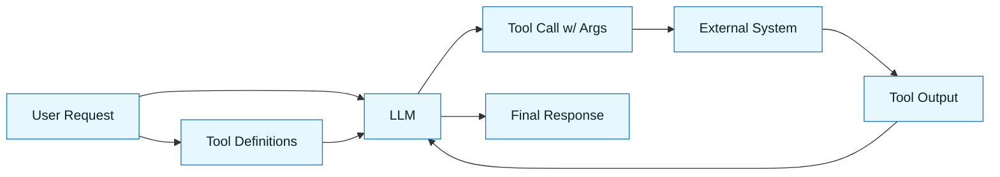

# Structured Output and Tool Use

:::info[Value Proposition]
Move beyond natural language generation to enable LLMs to produce data in predictable formats (e.g., JSON, YAML, XML) and interact with external systems (APIs, databases). This is essential for integrating LLMs into automated workflows and building reliable AI-assisted applications within GenAI & LLM Documentation.
:::

## Overview

While LLMs excel at generating free-form text, many GenAI & LLM Documentation tasks require structured outputs that can be parsed and acted upon by other software components. Furthermore, to perform complex, multi-step tasks, LLMs need the ability to use external tools. This document explores techniques for guiding LLMs to produce structured data and how to enable them to invoke and interpret external tool calls, transforming them from text generators into agents capable of interacting with the world.

**Goal**: Enable LLMs to produce machine-readable output and execute actions through external tools.
**Anti-pattern**: Expecting an LLM to reliably generate complex code or interact with APIs solely through free-form conversational prompts, leading to unreliable parsing and execution failures.

---

## When to Use

| ✅ Use This Pattern When...           | 🚫 Do Not Use When...                     |
| :------------------------------------ | :---------------------------------------- |
| Generating API requests or data models | The LLM's output is purely for human consumption (e.g., creative writing) |
| Automating code generation or refactoring | The external tool requires complex human judgment for every step |
| Integrating LLMs with external APIs or databases | The LLM's only purpose is to summarize or extract information from text |

---

## Prerequisites

:::warning[Before you start]
A clear understanding of the desired output format (e.g., JSON schema) and the APIs/tools the LLM needs to interact with.
:::

-   **Artifacts**: Defined schemas (e.g., OpenAPI, JSON Schema). Documented APIs.
-   **Context**: Familiarity with how to describe tool functionalities to an LLM.

---

## Structured Output

### Techniques for Structured Output

1.  **Direct Instruction**: Explicitly ask the LLM for a specific format.
    > "Generate the response as a JSON object."

2.  **Schema Definition**: Provide the LLM with a formal schema (e.g., JSON Schema, TypeScript interfaces).
    > "Generate a TypeScript interface for a `User` object that conforms to the following JSON Schema: `{ ... }`"

3.  **Few-shot Examples**: Give the LLM examples of the desired structured output.
    > "Here is an example of a valid API response: `{'status': 'success', 'data': {...}}`. Generate a similar response for X."

4.  **Grammar/Format Constraints**: Use specific libraries (e.g., `lm-format-enforcer` in Python) or prompt techniques that force the LLM to adhere to a grammar.

### Example: Generating JSON Output

**Prompt**:
> "Generate a JSON object for a product. It should have `name` (string), `price` (number), `` (boolean), and `tags` (array of strings)."

**LLM Output**:
```json
{
  "name": "Wireless Ergonomic Mouse",
  "price": 49.99,
  "inStock": true,
  "tags": ["peripherals", "ergonomic", "wireless"]
}
```

---

## Tool Use (Function Calling)

Tool use (also known as function calling) enables LLMs to interact with external systems by calling predefined functions. The LLM's role shifts from merely generating text to generating _arguments for functions_ that then perform real-world actions.

### How Tool Use Works

1.  **Define Tools**: You provide the LLM with a description of available functions, including their names, parameters, and what they do (often using schemas).
2.  **User Request**: The user makes a request that might require an external action.
3.  **LLM Determines Tool**: The LLM analyzes the request and decides if a tool is needed. If so, it generates the arguments to call that tool.
4.  **Execute Tool**: Your application code executes the tool with the LLM-generated arguments.
5.  **LLM Gets Tool Output**: The output of the tool is fed back to the LLM.
6.  **LLM Responds**: The LLM generates a final, informed response to the user.

### Example: Calling a Weather API

**Tool Definition (provided to LLM):**
```json
{
  "name": "getCurrentWeather",
  "description": "Get the current weather for a location",
  "parameters": {
    "type": "object",
    "properties": {
      "location": {
        "type": "string",
        "description": "The city and state, e.g. San Francisco, CA"
      },
      "unit": {"type": "string", "enum": ["celsius", "fahrenheit"]}
    },
    "required": ["location"]
  }
}
```

**User Request**: "What's the weather like in Boston?"

**LLM Tool Call (generated by LLM):**
```json
{
  "tool_name": "getCurrentWeather",
  "parameters": {
    "location": "Boston, MA"
  }
}
```

---

## Integration with GenAI & LLM Documentation

Structured output and tool use are fundamental to building agents and automated workflows in GenAI & LLM Documentation.

-   **Generation Requests**: Can explicitly ask for structured output or for the AI to make a tool call.
-   **Constraint Specs**: Can define the required schema for generated data or the specific tools that can be used.
-   **Delegation Contracts**: Can specify which tools the AI is permitted/prohibited from using.



---

## Common Pitfalls

| Pitfall                   | Impact                                   | Correction                                     |
| :------------------------ | :--------------------------------------- | :--------------------------------------------- |
| **Vague Schema Definitions** | LLM generates invalid or incomplete structured data. | Provide clear, explicit JSON Schemas or type definitions. |
| **Underspecified Tool Descriptions** | LLM calls tools with incorrect arguments or in wrong situations. | Make tool descriptions precise, including parameter types and examples. |
| **Ignoring Tool Output**  | LLM doesn't use tool results to inform its response, leading to errors. | Ensure tool output is correctly fed back to the LLM and prompt it to use that context. |

---

## Last Reviewed / Last Updated

- Last reviewed: 2025-12-28
- Version: 0.1.0