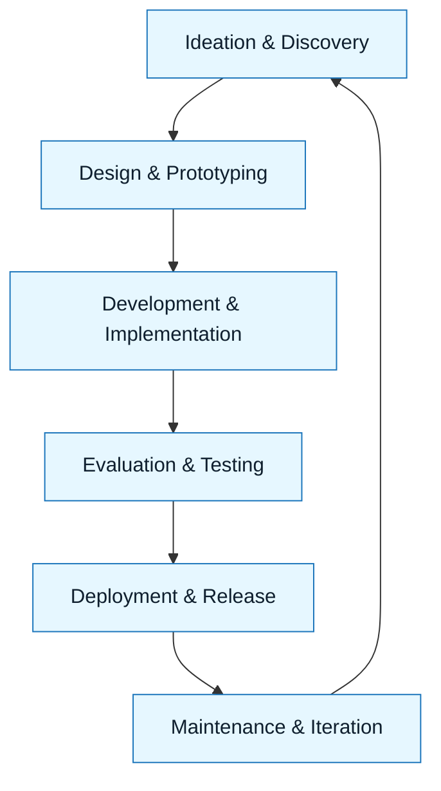

# GenAI Product Lifecycle

:::info[Value Proposition]
Integrate Generative AI capabilities into your product development lifecycle, from ideation to deployment and maintenance. This guide ensures that AI features are developed responsibly, align with user needs, and are governed effectively, leveraging GenAI & LLM Documentation principles throughout.
:::

## Overview

The introduction of Generative AI significantly impacts the traditional product development lifecycle. It's not just about adding a new feature; it's about re-evaluating ideation, design, development, and deployment processes to account for the unique characteristics of AI (e.g., probabilistic outputs, rapid iteration, ethical considerations). This document outlines a modified product lifecycle for GenAI products, emphasizing points of integration for GenAI & LLM Documentation practices.

**Goal**: Provide a structured approach to developing and managing products that incorporate Generative AI.
**Anti-pattern**: Treating GenAI features like any other software feature, ignoring AI-specific risks and development practices.

---

## When to Use

| ✅ Use This Pattern When...           | 🚫 Do Not Use When...                     |
| :------------------------------------ | :---------------------------------------- |
| Developing new products with Generative AI as a core feature | You are building a traditional software product with no AI components |
| Integrating GenAI capabilities into existing products | The AI functionality is purely an internal tool with no user-facing impact |
| Managing the entire lifecycle of an AI-driven product | Your focus is solely on a single development task (e.g., code generation for a component) |

---

## Prerequisites

:::warning[Before you start]
A foundational understanding of both product management principles and GenAI & LLM Documentation concepts is essential.
:::

-   **Artifacts**: Product Vision, User Research, Business Requirements.
-   **Context**: Awareness of your organization's product development methodology (e.g., Agile, Waterfall) and governance frameworks.

---

## The GenAI Product Lifecycle (Stages)

### 1. Ideation & Discovery (Enhanced with GenAI & LLM Documentation)

-   **Focus**: Identifying user problems, market opportunities, and potential GenAI applications.
-   **GenAI & LLM Documentation Role**:
    -   Use AI to analyze market trends, synthesize user research, and brainstorm product ideas.
    -   Craft **Discovery Briefs** to clearly define problems.
    -   Develop **Intent Specs** for potential GenAI features, focusing on user outcomes.
-   **Key Considerations**: Ethical implications, data availability, technical feasibility.

### 2. Design & Prototyping (Accelerated with GenAI & LLM Documentation)

-   **Focus**: Translating ideas into concrete product designs and prototypes.
-   **GenAI & LLM Documentation Role**:
    -   Use AI to generate UI mockups, user flow diagrams, or database schemas based on Intent Specs.
    -   Draft **Constraint Specs** for AI components (e.g., response format, performance).
    -   Automate the creation of user stories and acceptance criteria from high-level PRDs.
-   **Key Considerations**: User experience, model limitations, prompt design.

### 3. Development & Implementation (Guided by GenAI & LLM Documentation)

-   **Focus**: Building and integrating the GenAI features into the product.
-   **GenAI & LLM Documentation Role**:
    -   Apply **Execution Patterns** (e.g., Clean Slate, Refactor Safely, Write Tests) for AI-assisted coding.
    -   Use **Delegation Contracts** to manage AI agent behavior.
    -   Generate code, tests, and documentation using precise **Generation Requests**.
-   **Key Considerations**: Version control, testing, CI/CD, security.

### 4. Evaluation & Testing (Verified with GenAI & LLM Documentation)

-   **Focus**: Ensuring the GenAI product meets quality standards and user expectations.
-   **GenAI & LLM Documentation Role**:
    -   Utilize **Review & Interrogation** to validate AI outputs.
    -   Implement **Acceptance Criteria** and **Quality Rubrics** for AI features.
    -   Automate evaluation with LLM-as-a-judge patterns.
    -   Employ **Scenario Scorecards** for end-to-end feature evaluation.
-   **Key Considerations**: Hallucinations, bias detection, performance metrics.

### 5. Deployment & Release (Managed with GenAI & LLM Documentation)

-   **Focus**: Launching the GenAI product to users and communicating changes.
-   **GenAI & LLM Documentation Role**:
    -   Generate release notes and changelogs automatically.
    -   Apply **Migrations and Upgrades** patterns for smooth transitions.
    -   Monitor AI feature performance and user feedback.
-   **Key Considerations**: A/B testing, rollout strategies, communication.

### 6. Maintenance & Iteration (Optimized with GenAI & LLM Documentation)

-   **Focus**: Ongoing support, performance optimization, and continuous improvement of GenAI features.
-   **GenAI & LLM Documentation Role**:
    -   Use AI to analyze logs, debug issues ("Debug with Evidence"), and propose optimizations.
    -   Systematically iterate on features using the GenAI & LLM Documentation Loop.
    -   Maintain Living Documentation that evolves with the product.
-   **Key Considerations**: Model drift, data freshness, feedback loops.

---

## Visual Summary of GenAI Product Lifecycle

---

## Common Pitfalls

| Pitfall                   | Impact                                   | Correction                                     |
| :------------------------ | :--------------------------------------- | :--------------------------------------------- |
| **Ignoring AI-Specific Risks Early** | Costly rework, ethical failures, legal issues. | Integrate AI-specific risk assessment (e.g., bias, hallucination) from Ideation. |
| **Lack of Cross-Functional Collaboration** | Disconnects between product, engineering, and data science. | Establish clear communication channels and shared GenAI & LLM Documentation practices. |
| **Treating AI as a "Black Box"** | Inability to debug, evaluate, or improve AI features effectively. | Emphasize transparency, explainability, and verifiable outputs throughout the lifecycle. |

---

## Last Reviewed / Last Updated

- Last reviewed: 2025-12-28
- Version: 0.1.0