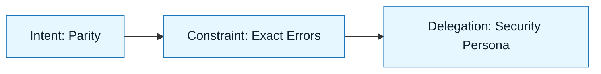

# Scenario: Refactoring Legacy Auth

:::info[Scenario Goal]
Demonstrate how to safely refactor a critical, untyped legacy module into TypeScript without causing regressions or downtime.
:::

## Context

- **Role**: Senior Backend Engineer
- **Task**: Refactor a legacy Node.js `authMiddleware.js` to TypeScript and replace the deprecated `request` library with `axios`.
- **Constraints**: Zero downtime. Must maintain 100% backward compatibility with existing JWTs. No database changes.
- **Tools Used**: VS Code + GitHub Copilot
- **Patterns Applied**: The Translator

---

## The Challenge

Why is this hard? Authentication code is high-stakes. A small regression locks users out.

| Challenge               | Traditional Risk                  | NNLP Mitigation                           |
| :---------------------- | :-------------------------------- | :---------------------------------------- |
| **Implicit Logic**      | _"It works, don't touch it"_      | Discovery Brief (Chesterton's Fence)      |
| **Hidden Side Effects** | _Swallowed errors in callbacks_   | Constraint Spec (Error parity)            |
| **Dependency Drift**    | _New library behaves differently_ | Review & Interrogation (Behavioral tests) |

---

## The Execution Loop

### 1. Discovery & Intent

We started by auditing the existing code to understand _why_ it was written that way.

> **Artifact**: `specs/auth-refactor/discovery.md`

:::tip[Key Insight]
We discovered the legacy code relied on a specific, non-standard header format. We explicitly added this to the **Intent Spec** to ensure the refactor didn't "fix" it (which would break mobile clients).
:::

### 2. Constraints & Delegation

We set strict boundaries to prevent the AI from "modernizing" too much.

- **Must**: Use `axios` for HTTP requests.
- **Must**: Preserve exact error message strings (downstream apps regex-match these).
- **Must Not**: Change the function signature of the middleware.

### 3. Generation & Review

We ran the generation loop 3 times.

- **Attempt 1**: The model replaced callback hell with clean `async/await`, but swallowed the specific HTTP status codes from the upstream identity provider.
- **Correction**: Updated the **Constraint Spec** to require "Propagating upstream status codes exactly."
- **Attempt 2**: The model used `axios` but forgot to handle the difference in how `axios` throws errors on 4xx responses (unlike `request`).
- **Correction**: Added a specific instruction to the **Generation Request**: "Handle axios 4xx errors by catching them and returning the response data, not throwing."
- **Attempt 3**: Succeeded.

:::warning[Review Find]
The model tried to add a "helpful" log line printing the JWT. The **Delegation Contract** (No PII in logs) and **Review Checklist** caught this immediately.
:::

---

## Outcome

| Metric           | Before                       | After                           |
| :--------------- | :--------------------------- | :------------------------------ |
| **Code Quality** | _Untyped JS / Callback Hell_ | Strict TypeScript / Async-Await |
| **Safety**       | _Deprecated `request` lib_   | Modern `axios`                  |
| **Confidence**   | _"Don't breathe on it"_      | Fully tested & typed            |

---

## Retrospective

### What Went Well

- The **Discovery Brief** forced us to read the code before prompting, finding the header quirk.
- The **Constraint Spec** regarding error strings saved us from a silent breaking change for mobile users.

### What We Learned

- **Lesson 1**: Legacy code often relies on "buggy" behavior. You must explicitly tell AI to _preserve_ quirks.
- **Lesson 2**: When swapping libraries (e.g., `request` to `axios`), explicitly ask the AI to "List behavioral differences" before generating code.

---

## Last Reviewed / Last Updated

- Last reviewed: 2025-12-20
- Version: 0.1.0
