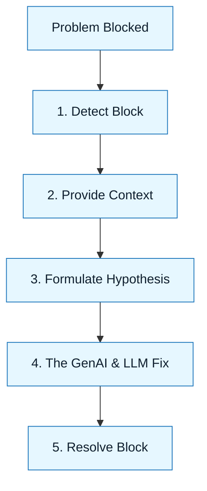

# Advanced Scenarios Index

:::info[Value Proposition]
Theory is clean. Reality is messy. These scenarios are "game tapes" of real GenAI & LLM execution, showing the messy middle where trade-offs happen, and how to apply the framework to overcome challenges.
:::

## Overview

Applying GenAI & LLM in a professional setting involves more than just following steps. It requires adapting the framework to real-world constraints, imperfect information, and complex team dynamics. This section provides a collection of professional scenarios, illustrating how different roles can leverage GenAI & LLM to solve common problems effectively.

**Goal**: Provide concrete, role-based examples of GenAI & LLM in action, highlighting practical application and decision-making.
**Anti-pattern**: Limiting understanding to theoretical concepts without practicing application in diverse, realistic contexts.

---

## When to Use

| ✅ Use This Pattern When...           | 🚫 Do Not Use When...                     |
| :------------------------------------ | :---------------------------------------- |
| Learning how to apply GenAI & LLM to your specific role | You are looking for a definitive, single answer to every problem |
| Onboarding new team members to AI-assisted workflows | The scenario perfectly matches a simple Execution Pattern |
| Understanding the trade-offs and nuances of AI-assisted development | You are purely interested in the technical mechanics of LLMs |

---

## Scenario Categories

Scenarios are grouped by the primary persona or functional area they address.

### Engineering Scenarios

-   **Greenfield React Component**: Building a new, reusable UI component from scratch.
    -   `./01-greenfield-react-component.md`
-   **Refactoring Legacy Auth**: Safely modernizing a critical, high-risk authentication system.
    -   `./02-refactoring-legacy-auth.md`
-   **Feature Addition**: Incrementally adding a new feature to an existing codebase.
    -   `./engineering/02-feature-addition.md`
-   **Bug Triage and Fix**: Systematically diagnosing and resolving a software defect.
    -   `./engineering/03-bug-triage-and-fix.md`
-   **Legacy Refactor**: Tackling large-scale refactoring of an old codebase.
    -   `./engineering/04-legacy-refactor.md`
-   **Performance Investigation**: Using AI to identify and optimize performance bottlenecks.
    -   `./engineering/05-performance-investigation.md`

### Product & UX Scenarios

-   **Writing a PRD**: Translating vague needs into a rigorous Product Requirement Document.
    -   `./03-writing-a-prd.md`
-   **Problem Framing to User Stories**: Breaking down a problem into actionable user stories.
    -   `./product-and-ux/01-problem-framing-to-prd.md`
-   **User Stories to Acceptance Tests**: Deriving testable acceptance criteria from user stories.
    -   `./product-and-ux/02-prd-to-user-stories.md`
-   **User Stories to Acceptance Tests**: Deriving testable acceptance criteria from user stories.
    -   `./product-and-ux/03-user-stories-to-acceptance-tests.md`

### Platform & Ops Scenarios

-   **CI/CD Pipeline Migration**: Automating the migration of build and deploy pipelines.
    -   `./04-cicd-pipeline-migration.md`
-   **Infra as Code Changes**: Safely modifying infrastructure definitions.
    -   `./platform-and-ops/02-infra-as-code-changes.md`
-   **Incident Response**: Using AI for incident diagnosis and runbook generation.
    -   `./platform-and-ops/03-incident-response.md`
-   **Security Review Prep**: Leveraging AI to assist in security audits and reviews.
    -   `./platform-and-ops/04-security-review-prep.md`

### Leadership & Stakeholder Scenarios

-   **Executive Summary from Tech Reality**: Translating complex technical issues into business language.
    -   `./leadership-and-stakeholders/01-executive-summary-from-tech-reality.md`
-   **Risk Register and Mitigations**: Identifying and documenting risks for AI projects.
    -   `./leadership-and-stakeholders/02-risk-register-and-mitigations.md`
-   **Roadmap and Trade-offs**: Using AI to explore solution spaces and articulate trade-offs.
    -   `./leadership-and-stakeholders/03-roadmap-and-tradeoffs.md`

### Docs and Enablement Scenarios

-   **Docs Site Setup**: Initializing and configuring a documentation website.
    -   `./docs-and-enablement/01-docs-site-setup.md`
-   **Runbooks and Ops Docs**: Generating operational runbooks from system code.
    -   `./docs-and-enablement/02-runbooks-and-ops-docs.md`
-   **Onboarding and Learning Paths**: Creating structured learning paths for new team members.
    -   `./docs-and-enablement/03-onboarding-and-learning-paths.md`
-   **Release Notes and Change Comms**: Automating the communication of product changes.
    -   `./docs-and-enablement/04-release-notes-and-change-comms.md`

---

## Visual Summary

---

## How to Contribute Your Own Scenario

Have a war story? Use the `scenario-template.md` to document your own GenAI & LLM win (or interesting failure).

---

## Last Reviewed / Last Updated

- Last reviewed: 2025-12-28
- Version: 0.1.0