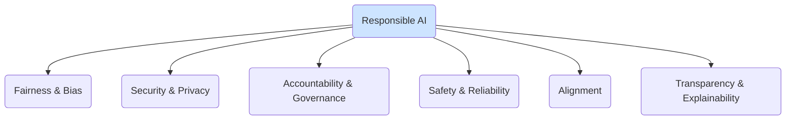

# Responsible AI: Ethics, Safety, and Alignment

The power and autonomy of modern Generative AI and Large Language Models bring with them significant responsibilities. Developing and deploying these technologies ethically, safely, and in a way that benefits humanity is paramount. This field of study and practice is known as **Responsible AI**.

This section provides a framework for thinking about and implementing responsible AI practices throughout the entire lifecycle of a GenAI project.

:::note[A Continuous Process, Not a Checklist]
Responsible AI is not a one-time task or a checklist to be completed at the end of a project. It is a continuous process that must be integrated into every stage of development, from initial design and data collection to deployment and ongoing monitoring.
:::

## Core Pillars of Responsible AI

Responsible AI can be understood through several key pillars, each of which is explored in this section.

-   **[Fairness and Bias](./bias-detection-and-mitigation.md):** Ensuring that AI models do not perpetuate or amplify existing societal biases. This involves auditing models for biased behavior and implementing mitigation techniques.

-   **[Security](./adversarial-attacks-and-defenses.md) and [Privacy](./data-privacy-in-llms.md):** Protecting models from adversarial attacks and ensuring that sensitive user data is not compromised or leaked.

-   **[Accountability and Governance](./governance-and-accountability.md):** Establishing clear lines of responsibility for the behavior of AI systems and creating governance structures to oversee their development and deployment.

-   **Safety and Reliability:** Designing models to be robust, predictable, and to avoid causing harm, whether through generating dangerous content, making critical errors, or other unsafe behaviors. A key practice for this is [Red Teaming](./red-teaming-guide.md).

-   **Alignment:** The ongoing research challenge of ensuring that an AI system's goals are aligned with human values and intentions, a topic covered in the [LLM Alignment and RLHF](/docs/foundations/02-llm-deep-dive/alignment-and-rlhf) guide.

-   **Transparency and Explainability (XAI):** Making the decision-making processes of AI models understandable to humans. For complex models like LLMs, this can be challenging, but techniques exist to provide insights into their behavior.

## Why It Matters

As we delegate more tasks to AI agents and integrate them more deeply into our products and workflows, the potential for unintended consequences grows. A lack of responsible practices can lead to reputational damage, legal liability, and real-world harm.

Conversely, a strong commitment to responsible AI builds trust with users, mitigates risks, and is essential for creating sustainable, long-term value with this technology.
