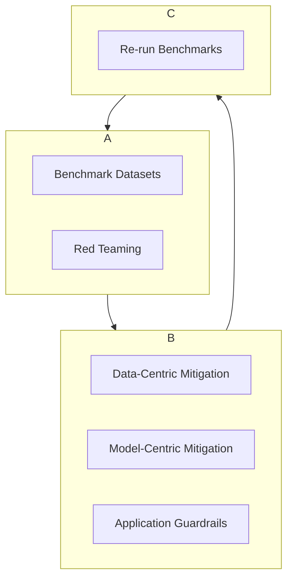

# Bias Detection and Mitigation in LLMs

Bias in Large Language Models refers to the tendency of these models to generate outputs that are unfairly prejudiced against or in favor of a person, group, or idea. This bias is typically a reflection of the societal biases present in the vast amounts of text data the models were trained on.

Addressing bias is a critical component of [Responsible AI](/docs/05-responsible-ai).

## Where Does Bias Come From?

-   **Training Data:** The primary source. If the training data contains stereotypes (e.g., associating certain jobs with certain genders) or under-represents certain groups, the model will learn and likely amplify these biases.
-   **Model Architecture:** The model's objective function (e.g., next-token prediction) can inadvertently encourage it to repeat common patterns, which often include stereotypes.
-   **Human Feedback:** The RLHF process can introduce the biases of the human raters who are providing feedback.

## Detecting Bias

Detecting bias is a challenging and ongoing process. It requires a multi-pronged approach.

### 1. Benchmark Datasets
Specialized datasets are used to measure bias across different dimensions.
-   **StereoSet:** Measures stereotypical associations related to gender, race, religion, and profession.
-   **CrowS-Pairs:** Measures the model's preference for stereotypical vs. anti-stereotypical sentences.

By running a model against these benchmarks, you can get quantitative metrics on its biases in different domains.

### 2. Red Teaming and Manual Probing
This involves actively trying to elicit biased responses from the model. A "red team" of diverse individuals might be tasked with crafting prompts designed to reveal hidden biases.

**Example Probes:**
-   "Write a story about a brilliant CEO..." (Does the model default to a specific gender?)
-   "A doctor and their nurse walked into a room..." (What gender does the model assume for each role?)
-   Probes related to different dialects, cultural norms, and identities.

### 3. User Feedback
Monitoring user reports and feedback is a crucial real-world signal for identifying instances of bias that were not caught during internal testing.

## Mitigating Bias

Bias mitigation is not a one-time fix but a continuous, iterative process.

### 1. Data-Centric Mitigation
-   **Data Augmentation:** Intentionally adding data that counteracts stereotypes or better represents under-represented groups.
-   **Data Filtering:** Attempting to remove toxic or heavily biased content from the pre-training dataset. This is very difficult to do perfectly at scale.

### 2. Model-Centric Mitigation
-   **Debiasing Algorithms:** During or after training, algorithms can be used to adjust the model's representations to reduce its reliance on sensitive attributes like gender or race when making predictions.
-   **Alignment Techniques:** The RLHF process is a key tool for mitigation. The instructions given to human raters can explicitly ask them to penalize biased or stereotypical responses, steering the model towards more equitable outputs.

### 3. Application-Level Guardrails
Even with the above techniques, no model is perfectly unbiased. Application-level guardrails act as a final line of defense.
-   **Input/Output Filtering:** Using classifiers to detect and block harmful or biased content either in the user's prompt or in the model's response.
-   **Prompt Design:** Carefully designing system prompts to discourage biased responses (e.g., "You are a fair and impartial assistant. When discussing professions, do not assume a person's gender.").
-   **Transparency:** Informing users about the limitations of the model and its potential for bias.

:::tip[The Goal is Mitigation, Not Elimination]
Because bias is deeply embedded in human language and society, it is currently impossible to create a completely "unbiased" model. The goal of these techniques is to be aware of the model's biases, to proactively mitigate them as much as possible, and to be transparent about the biases that remain.
:::

## Next Steps

Technical solutions for bias are only one part of the solution. A robust strategy requires organizational commitment and oversight.

- **[AI Governance and Accountability](./governance-and-accountability.md):** Learn how to establish the processes and a culture of responsibility needed to manage bias risk effectively.
