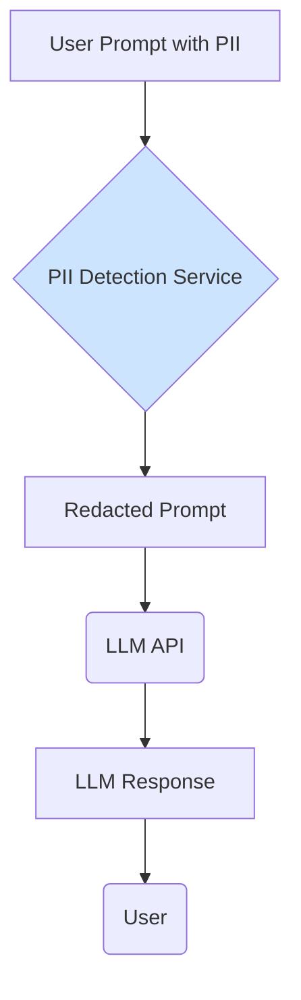

# Data Privacy in Large Language Models

Data privacy is a cornerstone of building trustworthy and [Responsible AI](/docs/05-responsible-ai). When users interact with an LLM-powered application, they may share sensitive information, and it is our responsibility to handle that data with the utmost care. The unique nature of LLMs introduces specific privacy challenges that must be addressed.

## Primary Privacy Risks in LLMs

### 1. Training Data Contamination
LLMs are trained on vast datasets, often scraped from the public internet. This data can inadvertently contain Personally Identifiable Information (PII) such as names, email addresses, phone numbers, or medical information that was not properly scrubbed.

-   **Risk: Memorization and Regurgitation:** A model might "memorize" this PII during training and then regurgitate it in response to a seemingly unrelated prompt. This is a serious data breach.

### 2. Prompt and Inference-Time Data Exposure
This relates to the data users provide to the model when they interact with it (i.e., in the prompt).

-   **Risk: Unintentional Logging:** If an application or a third-party model provider logs all prompts, any sensitive user data within those prompts could be stored indefinitely and become a target for data breaches.
-   **Risk: Model Training on User Data:** Some services may use customer data submitted to their APIs to train future versions of their models. This is a major privacy concern and is explicitly forbidden by many modern LLM providers for their enterprise offerings.
-   **Risk: Indirect Prompt Injection:** As discussed in [Adversarial Attacks](./adversarial-attacks-and-defenses.md), an attacker could use an indirect prompt injection to trick the model into sending a user's private conversation data to an external server.

## Mitigation Strategies and Best Practices

### 1. For Training Data
-   **Rigorous Data Curation:** Whenever possible, use curated, high-quality datasets from trusted sources rather than unfiltered web scrapes.
-   **Data Anonymization and Scrubbing:** Before training, use automated tools to scrub the dataset of common PII patterns (e.g., using regular expressions to find email addresses and phone numbers).
-   **Differential Privacy:** A more advanced technique where statistical "noise" is added during the training process, making it mathematically difficult for the model to memorize and reproduce specific individual data points.

### 2. For Inference-Time Data
-   **Choose a Privacy-Conscious Provider:** When using a third-party LLM API, carefully review their data privacy policy. Reputable providers (like OpenAI, Google, Anthropic) now have clear policies that state they will **not** train on API-submitted data for their enterprise tiers.
-   **PII Detection and Redaction:** Before sending a user's prompt to an LLM, use a PII detection service (like Amazon Comprehend or a dedicated model) to identify and redact sensitive information.
    -   **Example:** "My name is John Doe and my email is john@example.com" becomes "My name is [PERSON] and my email is [EMAIL]."

-   **Self-Hosting:** For applications with extreme privacy requirements, consider hosting an open-source model within your own secure infrastructure. This gives you complete control over the data and ensures it never leaves your environment.
-   **Clear Privacy Policies:** Be transparent with your users. Your application's privacy policy should clearly state what data is collected, how it is used, and who it is shared with.

:::tip[API vs. Consumer Product Privacy]
It is critical to understand the difference between a provider's API and their free consumer product.
- **API (e.g., OpenAI API):** Reputable providers have a zero-retention policy and will **not** train their models on data submitted via their API. This is designed for building applications.
- **Consumer Product (e.g., ChatGPT):** Data submitted to free consumer products is often used to train future models. You should never submit sensitive personal or company information to these services.
Always read the terms of service carefully.
:::

## Next Steps

A strong technical approach to privacy must be supported by a strong organizational one.

- **[AI Governance and Accountability](./governance-and-accountability.md):** Learn how to create the policies and processes needed to ensure privacy and other responsible AI principles are upheld across your organization.
