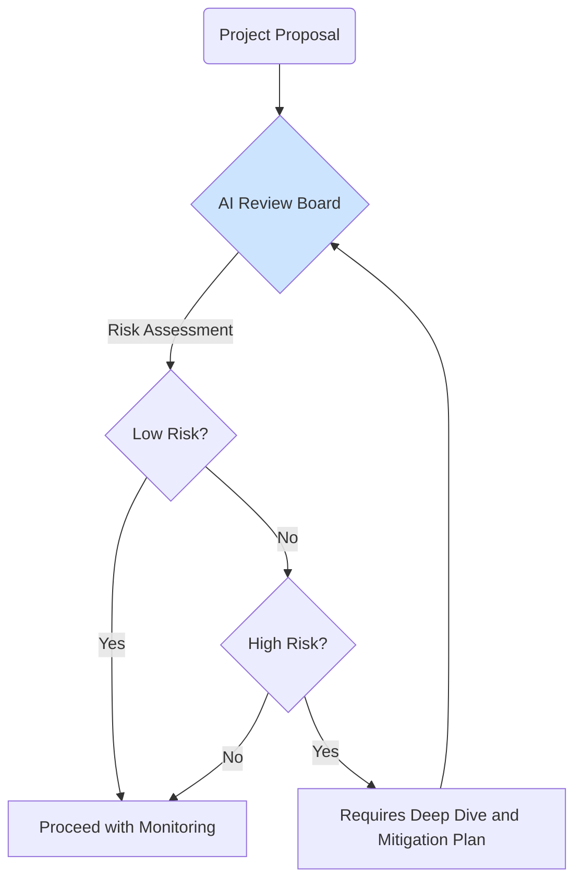

# AI Governance and Accountability

Technical solutions for responsible AI are essential, but they are insufficient on their own. A robust program for [Responsible AI](/docs/05-responsible-ai) requires a strong foundation of **governance** and clear lines of **accountability** within an organization. This involves establishing processes, roles, and documentation to ensure that AI is developed and deployed in a manner consistent with your company's values and ethical principles.

## Why Governance is Crucial

-   **Reduces Risk:** A formal governance process can identify potential ethical, legal, and reputational risks long before a product is launched.
-   **Ensures Consistency:** It ensures that all teams across an organization are adhering to the same principles and standards for AI development.
-   **Builds Trust:** Demonstrating a commitment to governance and accountability builds trust with users, customers, and regulators.

:::note[Governance Enables Innovation]
Effective governance should not be seen as a bureaucratic process that slows down development. Instead, it's a framework that enables teams to innovate safely and confidently. By providing clear guidelines and support, a governance process can empower developers to build bold and creative AI applications without having to be experts in law or ethics themselves.
:::

## Key Components of an AI Governance Framework

### 1. AI Principles
The foundation of any governance program is a clear set of principles that articulate your organization's commitments regarding AI. These principles should be high-level but actionable.

**Example Principles:**
-   **Be Socially Beneficial:** We will prioritize AI applications that have a positive impact.
-   **Be Fair:** We will work to avoid creating or reinforcing unfair bias.
-   **Be Transparent and Accountable:** We will be transparent about our use of AI and take responsibility for its outcomes.
-   **Be Secure and Privacy-Preserving:** We will design our AI systems to be secure and to protect user data.

### 2. AI Review Board (or Council)
An internal, cross-functional team should be established to oversee AI projects. This team is responsible for providing guidance and ensuring alignment with the AI principles.

The board should include representation from legal, policy, ethics, engineering, and product teams.

### 3. Documentation and Transparency: Model Cards
A "model card" is a short document that provides transparency about a model's intended use, performance characteristics, and limitations. It's like a nutrition label for an AI model.

**A typical model card includes:**
-   **Model Details:** The model's architecture, training data, and date.
-   **Intended Use:** The specific use cases the model was designed and tested for.
-   **Limitations:** The use cases for which the model is not suitable. "This model should not be used for medical diagnosis."
-   **Evaluation Metrics:** Performance on key metrics, including fairness and bias benchmarks.
-   **Ethical Considerations:** A discussion of potential risks and the steps taken to mitigate them.

Model cards are a crucial tool for both internal accountability and external transparency.

### 4. Incident Response Plan
Things can and will go wrong. An incident response plan outlines the steps your organization will take when an AI system causes harm or behaves in an unintended, negative way.

The plan should define:
-   What constitutes an "incident."
-   Who is responsible for investigating the incident.
-   How the model can be quickly disabled or rolled back.
-   How the incident will be communicated to stakeholders and affected users.

## Next Steps

Governance provides the framework, but it must be informed by hands-on, practical testing of your AI systems.

- **[A Practical Guide to Red Teaming LLMs](./red-teaming-guide.md):** Learn how to proactively find the very risks that a governance process is designed to manage.
