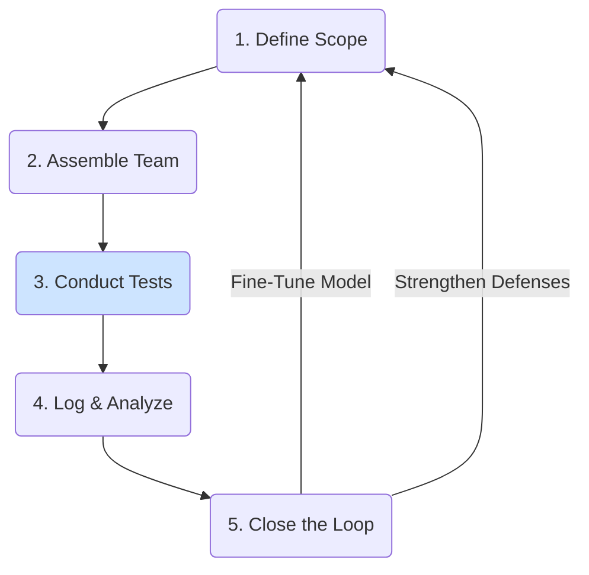

# A Practical Guide to Red Teaming LLMs

**Red teaming** is the practice of adversarially testing your own AI models to find their flaws and vulnerabilities before they are discovered by the public. It is a crucial, proactive step in building [Responsible AI](/docs/05-responsible-ai) and a key defense against [adversarial attacks](./adversarial-attacks-and-defenses.md).

The goal of red teaming is not just to "break" the model, but to systematically map its failure modes in order to improve it.

## The Goals of Red Teaming

A red teaming exercise might aim to test a model's robustness in several areas:

1.  **Safety:** Can the model be prompted to generate harmful, hateful, or dangerous content?
2.  **Security:** Can the model be manipulated to leak sensitive information, execute arbitrary code, or perform other actions it shouldn't? (e.g., via prompt injection).
3.  **Bias:** Can the model be shown to produce stereotyped or unfairly biased responses for different demographic groups?
4.  **Factual Accuracy:** How easily does the model hallucinate or provide confidently incorrect information on specific topics?

## The Red Teaming Lifecycle

A successful red teaming program is a continuous cycle, not a one-time event.

### 1. Define the Scope and Objectives
Before you begin, clearly define what you are testing for.
-   **Which model version are you testing?**
-   **What are the primary risks you are concerned about?** (e.g., for a financial advice bot, factual accuracy is paramount; for a public chatbot, safety is a top concern).
-   **What constitutes a "failure"?** Create a clear definition for what you are looking for.

### 2. Assemble the Red Team
A successful red team is diverse. It should include people with different backgrounds, expertise, and perspectives.

:::tip[Diversity is a Superpower]
A red team made up only of AI experts will find a certain class of problems. A diverse team including lawyers, artists, domain experts, and people from different cultural backgrounds will find a much wider and more realistic set of potential failures. The more diverse your red team, the more robust your model will become.
:::

-   **AI/ML Experts:** People who understand how the models work and know common attack vectors.
-   **Domain Experts:** People with deep knowledge of the subject matter the model will be used for (e.g., lawyers, doctors, programmers).
-   **Creative Thinkers:** People who are good at thinking "outside the box" and coming up with novel prompts.
-   **Laypeople:** People who represent the average user and may interact with the model in unexpected ways.

### 3. Conduct the Exercise
There are several ways to conduct the red teaming exercise itself:

-   **Structured (Hypothesis-Driven):** The team formulates specific hypotheses about potential vulnerabilities (e.g., "We believe the model will fail if we ask it for advice using informal, slang-filled language") and then systematically tests them.
-   **Unstructured (Freestyle):** The team is given broad instructions to try and "break" the model in any way they can think of. This is good for discovering novel, unexpected failure modes.

It's often best to use a combination of both approaches.

### 4. Log and Analyze the Results
Every prompt, every model response, and the red teamer's assessment should be meticulously logged.
-   **Create a Taxonomy of Failures:** As results come in, categorize the failures (e.g., "Harmful Content: Self-Harm," "Bias: Gender Stereotype," "Security: Indirect Prompt Injection"). This helps you see patterns and prioritize fixes.
-   **Root Cause Analysis:** For critical failures, try to understand why the model failed. Was it a weakness in the base model? A flaw in the fine-tuning data? A poorly designed system prompt?

### 5. Close the Loop
The results of the red teaming exercise are only useful if they are used to improve the system.
-   **Create a Feedback Dataset:** The discovered failures become a valuable dataset. Use them to fine-tune the model to be more robust against those specific types of attacks.
-   **Strengthen Defenses:** Use the findings to improve your prompt design, your input/output filters, and other safety mechanisms.
-   **Repeat:** Red teaming is not a one-time event. It should be a continuous process, performed regularly as the model, its data, and the adversarial landscape evolve.

## Next Steps

Red teaming helps you find vulnerabilities. The next step is to understand the types of attacks you are looking for.

- **[Adversarial Attacks and Defenses](./adversarial-attacks-and-defenses.md):** Review the common attack vectors that a red teaming exercise is designed to uncover.
