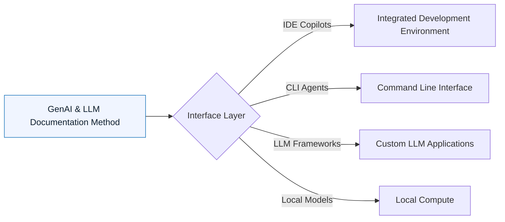

# Tooling Index

:::info[Value Proposition]
The tool is not the method. A carpenter can use a hand saw or a power saw, but the geometry of the cut remains the same. GenAI & LLM Documentation works with any tool that allows context injection and structured interaction.
:::

## Overview

GenAI & LLM Documentation is **tool-agnostic**. It provides a framework for disciplined AI-assisted development, regardless of the specific LLM or interface you use. This section explores various tooling options and how they integrate with the GenAI & LLM Documentation Loop, from powerful IDEs to specialized CLI agents.

**Goal**: Guide practitioners in selecting and configuring tools that support the GenAI & LLM Documentation workflow, rather than dictating specific products.
**Anti-pattern**: Relying on a tool's "magic" without understanding the underlying principles, or allowing tool limitations to dictate your workflow.

---

## When to Use

| ✅ Use This Pattern When...           | 🚫 Do Not Use When...                     |
| :------------------------------------ | :---------------------------------------- |
| Selecting new AI-assisted development tools | You are trying to find the "best" LLM tool without considering your specific workflow |
| Optimizing your AI-assisted workflow  | You expect a tool to solve all your prompt engineering challenges for you |
| Integrating AI into CI/CD or other automated pipelines | You have no clear definition of what "success" looks like for your AI-assisted task |

---

## Prerequisites

:::warning[Before you start]
A solid understanding of the GenAI & LLM Documentation Loop is crucial. The tools are there to serve the method, not replace it.
:::

-   **Artifacts**: Defined Intent Specs, Constraint Specs, and Generation Requests.
-   **Context**: Awareness of your team's existing tech stack and development environment.

---

## Tool Categories and Integration

You can execute the GenAI & LLM Documentation Loop using:

### 1. IDE Integrations (Copilots)

-   **Description**: AI assistants integrated directly into your Integrated Development Environment (IDE), providing real-time code suggestions, generation, and refactoring.
-   **GenAI & LLM Documentation Focus**: Streamlining Generation Requests, quick iterations, context injection from open files.
-   **Examples**: GitHub Copilot, Cursor, Codeium.
-   **See**: `docs/06-tooling/01-ide-setup-cursor.md`

### 2. CLI Agents

-   **Description**: AI tools that operate from the command line, often with access to the local filesystem and shell commands. Ideal for automating larger, multi-file tasks.
-   **GenAI & LLM Documentation Focus**: Autonomous execution of Generation Requests, refactorings, test generation, and documentation.
-   **Examples**: Aider, Continue, Open Interpreter.
-   **See**: `docs/06-tooling/02-cli-agents.md`

### 3. LLM Frameworks (and Orchestration)

-   **Description**: Libraries and platforms designed to build complex AI applications, often involving chaining LLM calls, tool use, and external data sources (e.g., RAG).
-   **GenAI & LLM Documentation Focus**: Building sophisticated agents that adhere to GenAI & LLM Documentation principles programmatically.
-   **Examples**: LangChain, LlamaIndex, LiteLLM.
-   **See**: `docs/06-tooling/02-llm-frameworks.md` (Note: This file does not exist yet)

### 4. Local-First Models

-   **Description**: Running LLMs directly on your local machine or private infrastructure for enhanced privacy and control.
-   **GenAI & LLM Documentation Focus**: Securely processing sensitive or proprietary information without sending it to third-party cloud services.
-   **Examples**: Ollama, Llama.cpp.
-   **See**: `docs/06-tooling/03-local-inference.md`

---

## Tooling Integration Diagram

---

## What Makes a Tool "GenAI & LLM Documentation-Ready"?

Not all AI tools are suitable for professional GenAI & LLM Documentation. To execute the loop effectively, a tool must support:

1.  **Context Injection**: The ability to feed relevant code, specifications, and previous conversations to the LLM.
2.  **Structured Output**: The capacity to generate output in predictable formats (e.g., JSON, YAML, specific code structures).
3.  **Iteration and Refinement**: Mechanisms for easy feedback and re-prompting based on initial AI outputs.
4.  **Local Control**: For sensitive tasks, the ability to operate without sending proprietary data to external cloud services.
5.  **Transparency**: Clear indication of what the AI is doing and what changes it proposes.

---

## Last Reviewed / Last Updated

- Last reviewed: 2025-12-28
- Version: 0.1.0