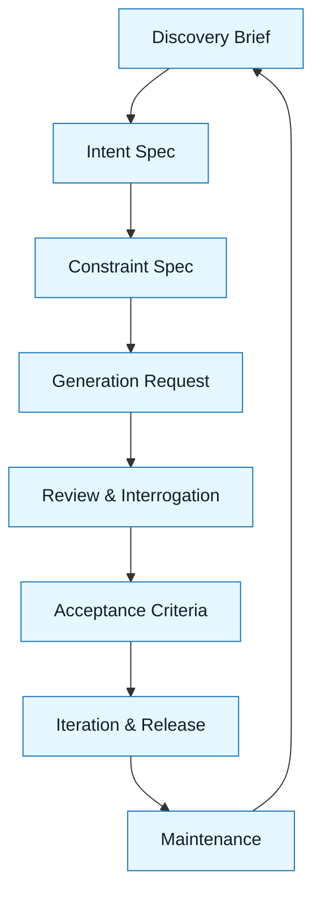

# GenAI Project Lifecycle

:::info[Value Proposition]
Integrate Generative AI capabilities into your project development lifecycle, from ideation to deployment and maintenance. This guide ensures that AI features are developed responsibly, align with user needs, and are governed effectively.
:::

## Overview

The introduction of Generative AI significantly impacts the traditional project development lifecycle. It's not just about adding a new feature; it's about re-evaluating ideation, design, development, and deployment processes to account for the unique characteristics of AI (e.g., probabilistic outputs, rapid iteration, ethical considerations). This document outlines a modified project lifecycle for GenAI projects, emphasizing points of integration for structured practices.

**Goal**: Provide a structured approach to developing and managing projects that incorporate Generative AI.
**Anti-pattern**: Treating GenAI features like any other software feature, ignoring AI-specific risks and development practices.

---

## The GenAI Project Lifecycle (8 Steps)

The GenAI Project Lifecycle is an 8-step iterative process designed to make AI-assisted work predictable and accountable. Each step focuses on producing a specific, reviewable artifact.

| Step                      | Focus                                 | Key Output                           | Risks if Skipped              |
| :------------------------ | :------------------------------------ | :----------------------------------- | :---------------------------- |
| **1. Discovery Brief**    | Problem Clarification                 | Problem Statement                    | Solving the wrong problem     |
| **2. Intent Spec**        | Desired Outcome & Success Criteria    | Measurable Goals                     | Ambiguity, Scope Creep        |
| **3. Constraint Spec**    | Boundaries & Non-negotiables          | Guardrails, Technical Requirements   | Overreach, Unsafe Changes     |
| **4. Generation Request** | Structured Prompt to AI               | AI Draft Artifact                    | Plausible but Incorrect Output |
| **5. Review & Interrogation** | Evidence-Based Verification         | Review Findings, Actionable Feedback | Silent Failures, Hidden Bugs  |
| **6. Acceptance Criteria**| Definition of Done                    | Objective Checklist                  | Premature Shipping            |
| **7. Iteration & Release**| Feedback Loop & Deployment            | Refined Artifact, Learnings          | Repeating Failures            |
| **8. Maintenance**| Ongoing support and monitoring | System Health | Model drift, performance degradation |

---

## Visual Summary of GenAI Project Lifecycle

---

## Iteration and Release

The GenAI Project Lifecycle is rarely a straight line. You will fail to meet Acceptance Criteria. Failure is a data point, not a dead end. How you react to failure determines whether you are practicing a disciplined methodology or just "chatting with a bot." This final stage focuses on learning from those failures, iterating on your specifications (not just the AI's output), and ultimately releasing high-quality, verified artifacts.

### Iteration Steps
1.  **Analyze Review Findings**: If an artifact fails acceptance, identify the root cause of the failure. Was it due to a flawed Intent Spec, a missing Constraint, a poor Generation Request, or an AI hallucination?
2.  **Revise Specifications**: Update the Intent Spec or Constraint Spec based on the analysis. Do not just tweak the AI's prompt without addressing the underlying specification flaw.
3.  **Iterate (Re-enter the Loop)**: With revised specifications, generate a new Generation Request and re-enter the loop from the Generation step.
4.  **Release and Document Learnings**: Once an artifact passes acceptance criteria, integrate it into the codebase and deploy. Document any significant learnings, new patterns, or updates to existing templates.

---

## Why This Lifecycle is Critical for Professional Work

-   **Reduces Hallucinations**: By being explicit, you leave less room for the AI to invent facts or logic.
-   **Ensures Correctness**: Constraints prevent the AI from generating code that violates architectural, security, or quality standards.
-   **Enables Verifiability**: A precise spec allows you to objectively compare AI output against expected behavior.
-   **Manages Scope**: Explicit boundaries prevent the AI from over-generating or drifting from the task.
-   **Fosters Accountability**: When the spec is clear, any deviation by the AI (or a human misinterpretation of the spec) can be identified and corrected.

---

## Common Pitfalls

| Pitfall                   | Impact                                   | Correction                                     |
| :------------------------ | :--------------------------------------- | :--------------------------------------------- |
| **Ignoring AI-Specific Risks Early** | Costly rework, ethical failures, legal issues. | Integrate AI-specific risk assessment (e.g., bias, hallucination) from Ideation. |
| **Lack of Cross-Functional Collaboration** | Disconnects between product, engineering, and data science. | Establish clear communication channels and shared practices. |
| **Treating AI as a "Black Box"** | Inability to debug, evaluate, or improve AI features effectively. | Emphasize transparency, explainability, and verifiable outputs throughout the lifecycle. |
| **Fixing AI Output Directly** | Ignoring the root cause (flawed spec), leading to recurring issues. | Always revise the *specifications* first, then regenerate. |

---

## Last Reviewed / Last Updated

- Last reviewed: 2025-12-28
- Version: 0.1.0