# Ideation and Use Case Definition

:::info[Value Proposition]
Clarify the problem space, identify stakeholders, and gather essential context without proposing solutions. This artifact ensures a shared understanding of _what_ problem needs solving before jumping to _how_ to solve it with AI.
:::

## Overview

This is the very first step in the GenAI Project Lifecycle. Its purpose is to lay a solid foundation by thoroughly understanding the problem, its impact, and who it affects, before any AI generation begins. This prevents AI from solving the wrong problem or generating irrelevant solutions. It sets the stage for a precise Intent Spec.

**Goal**: Achieve a shared, objective understanding of the problem.
**Anti-pattern**: Jumping directly from a vague idea to an AI prompt, leading to solutions that miss the mark.

---

## When to Use

| ✅ Use This Pattern When...           | 🚫 Do Not Use When...                     |
| :------------------------------------ | :---------------------------------------- |
| Starting any new feature or project   | You already have a clear, documented problem statement |
| Clarifying vague stakeholder requests | The problem is purely technical and well-defined (e.g., "fix a known bug") |
| Aligning diverse team perspectives    | You are optimizing an existing, well-understood workflow |

---

## Prerequisites

:::warning[Before you start]
No formal artifacts are required, but a willingness to ask probing questions and listen to stakeholders is key.
:::

-   **Artifacts**: Initial problem statement (could be a single sentence or a longer document).
-   **Context**: Access to stakeholders, user research, or existing data about the problem.

---

## The Pattern (Step-by-Step)

### Step 1: State the Problem

Clearly articulate the core problem you are trying to solve. Focus on the symptoms and impact, not on potential solutions.

> **Practical Insight**: Use the "As a [user type], I want to [action], so that [benefit]" format to center on user needs. "As a user, I am frustrated by slow loading times on the dashboard, which leads to a poor user experience."

### Step 2: Identify Affected Stakeholders

Who is impacted by this problem? List all relevant user groups, internal teams, or systems.

> "Affected: End-users (dashboard users), Engineering team (support burden), Product team (feature adoption)."

### Step 3: Gather Initial Context and Data

What existing information is available about this problem? This could include analytics, user feedback, error logs, or business requirements.

> "Analytics show a 20% drop-off rate on the dashboard. User feedback includes comments like 'too slow' and 'unresponsive'. Server logs indicate high database query times for dashboard data."

### Step 4: Define Success Markers (without solutions)

How would you know if the problem were solved? Focus on measurable outcomes, not implementation details.

> "Dashboard loading times should be under 2 seconds for 95% of users. User satisfaction scores for the dashboard should increase by 15%."

### Step 5: Deconstruct the Problem

Break down the overall objective into smaller, logical sub-components. Identify inputs, outputs, and intermediate steps.

> **Practical Insight**: Think like a compiler or an interpreter. What exact pieces of information does the AI need to process? What format should the output take?

### Step 6: Define Boundaries (In-Scope/Out-of-Scope)

Explicitly state what the AI should focus on and, just as importantly, what it should *not* attempt to do. This minimizes over-generation and prevents the AI from venturing into unintended areas.

> "Focus solely on the backend API logic; do not generate any frontend code."

### Step 7: Specify Constraints

Translate system requirements, architectural patterns, and coding standards into explicit constraints. This includes language versions, frameworks, error handling, logging, and security considerations.

> "Ensure all generated code adheres to TypeScript 5.x, uses Express.js for routing, and includes Joi for input validation as per the `Constraint Spec`."

### Step 8: Detail Desired Output Format

Be prescriptive about the output. Do you need a code snippet, a full file, a design document, or a test suite? Specify file names, directory structures, and even specific comment styles.

> "Generate a single `userRoutes.ts` file containing the Express.js routes. The file should be placed in `src/api/routes/`."

```mermaid
flowchart LR
    A[State Problem] --> B[Identify Stakeholders]
    B --> C[Gather Context/Data]
    C --> D[Define Success Markers]
    D --> E[Deconstruct Problem]
    E --> F[Define Boundaries]
    F --> G[Specify Constraints]
    G --> H[Detail Output Format]

    classDef step fill:#E6F7FF,stroke:#1B75BB,color:#0F1F2E;
    class A,B,C,D,E,F,G,H step;
```




---

## Practical Example: Discovery Brief for Improving Search Functionality

**Objective**: Improve the effectiveness of the product search functionality.

**Discovery Brief:**

```markdown
**1. Problem Statement:**
"As a user, I struggle to find relevant products using the search bar, which leads to frustration and missed purchase opportunities."

**2. Affected Stakeholders:**
-   **End-Users**: Experience poor search results, leading to dissatisfaction.
-   **Product Team**: Impacted by low search conversion rates and user churn.
-   **Business**: Lost revenue due to users not finding desired products.
-   **Support Team**: High volume of inquiries related to product discoverability.

**3. Initial Context and Data:**
-   **Analytics**: Search logs show high bounce rates (users leave after searching) and low conversion rates from search results. Many searches return "no results found" for products that actually exist.
-   **User Feedback**: Common complaints about search not understanding synonyms, misspellings, or natural language queries.
-   **Competitor Analysis**: Competitors have more sophisticated search capabilities (e.g., faceted search, recommendation engine integration).

**4. Success Markers (without solutions):**
-   Increase search-to-purchase conversion rate by 10%.
-   Reduce "no results found" instances by 20%.
-   Improve user satisfaction with search functionality (measured via post-search survey) by 15%.
```

---

## Common Pitfalls

| Pitfall                   | Impact                                   | Correction                                     |
| :------------------------ | :--------------------------------------- | :--------------------------------------------- |
| **Premature Solutions**   | Locking into an implementation before understanding the problem. | Focus solely on the "what" and "why" of the problem. |
| **Ignoring Data**         | Relying on assumptions instead of facts. | Actively seek out analytics, user feedback, and existing system data. |
| **Missing Stakeholders**  | Building solutions that don't address key user needs or business impacts. | Interview a diverse set of stakeholders.       |
| **Vague Instructions**    | AI makes assumptions, leading to rework. | Be explicit about every detail.                     |
| **Underspecified Constraints** | AI generates code that doesn't fit your project. | Provide clear technical boundaries (libraries, versions, patterns). |
| **Over-Scoping**          | AI attempts too much, resulting in incomplete or buggy code. | Break down into smaller, atomic tasks. Focus on one logical unit. |


---

## Next Step

Proceed to defining the **Intent Spec**.

---

## Last Reviewed / Last Updated

- Last reviewed: 2025-12-28
- Version: 0.1.0