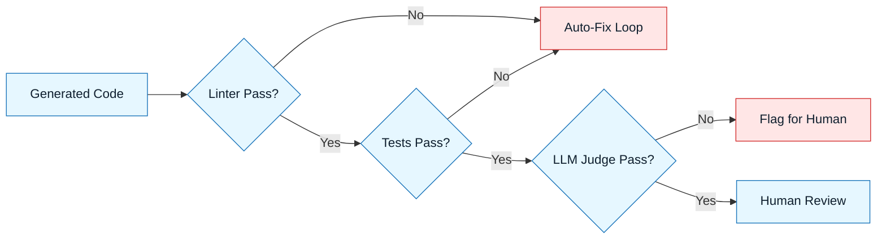

# Automated Evaluation

:::info[Purpose]
Manual review is essential but slow. Automated evaluation allows you to catch defects instantly, reserving human attention for high-level logic and safety.
:::

## Overview

In NNLP, we treat evaluation as a **pipeline**, not just a meeting.
Before a human sees the code, it should pass a series of automated gates.

We use three layers of automation:

1. **Deterministic Checks** (Linters, Types)
2. **Functional Tests** (Unit/Integration)
3. **Probabilistic Evals** (LLM-as-a-Judge)

---

## Layer 1: Deterministic Checks

**Goal**: Catch syntax errors and style violations immediately.

AI often generates valid code that violates project style (e.g., using `require` instead of `import`).

- **Tooling**: ESLint, Prettier, Ruff, MyPy.
- **NNLP Rule**: Configure your CLI agent (e.g., Aider) to run these checks _before_ asking for human review.

:::tip[Self-Correction]
If the linter fails, feed the error back to the AI automatically. "The code you generated failed linting. Fix it."
:::

---

## Layer 2: Functional Tests

**Goal**: Verify the code does what it claims to do.

In the **Constraint Spec**, you should require the AI to generate tests alongside the code.

- **Requirement**: "Generate a Jest test file for this component covering the happy path and one error state."
- **Validation**: Run the tests. If they fail, the generation is rejected.

---

## Layer 3: LLM-as-a-Judge

**Goal**: Evaluate fuzzy qualities like "clarity" or "relevance."

You can use a stronger model (e.g., GPT-4o) to evaluate the output of a faster model (e.g., Llama 3 or GPT-3.5).

### The Judge Prompt

```markdown
You are a Senior Code Reviewer.
Evaluate the following code against this Constraint Spec:
[Insert Constraints]

Output JSON:
{
"pass": boolean,
"reason": "string",
"security_risk": "low|medium|high"
}
```

---

## Visual: The Evaluation Pipeline



---

## Last Reviewed / Last Updated

- Last reviewed: 2025-12-20
- Version: 0.1.0
