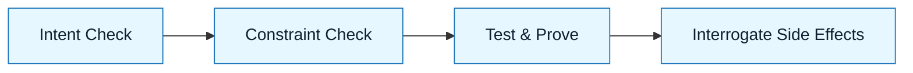

# Human Review and Interrogation Protocols

:::info[Value Proposition]
Systematically verify AI-generated outputs against your Intent and Constraint Specs. This is where human judgment ensures correctness, safety, and alignment before acceptance.
:::

## Overview

AI generates plausible outputs, but correctness is not guaranteed. Review and Interrogation is a critical human step in the GenAI Project Lifecycle. It's an evidence-based process of comparing the AI's output against your explicit specifications. This phase is about finding flaws, asking probing questions, and ensuring the AI’s work aligns perfectly with your intent and constraints.

**Goal**: Confirm AI output matches specification and has no unintended side effects.
**Anti-pattern**: "Looks good to me." (Result: Silent failures, hidden regressions).

---

## When to Use

| ✅ Use This Pattern When...                     | 🚫 Do Not Use When...                     |
| :---------------------------------------------- | :---------------------------------------- |
| Evaluating any AI-generated artifact          | You are confident the AI cannot make mistakes |
| Verifying critical paths or security logic      | You have no clear acceptance criteria     |
| Before committing AI-generated code           | You are purely exploring ideas with AI      |

---

## Prerequisites

:::warning[Before you start]
You must have a clear **Intent Spec** and **Constraint Spec**. Without them, you lack objective criteria for review.
:::

- **Artifacts**: AI-generated output, Intent Spec, Constraint Spec, Acceptance Criteria (if available).
- **Context**: Understanding of the expected behavior and potential failure modes.

---

## The Pattern (Step-by-Step)

### Step 1: Compare to Intent Spec

Does the AI's output fulfill the stated purpose and achieve the desired outcome? Focus on the "what" and "why."

> "Does this generated `UserProfile` component meet the intent of allowing users to view and edit their profile details?"

### Step 2: Validate Against Constraint Spec

Does the output violate any defined constraints (technical, security, performance, style)? This is about the "how."

> "Does the generated code adhere to our React coding standards (Constraint Spec), including using functional components and hooks, and avoiding direct DOM manipulation?"

### Step 3: Test and Prove

Execute the AI's output (run code, test APIs, preview docs). Generate evidence that it works as expected (or doesn't).

> "Run the generated unit tests for the `UserService`. Do all tests pass? Are there any missing tests?"

### Step 4: Interrogate for Undesired Behavior

Actively search for unintended side effects, edge case failures, or security vulnerabilities. Ask "what if" questions.

> "What happens if a user tries to create an account with an existing email? Does the API return a 409 Conflict as per the Constraint Spec?"



---

## Practical Example: Reviewing an AI-Generated User Authentication Module

**Objective**: Review an AI-generated user authentication module (`auth.ts`).

**Task Definition for AI (for review prompts):**

1.  **Context**: Provide the generated `auth.ts` module and the original Intent Spec (`Create a secure JWT-based authentication module`) and Constraint Spec (`Use bcrypt for hashing, jsonwebtoken for JWTs, handle invalid credentials with 401, duplicate users with 409`).

2.  **Prompt for Intent Check:**
    ```markdown
    "Review the attached `auth.ts` module. Does it implement the core functionality of JWT-based user authentication (registration, login, token generation, token verification) as described in the Intent Spec?"
    ```

3.  **Prompt for Constraint Check:**
    ```markdown
    "Review the `auth.ts` module against the Constraint Spec:
    -   Does it use `bcrypt` for password hashing?
    -   Does it use `jsonwebtoken` for JWT operations?
    -   Does it handle invalid credentials (`401`) and duplicate users (`409`)?"
    ```

4.  **Prompt for Test and Prove (assuming manual test execution or AI-generated tests):**
    ```markdown
    "Assuming I have run the unit tests generated for `auth.ts`, do they cover all functions and critical error paths? Are there any missing test cases I should add?"
    ```

5.  **Prompt for Interrogation:**
    ```markdown
    "Interrogate the `auth.ts` module:
    -   What happens if the `JWT_SECRET` is exposed?
    -   Is there a risk of brute-force attacks on the login endpoint?
    -   How does it handle token expiration?
    -   Are there any potential timing attacks during password comparison?"
    ```
    (AI would then provide a security analysis based on the code provided.)

---

## Common Pitfalls

| Pitfall                   | Impact                                   | Correction                                     |
| :------------------------ | :--------------------------------------- | :--------------------------------------------- |
| **Confirmation Bias**     | Only looking for evidence that confirms assumptions. | Actively seek evidence that *disproves* correctness. |
| **Insufficient Evidence** | Accepting output based on "gut feeling." | Demand concrete tests, logs, or demonstrations. |
| **Vague Acceptance Criteria** | No objective way to say "done."          | Define specific, measurable criteria upfront. |
| **Skipping Interrogation** | Missing subtle bugs or security risks.   | Always ask "what if" and "how does it fail?"   |

:::danger[Critical Risk]
Never assume AI understands your context or intent perfectly. The burden of verification always lies with the human reviewer. Treat AI output as a draft until proven otherwise.
:::

---

## Next Step

Proceed to defining the **Acceptance Criteria**.

---

## Last Reviewed / Last Updated

- Last reviewed: 2025-12-28
- Version: 0.1.0