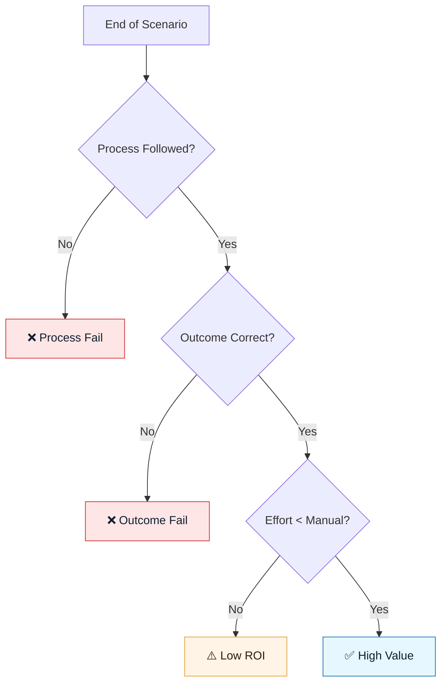

# Scenario Scorecards

:::info[Purpose]
A Scenario Scorecard evaluates the **entire lifecycle** of an AI-assisted task. It answers: "Did the GenAI & LLM Documentation process actually work, or did we just generate code fast?"
:::

## Overview

The **Quality Rubric** evaluates a specific artifact (like a piece of code).
The **Scenario Scorecard** evaluates the **end-to-end session**.

It measures:

1. **Process Discipline**: Did we follow the GenAI & LLM Documentation Loop?
2. **Outcome Success**: Did we solve the problem defined in Discovery?
3. **Efficiency**: Was this faster or better than doing it manually?

Use this to audit your team's maturity and the ROI of your AI tools.

---

## The Scorecard Structure

A complete scorecard assesses three dimensions.

### 1. Process Hygiene (Did we cheat?)

- **Discovery**: Was a brief written _before_ prompting?
- **Constraints**: Were constraints explicit?
- **Review**: Did a human verify the output?

_If you skipped these, the scenario is "High Risk" regardless of the code quality._

### 2. Outcome Quality (Did it work?)

- **Functional**: Does the feature work as intended?
- **Side Effects**: Did we break anything else?
- **Drift**: Did the AI hallucinate requirements not in the spec?

### 3. Efficiency (Was it worth it?)

- **Correction Loops**: How many times did we have to regenerate? (Target: < 3)
- **Human Time**: Did the human spend more time prompting than they would have coding?

---

## Visual: The Scoring Logic

---

## How to Grade a Scenario

### Pass / Fail Criteria

| Metric         | Pass Threshold                                      | Fail Condition                   |
| :------------- | :-------------------------------------------------- | :------------------------------- |
| **Artifacts**  | All 3 specs (Intent, Constraint, Delegation) exist. | Prompting started without specs. |
| **Iterations** | < 3 regeneration loops.                             | > 5 loops (indicates bad specs). |
| **Safety**     | No Red Zone data leaks.                             | PII pasted into chat.            |

:::warning[Red Flag]
If a scenario succeeds functionally but fails safety checks, it is a **Fail**.
:::

---

## When to Use Scorecards

You don't need a scorecard for every helper function. Use them for:

- **Pilot Projects**: When evaluating a new tool (e.g., "Should we buy Copilot?").
- **Post-Mortems**: When an AI-generated feature causes a bug.
- **Training**: To grade practitioners on their GenAI & LLM Documentation adherence.

---

## Next Step

Use the template to grade your next session:
**`docs/09-templates/scenario-scorecard-template.md`**

---

## Last Reviewed / Last Updated

- Last reviewed: 2025-12-20
- Version: 0.1.0
