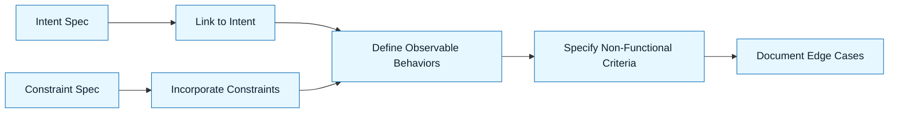

# Acceptance Criteria

:::info[Value Proposition]
Define objective, measurable conditions that must be met for an AI-generated output to be considered "done." This transforms subjective "looks good" into evidence-based "is good," preventing premature acceptance and ensuring quality.
:::

## Overview

Acceptance Criteria are the objective standards against which AI-generated artifacts are judged. In GenAI & LLM Documentation, acceptance is not a feeling. It is a checklist. This artifact clearly outlines the specific behaviors, performance metrics, and quality standards that an output must satisfy before it can be integrated, shipped, or moved to the next stage of development. It serves as the final gateway before AI-assisted work is deemed complete.

**Goal**: Establish a clear, verifiable definition of "done" for AI-generated outputs.
**Anti-pattern**: Relying on vague approval or subjective judgment ("I like it") for AI-assisted work, leading to inconsistent quality and hidden flaws.

---

## When to Use

| ✅ Use This Pattern When...           | 🚫 Do Not Use When...                     |
| :------------------------------------ | :---------------------------------------- |
| Every time you expect an AI-generated output to be used in production | You are purely exploring or prototyping with no intention of deployment |
| Defining tasks for an AI agent        | The output is a draft for internal discussion, not external release |
| Validating any change to code or docs | You are debugging a simple syntax error   |

---

## Prerequisites

:::warning[Before you start]
A clear **Intent Spec** and **Constraint Spec** are essential. Acceptance Criteria flow directly from these.
:::

-   **Artifacts**: Intent Spec, Constraint Spec, AI-generated output (from Generation Request).
-   **Context**: Understanding of the expected functional behavior and non-functional requirements.

---

## The Pattern (Step-by-Step)

### Step 1: Link to Intent Spec

Ensure each acceptance criterion directly supports a point in the Intent Spec.

> **Practical Insight**: For each item in "Desired Outcome" or "Success Criteria" in your Intent Spec, create one or more acceptance criteria.

### Step 2: Incorporate Constraint Spec

Translate relevant constraints into testable criteria.

> "The API response MUST conform to the JSON schema defined in the Constraint Spec."

### Step 3: Define Observable Behaviors

Focus on what can be directly observed or tested. Avoid internal implementation details.

> "When an invalid email is provided during registration, the API MUST return a HTTP 400 status code with a JSON payload `{ "message": "Invalid email format" }`."

### Step 4: Specify Performance and Non-Functional Criteria

If applicable, include criteria for speed, security, accessibility, etc.

> "The component MUST be keyboard navigable. The API endpoint MUST respond within 200ms (P95)."

### Step 5: Document Edge Cases and Error Handling

Define expected behavior for boundary conditions and error scenarios.

> "If the database is unreachable, the application MUST log a critical error and display a user-friendly message, without crashing."



---

## Practical Example: Acceptance Criteria for a User Registration Endpoint

**Objective**: Define acceptance criteria for an AI-generated user registration endpoint.

**Intent Spec (recap)**: "Implement a new user registration API endpoint. The endpoint should allow new users to create an account by providing a username, email, and password. Upon successful registration, a user account should be created in the database, and the user should receive a confirmation."

**Constraint Spec (recap)**: "Use bcrypt for password hashing, validate email format, ensure unique username/email, return appropriate HTTP status codes."

**Acceptance Criteria:**

```markdown
**Acceptance Criteria for User Registration Endpoint:**

-   **Scenario 1: Successful User Registration**
    -   **GIVEN** a unique username, valid email format, and a strong password.
    -   **WHEN** a POST request is sent to `/api/register` with these credentials.
    -   **THEN**
        -   The API **MUST** respond with HTTP status `201 Created`.
        -   The response body **MUST** contain a JSON object with the new user's ID and username (e.g., `{ "id": "...", "username": "..." }`).
        -   A new user record **MUST** be created in the database with the provided username and email.
        -   The password in the database **MUST** be securely hashed using bcrypt.

-   **Scenario 2: Registration with Existing Email**
    -   **GIVEN** an email that already exists in the system.
    -   **WHEN** a POST request is sent to `/api/register` with this email and valid other credentials.
    -   **THEN**
        -   The API **MUST** respond with HTTP status `409 Conflict`.
        -   The response body **MUST** contain a JSON object indicating the conflict (e.g., `{ "message": "Email already registered" }`).
        -   No new user record **MUST** be created.

-   **Scenario 3: Registration with Invalid Email Format**
    -   **GIVEN** an invalid email format (e.g., "user@.com").
    -   **WHEN** a POST request is sent to `/api/register` with this email.
    -   **THEN**
        -   The API **MUST** respond with HTTP status `400 Bad Request`.
        -   The response body **MUST** contain a JSON object indicating the validation error (e.g., `{ "message": "Invalid email format" }`).

-   **Non-Functional Criteria:**
    -   The `/api/register` endpoint **MUST** respond within 150ms (P90) under normal load conditions.
    -   Password hashing **MUST** use bcrypt with at least 10 salt rounds.
    -   All error messages **MUST** be sanitized and not expose internal server details.
```

Acceptance is the gatekeeper. It is the final step before code leaves the GenAI & LLM Documentation loop.

---

## Common Pitfalls

| Pitfall                   | Impact                                   | Correction                                     |
| :------------------------ | :--------------------------------------- | :--------------------------------------------- |
| **Vague Criteria**        | Subjective interpretation, inconsistent quality. | Make criteria specific, measurable, achievable, relevant, time-bound (SMART). |
| **Testing Implementation Details** | Criteria break with internal refactors.  | Focus on observable behavior, not internal logic. |
| **Ignoring Non-Functional Requirements** | Performance, security, or usability issues. | Explicitly include non-functional criteria where relevant. |

---

## Next Step

Proceed to:
**`docs/03-method/08-iteration-and-release.md`**

---

## Last Reviewed / Last Updated

- Last reviewed: 2025-12-28
- Version: 0.1.0