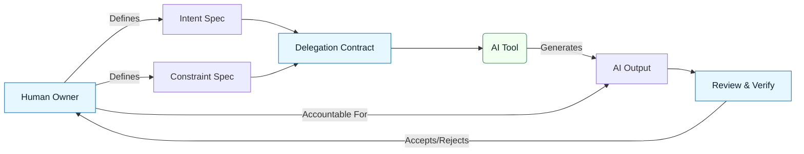

# GenAI & LLM Documentation Accountability and Delegation Model

:::info[Value Proposition]
Clarify roles, responsibilities, and decision-making authority when working with AI. This model ensures that humans remain accountable for outcomes, even when delegating tasks to AI tools.
:::

## Overview

AI tools are powerful, but they operate without judgment or responsibility. In GenAI & LLM Documentation, humans **MUST** retain accountability for all outcomes of AI-assisted work. This document defines a clear model for how accountability is maintained and how tasks are safely delegated to AI, emphasizing that delegation is for execution, not for judgment.

**Goal**: Establish clear lines of responsibility and safe delegation practices for AI-assisted workflows.
**Anti-pattern**: Blaming the AI for errors, or treating AI outputs as authoritative without human review and acceptance.

---

## When to Use

| ✅ Use This Pattern When...           | 🚫 Do Not Use When...                     |
| :------------------------------------ | :---------------------------------------- |
| Defining team roles for AI-assisted projects | You are in a purely exploratory, non-production environment |
| Establishing governance for AI tools  | The AI tool is making purely internal, non-impactful suggestions |
| Ensuring legal and ethical compliance | You want to delegate the final decision-making authority to AI |

---

## Prerequisites

:::warning[Before you start]
A foundational understanding of the GenAI & LLM Documentation Loop, Intent Specs, and Constraint Specs is essential.
:::

- **Artifacts**: Defined roles and responsibilities within the team/organization.
- **Context**: Awareness of relevant legal, ethical, and company policies regarding AI use.

---

## The Accountability Model

### Human is Always in Command

-   **Accountability**: The human owner of the task is 100% accountable for the AI's outputs, just as they would be for code written by a junior engineer.
-   **Responsibility**: Humans are responsible for defining intent, setting constraints, reviewing outputs, and making final acceptance decisions.
-   **Liability**: Ultimate liability for software and documentation produced using AI rests with the human or organization, not the AI tool.

### AI as a Tool, Not a Peer

-   AI does not "understand" intent in a human sense. It matches patterns.
-   AI does not "learn" ethics or compliance. It applies rules you provide.
-   AI does not "verify" its own work. It generates; you verify.

---

## The Delegation Model

Delegation in GenAI & LLM Documentation is a structured process, not a casual request.

### Step 1: Define Intent and Constraints (Human Task)

The human owner **MUST** define the Intent Spec and Constraint Spec before delegating to AI. This sets the boundaries for AI's operation.

### Step 2: Craft a Delegation Contract (Human Task)

The Delegation Contract explicitly states what the AI is permitted to do, what it is prohibited from doing, and what resources it can access.

> **Practical Insight**: Think of the Delegation Contract as a "Terms of Service" for your AI assistant.

### Step 3: Issue a Generation Request (Human Task)

The Generation Request is the precise prompt, framed by the Intent and Constraints, instructing the AI on what to generate.

### Step 4: Execute (AI Task)

The AI performs the generation within the defined scope.

### Step 5: Review and Verify (Human Task)

The human owner **MUST** critically review the AI's output against the Intent, Constraints, and Acceptance Criteria. This is where evidence-based verification happens.

### Step 6: Accept or Reject (Human Task)

The human owner makes the final decision to accept, reject, or request revisions from the AI.

---

## Practical Example: Delegating Code Generation

**Objective**: Delegate the creation of a new API endpoint to an AI.

1.  **Intent Spec**: "Implement a secure REST endpoint `/api/users/{id}` to retrieve user details, accessible only by authenticated users, returning user ID and public profile info."
2.  **Constraint Spec**: "Use Express.js, Node.js 20.x, TypeScript. User data from `UserService.getUserById(id)`. Authentication via JWT. Error handling: 401 for unauthenticated, 403 for unauthorized, 404 for not found, 500 for server errors."
3.  **Delegation Contract**: "AI is permitted to create new files in `src/routes` and `src/controllers`. AI is prohibited from modifying existing authentication middleware. AI must use the provided `UserService` interface."
4.  **Generation Request**: "Generate Express.js router and controller code for the `/api/users/{id}` endpoint based on the Intent Spec, Constraint Spec, and Delegation Contract. Include JSDoc for generated functions."
5.  **Review**: Human reviews generated code for security, correctness, and adherence to specs.
6.  **Acceptance**: Human accepts code after passing all tests and manual review.

---

## Common Pitfalls

| Pitfall                   | Impact                                   | Correction                                     |
| :------------------------ | :--------------------------------------- | :--------------------------------------------- |
| **Delegating Judgment**   | AI makes critical design or ethical decisions. | AI executes within strict human-defined boundaries. |
| **Implicit Delegation**   | Unclear what AI can/cannot do.           | Use explicit Delegation Contracts.             |
| **Human Over-Reliance**   | Skipping critical human review steps.    | Implement rigorous review and acceptance protocols. |

---

## Last Reviewed / Last Updated

- Last reviewed: 2025-12-28
- Version: 0.1.0