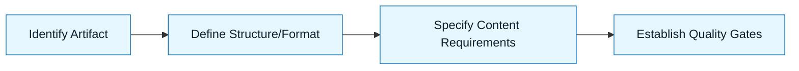

# GenAI & LLM Documentation Artifact Contracts (Normative)

:::info[Value Proposition]
Define the expected structure, content, and quality of each artifact produced throughout the GenAI & LLM Documentation Loop. This ensures consistency, facilitates efficient review, and establishes a clear understanding of deliverables.
:::

## Overview

In the GenAI & LLM Documentation workflow, every significant output is an "artifact." These aren't just informal notes; they are structured, reviewable documents or code segments that serve as inputs for subsequent steps and evidence for human acceptance. Artifact contracts define the normative requirements for these deliverables, ensuring that both human and AI contributions meet a predictable standard.

**Goal**: Establish clear, consistent expectations for the format and content of all GenAI & LLM Documentation artifacts.
**Anti-pattern**: Undefined deliverables, leading to ambiguity, inconsistent quality, and difficulty in automated or human review.

---

## When to Use

| ✅ Use This Pattern When...           | 🚫 Do Not Use When...                     |
| :------------------------------------ | :---------------------------------------- |
| Every stage of the GenAI & LLM Documentation Loop | The output is purely for transient, personal scratchpad notes |
| Establishing team standards for AI-assisted work | The work is an informal brainstorm with no expectation of formal output |
| Automating review processes           | The artifact's purpose is unclear or undefined |

---

## Prerequisites

:::warning[Before you start]
A clear understanding of the GenAI & LLM Documentation Loop and its stages is essential.
:::

-   **Artifacts**: Familiarity with the intent and purpose of each artifact (e.g., Intent Spec, Constraint Spec).
-   **Context**: Agreement on tooling and formats (e.g., Markdown for documentation, TypeScript for code).

---

## The Pattern (Step-by-Step)

### Step 1: Identify the Artifact

For each stage of the GenAI & LLM Documentation Loop, identify the primary output artifact.

> **Practical Insight**: The Loop defines 8 core artifacts. Focus on these first.

### Step 2: Define Structure and Format

Specify the required sections, headings, and overall layout. For code, define file names, directory placement, and required comments.

> "An Intent Spec MUST be a Markdown file with a `## Purpose`, `## Desired Outcome`, `## Success Criteria`, and `## Exclusions` sections."

### Step 3: Specify Content Requirements

Detail what information **MUST** be present in each section. For code, this includes variable naming conventions, error handling, and security considerations.

> "The `## Success Criteria` section in an Intent Spec MUST contain at least one measurable statement."

### Step 4: Establish Quality Gates

Define criteria for the artifact to pass from one stage to the next. This links directly to the Review and Acceptance steps.

> "A Generation Request artifact is not complete until its corresponding Intent Spec and Constraint Spec have been formally reviewed and approved."



---

## Practical Example: Artifact Contract for a Constraint Spec

**Objective**: Define the contract for a Constraint Spec artifact.

**Artifact Contract for Constraint Spec:**

```markdown
**Artifact Name:** Constraint Spec

**Purpose:** To explicitly define all non-negotiable boundaries, technical requirements, and guardrails for an AI-assisted task, ensuring AI output adheres to project standards and mitigates risks.

**Format:** Markdown (`.md`) file, structured with YAML frontmatter.

**Required Sections:**
1.  **YAML Frontmatter**:
    -   `title`: "Constraint Spec for [Task Name]"
    -   `archetype`: "method"
    -   `status`: "draft" | "active" | "deprecated"
    -   `owner`: Name of the human responsible
    -   `tags`: ["genai-llm", "constraints", "technical"]
2.  **# Constraint Spec**: Main heading.
3.  **:::info[Value Proposition]**: Standard info box explaining the purpose of Constraint Spec.
4.  **## Overview**: Concise explanation of what the Constraint Spec is.
5.  **## When to Use**: Table detailing applicability.
6.  **## Prerequisites**: List of required inputs (e.g., Intent Spec).
7.  **## The Pattern (Step-by-Step)**: Standardized section outlining creation process.
    -   **MUST** include definitions for Technical, Non-Functional, Architectural, and Prohibitive constraints.
8.  **## Practical Example**:
    -   **MUST** include an example Constraint Spec, ideally in a Markdown code block, directly tied to a corresponding Intent Spec.
9.  **## Common Pitfalls**: Table describing typical mistakes and corrections.
10. **## Next Step**: Link to the next artifact (`delegation-contract.md`).
11. **## Last Reviewed / Last Updated**: Standard review metadata.

**Content Requirements:**
-   All constraints **MUST** be specific, measurable, achievable, relevant, and time-bound (SMART) where applicable.
-   Prohibitions **MUST** be explicit (e.g., "MUST NOT modify...", "MUST NOT introduce new...").
-   Technical constraints **MUST** specify technologies and versions (e.g., "React 18.x", "TypeScript 5.x").

**Quality Gates:**
-   **MUST** be reviewed by a technical lead or architect for completeness and correctness.
-   **MUST** be signed off by the task owner before proceeding to Delegation Contract.
-   **MUST NOT** contradict the Intent Spec.
```

---

## Common Pitfalls

| Pitfall                   | Impact                                   | Correction                                     |
| :------------------------ | :--------------------------------------- | :--------------------------------------------- |
| **Undefined Artifacts**   | Ambiguity about what constitutes a valid deliverable. | Explicitly define contracts for all key outputs. |
| **Inconsistent Formats**  | Difficulty in automated parsing or human review. | Standardize Markdown headings, code block types, and metadata. |
| **Missing Content**       | Artifacts lack critical information for the next stage. | Use templates and checklists to ensure all required sections are present. |

---

## Last Reviewed / Last Updated

- Last reviewed: 2025-12-28
- Version: 0.1.0