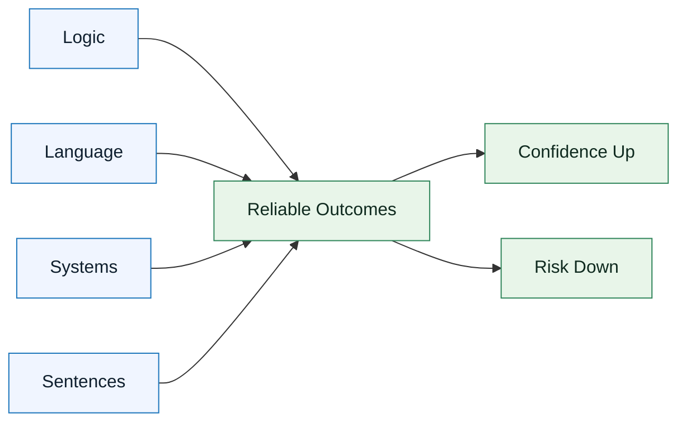

# Skill Matrix and Progression

:::info[Why this exists]
Most AI-assisted failures come from overestimating skill. Use this matrix to see where you stand and where to level up.
:::

## Overview

GenAI & LLM skills do not arrive fully formed.
They **progress through identifiable stages**.

This document provides:

- a skill matrix for GenAI & LLM
- a way to self-assess honestly
- a progression path from novice to professional use

The goal is not mastery for its own sake.
The goal is **predictable execution in real-world scenarios**.

---

## Visual Snapshot

Mermaid source: `assets/diagrams/genai-llm-skill-matrix.mmd`

:::warning[Read it this way]
Weakness in any skill pulls reliability down. Improve the weakest link first.
:::

---

## Why a Skill Matrix Matters

Most AI-assisted workflows fail because people **overestimate their skill level**.

Common problems:

- premature delegation to AI
- insufficient constraints
- weak review discipline
- overconfidence in output quality

GenAI & LLM Documentation uses a skill matrix to:

- make gaps visible
- reduce risk
- guide deliberate practice

---

## The GenAI & LLM Documentation Skill Matrix

Each core skill progresses independently.
Weakness in one will cap overall effectiveness.

### Logic Progression

| Level        | Characteristics                                   |
| ------------ | ------------------------------------------------- |
| Awareness    | Recognizes cause-and-effect in simple tasks       |
| Functional   | Can define conditions and dependencies explicitly |
| Applied      | Anticipates edge cases and failure modes          |
| Professional | Designs invariants and trade-offs upfront         |

### Language Progression

| Level          | Characteristics                                 |
| -------------- | ----------------------------------------------- |
| Conversational | Writes descriptive, informal instructions       |
| Structured     | Separates intent, constraints, and instructions |
| Precise        | Uses deterministic vocabulary consistently      |
| Professional   | Writes language that can be tested and reviewed |

### Systems Progression

| Level         | Characteristics                         |
| ------------- | --------------------------------------- |
| Local         | Focuses only on the immediate task      |
| Contextual    | Considers integrations and dependencies |
| Architectural | Understands boundaries and contracts    |
| Professional  | Anticipates long-term system impact     |

### Sentences Progression

| Level        | Characteristics                          |
| ------------ | ---------------------------------------- |
| Intuitive    | Writes natural but ambiguous sentences   |
| Controlled   | Limits scope and reduces overloading     |
| Precise      | Encodes one instruction per sentence     |
| Professional | Designs sentence structure intentionally |

---

## How to Use This Matrix

Use this matrix to:

- assess your current level honestly
- identify the weakest skill
- focus improvement effort there

:::tip[Coach’s note]
Improving your strongest skill yields diminishing returns. Improving your weakest skill yields **outsized gains**.
:::

---

## Typical Progression Path

Most practitioners follow this pattern:

1. Improve **Language** first (fastest gains)
2. Strengthen **Sentences** (control ambiguity)
3. Develop **Logic** (reduce silent failures)
4. Build **Systems** thinking (prevent regressions)

Skipping steps leads to fragile GenAI & LLM Documentation usage.

---

## Skill Progression and Delegation

Your delegation level should match your skill level.

- Lower skill → narrow, constrained delegation
- Higher skill → broader delegation with guardrails

Delegating beyond your skill level transfers risk to production.

---

## Evidence of Progress

You are progressing when:

- outputs become more consistent
- review cycles shorten
- fewer re-generations are needed
- failures are caught earlier
- specs become shorter but clearer

Progress is observable.

---

## Next Document

Proceed to:
**`docs/01-skills/06-common-skill-gaps.md`**

This will make failure patterns explicit so you can avoid them deliberately.

---

## Last Reviewed / Last Updated

- Last reviewed: 2025-12-20
- Version: 0.1.0
