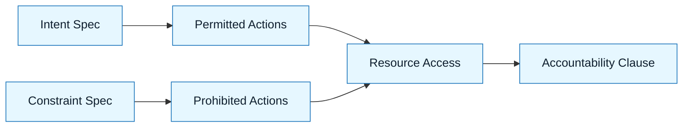

# Delegation Contract

:::info[Value Proposition]
Explicitly define the scope of authority granted to an AI tool for a specific task. This prevents AI overreach, ensures adherence to security and architectural boundaries, and clarifies where AI can act autonomously versus where human intervention is required.
:::

## Overview

In GenAI & LLM Documentation, delegating to AI is a precise act. The Delegation Contract formalizes this delegation, acting as a clear set of permissions and prohibitions for the AI. It's built upon the Intent Spec and Constraint Spec, ensuring the AI operates strictly within defined boundaries. This prevents unintended modifications, resource access, or functional deviations.

**Goal**: Establish a clear, enforceable boundary for AI's actions during a task.
**Anti-pattern**: Granting blanket permissions to AI ("do whatever is necessary"), leading to unpredictable behavior and potential security risks.

---

## When to Use

| ✅ Use This Pattern When...           | 🚫 Do Not Use When...                     |
| :------------------------------------ | :---------------------------------------- |
| Every time you delegate a code-generating task to AI | The task is purely informational (e.g., summarizing an article) |
| Asking AI to modify existing code     | You are brainstorming ideas where boundaries are intentionally fluid |
| Integrating AI into sensitive systems | The AI tool has no direct access to modify your codebase or environment |

---

## Prerequisites

:::warning[Before you start]
You **MUST** have a well-defined **Intent Spec** and **Constraint Spec**. The Delegation Contract builds directly on these.
:::

-   **Artifacts**: Intent Spec, Constraint Spec.
-   **Context**: Understanding of the AI tool's capabilities (e.g., does it have file system access, can it make API calls?).

---

## The Pattern (Step-by-Step)

### Step 1: Define Permitted Actions

Explicitly list what the AI is allowed to do. This should be granular and tied to the Intent.

> **Practical Insight**: Think of this as defining the "write scope." "You are permitted to create new files in the `src/components/widgets/` directory."

### Step 2: Define Prohibited Actions

Explicitly list what the AI is forbidden from doing. This reinforces constraints and prevents overreach.

> "You are prohibited from modifying any files outside the `src/components/widgets/` directory. You must not introduce any new npm dependencies."

### Step 3: Specify Resource Access

Clarify which external resources (APIs, databases, file system paths) the AI can interact with.

> "You are permitted to read the content of `src/styles/tailwind.config.js` for styling context. You are prohibited from making external API calls."

### Step 4: State Accountability Clause

Reiterate that the human remains accountable for all AI outputs and actions.

> "The human developer retains full accountability for all code generated. All AI output must be reviewed and verified by a human."



---

## Practical Example: Delegation Contract for a React Component Generation

**Objective**: Delegate the generation of a new React `DatePicker` component to an AI.

**Intent Spec (recap)**: "Create an accessible, customizable `DatePicker` component for our design system."

**Constraint Spec (recap)**: "React with TypeScript, Tailwind CSS, compliant with WCAG 2.1 AA, no new UI library dependencies, use `date-fns` for date manipulation."

**Delegation Contract:**

```markdown
**Delegation Contract for `DatePicker` Component Generation:**

**1. Permitted Actions:**
-   Create new files within the `src/components/DatePicker/` directory.
-   Generate `DatePicker.tsx` (React component).
-   Generate `DatePicker.test.tsx` (Jest unit tests for the component).
-   Generate `DatePicker.stories.tsx` (Storybook stories for the component).
-   Add necessary TypeScript interfaces and types within `DatePicker.tsx` or `src/types/datepicker.d.ts`.

**2. Prohibited Actions:**
-   You are prohibited from modifying any files outside of `src/components/DatePicker/` or `src/types/`.
-   You must not introduce any new npm dependencies beyond `react`, `tailwindcss`, and `date-fns`.
-   You must not generate any global CSS or modify existing CSS files.
-   You must not make any network requests or perform any I/O operations beyond reading provided files.

**3. Resource Access:**
-   You are permitted to read existing files in `src/utils/` for utility functions (e.g., date formatting).
-   You are permitted to read `tailwind.config.js` for color palette and spacing values.

**4. Accountability Clause:**
-   The human developer remains fully accountable for the correctness, accessibility, and security of all generated code. All outputs require human review and acceptance.
```

---

## Common Pitfalls

| Pitfall                   | Impact                                   | Correction                                     |
| :------------------------ | :--------------------------------------- | :--------------------------------------------- |
| **Implicit Permissions**  | AI performs actions beyond intent, e.g., modifying unrelated files. | Explicitly list all permitted actions and locations. |
| **Weak Prohibitions**     | AI introduces unwanted dependencies or security flaws. | Use strict prohibitions against new dependencies, external calls, or non-compliant practices. |
| **Ignoring Context**      | AI generates code incompatible with the existing codebase or system. | Clearly specify which existing code/resources the AI can read or use for context. |

---

## Next Step

Proceed to:
**`docs/03-method/05-generation-requests.md`**

---

## Last Reviewed / Last Updated

- Last reviewed: 2025-12-28
- Version: 0.1.0