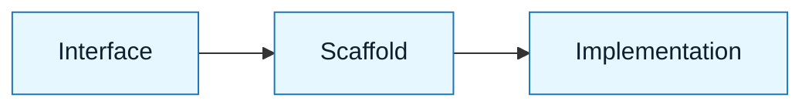

# Pattern: The Clean Slate

:::info[Value Proposition]
Use this pattern when building a new module, component, or service from scratch. It ensures the AI builds exactly what you need without legacy baggage.
:::

## Overview

Generating code from zero is AI's "Happy Path." However, without structure, it produces generic, unmaintainable tutorial code.

**Goal**: Generate production-ready scaffolding and logic in one pass.
**Anti-pattern**: "Write a snake game." (Result: Spaghetti code in one file).

---

## When to Use

| ✅ Use This Pattern When...    | 🚫 Do Not Use When...              |
| :----------------------------- | :--------------------------------- |
| You need a new React component | You are modifying a 500-line class |
| You need a new API endpoint    | You are debugging a race condition |
| You need a SQL schema          | You are migrating data             |

---

## Prerequisites

:::warning[Before you start]
You must have the **Constraint Spec** ready. Without it, the AI will pick random libraries.
:::

- **Artifacts**: Intent Spec, Constraint Spec.
- **Context**: Knowledge of where the file will live in the repo.

---

## The Pattern (Step-by-Step)

### Step 1: Define the Interface

Don't ask for the code yet. Ask for the **Type Definition** or **Interface**.

> "Based on the Intent Spec, generate the TypeScript interface for the `UserService`. Do not generate the implementation yet."

_Why? This forces the model to plan the public API before getting lost in logic._

### Step 2: The Scaffold

Generate the file structure with comments, but no logic.

> "Generate the file skeleton. Include all imports and method signatures, but use `// TODO` for the bodies."

### Step 3: The Implementation

Now fill it in, constrained by your specs.

> "Now implement the methods. Adhere to the Constraint Spec regarding error handling and logging."



### Practical Example: `UserService`

Let's illustrate with a simple `UserService` in TypeScript.

**Step 1: Define the Interface**

```typescript
// docs/types/UserService.ts
export interface User {
  id: string;
  name: string;
  email: string;
}

export interface IUserService {
  getUserById(id: string): Promise<User | null>;
  createUser(name: string, email: string): Promise<User>;
}
```

**Step 2: The Scaffold**

```typescript
// docs/services/UserService.ts
import { User, IUserService } from '../types/UserService';

export class UserService implements IUserService {
  async getUserById(id: string): Promise<User | null> {
    // TODO: Implement fetching user by ID
    return null;
  }

  async createUser(name: string, email: string): Promise<User> {
    // TODO: Implement creating a new user
    // For now, return a placeholder
    return { id: 'temp-id', name, email };
  }
}
```

**Step 3: The Implementation**

```typescript
// docs/services/UserService.ts (after implementation)
import { User, IUserService } from '../types/UserService';

export class UserService implements IUserService {
  // Assume a simple in-memory store for demonstration
  private users: User[] = [];
  private nextId: number = 1;

  async getUserById(id: string): Promise<User | null> {
    return this.users.find(user => user.id === id) || null;
  }

  async createUser(name: string, email: string): Promise<User> {
    const newUser: User = {
      id: String(this.nextId++),
      name,
      email,
    };
    this.users.push(newUser);
    return newUser;
  }
}
```

---

## Example Scenario

- **Context**: Creating a new `Button` component.
- **Input**: Constraint Spec (Tailwind, TypeScript).
- **Output**: A fully typed, accessible button with variant support.

---

## Common Pitfalls

| Pitfall                 | Impact                         | Correction                              |
| :---------------------- | :----------------------------- | :-------------------------------------- |
| **The "One Shot"**      | Asking for everything at once. | Split Interface vs. Implementation.     |
| **The "Generic Style"** | AI uses `var` or old patterns. | Enforce "Modern Syntax" in Constraints. |

:::danger[Critical Risk]
Do not accept code that introduces new npm packages unless you explicitly approved them.
:::