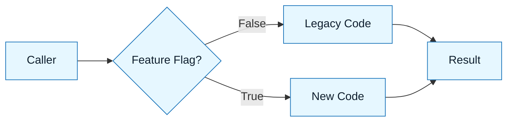

# Pattern: The Strangler

:::info[Value Proposition]
Use this pattern to refactor legacy systems incrementally. It allows you to replace old code with new code piece by piece, reducing the risk of a "Big Bang" rewrite failure.
:::

## Overview

The "Strangler Fig" pattern involves wrapping legacy code with a new interface, then gradually replacing the internals until the old system can be deleted.

**Goal**: Replace legacy logic without breaking production.
**Anti-pattern**: "Rewrite this entire module." (Result: Months of work, massive regressions).

---

## When to Use

| ✅ Use This Pattern When...                     | 🚫 Do Not Use When...                      |
| :---------------------------------------------- | :----------------------------------------- |
| You are migrating a monolith to microservices   | You are writing a new feature from scratch |
| You are replacing a deprecated library          | You are fixing a simple bug                |
| You need to refactor a critical, high-risk path | You can afford downtime                    |

---

## Prerequisites

:::warning[Before you start]
You must have a way to run both the old and new code paths simultaneously (e.g., feature flags or an abstraction layer).
:::

- **Input**: Legacy source code.
- **Safety**: Existing tests or a way to capture production inputs/outputs.

---

## The Pattern (Step-by-Step)

### Step 1: Characterization (The "Black Box")

Before changing anything, ask the AI to write a test that captures the _current_ behavior (bugs and all).

> "Write a test for `legacyCalc.js` that covers the happy path and edge cases. Treat the code as the source of truth."

### Step 2: The Seam (The Interface)

Ask the AI to extract an interface or facade around the legacy code.

> "Refactor `legacyCalc.js` to hide its logic behind a `Calculator` interface. Do not change the logic yet."

### Step 3: The Shadow Implementation

Generate the new implementation alongside the old one.

> "Create a new class `ModernCalculator` that implements the `Calculator` interface using the Intent Spec. Do not delete the old class."

### Step 4: The Switch

Ask the AI to wire up a toggle.

> "Update the factory to return `ModernCalculator` if the feature flag `USE_MODERN_CALC` is true, otherwise return `LegacyCalculator`."



---

## Example Scenario

-   **Context**: Replacing a raw SQL query with an ORM.
-   **Input**: The 50-line SQL string.
-   **Process**: Created a Repository interface. Implemented `SqlRepository` (old) and `OrmRepository` (new).
-   **Outcome**: Switched traffic gradually. Verified ORM queries matched SQL results.

### Practical Example: Migrating a Calculator

Let's imagine a legacy system with a simple `Calculator` function that needs to be refactored using the Strangler pattern.

**Step 1: Characterization**
(Assume tests are written to cover the existing `LegacyCalculator` behavior.)

**Step 2: The Seam (The Interface)**

```typescript
// calculator.interface.ts
interface Calculator {
  add(a: number, b: number): number;
  subtract(a: number, b: number): number;
}
```

**Step 3: The Shadow Implementation**

```typescript
// legacy-calculator.ts
class LegacyCalculator implements Calculator {
  add(a: number, b: number): number {
    // This might have some legacy quirks, e.g., integer overflow issues
    return a + b;
  }

  subtract(a: number, b: number): number {
    return a - b;
  }
}

// modern-calculator.ts
class ModernCalculator implements Calculator {
  add(a: number, b: number): number {
    // Modern, robust implementation
    return a + b;
  }

  subtract(a: number, b: number): number {
    return a - b;
  }
}
```

**Step 4: The Switch**

```typescript
// calculator-factory.ts
import { Calculator } from './calculator.interface';
import { LegacyCalculator } from './legacy-calculator';
import { ModernCalculator } from './modern-calculator';

// This could come from a feature flag service, environment variable, etc.
const USE_MODERN_CALC = true; // or process.env.FEATURE_FLAG_MODERN_CALC === 'true';

class CalculatorFactory {
  static getCalculator(): Calculator {
    if (USE_MODERN_CALC) {
      return new ModernCalculator();
    }
    return new LegacyCalculator();
  }
}

// Usage in application code
const calculator = CalculatorFactory.getCalculator();
console.log(calculator.add(5, 3)); // Will use ModernCalculator if flag is true
```

---

## Common Pitfalls

| Pitfall               | Impact                         | Correction                              |
| :-------------------- | :----------------------------- | :-------------------------------------- |
| **Changing Behavior** | "Fixing" bugs during the port. | Keep parity first. Fix bugs later.      |
| **Missing Seams**     | Code is too coupled to wrap.   | Use the "Extract Method" pattern first. |

:::danger[Critical Risk]
Do not delete the legacy code until the new code has run in production for a safe period (e.g., 1 week).
:::

---

## Last Reviewed / Last Updated

- Last reviewed: 2025-12-28
- Version: 0.1.0