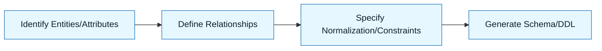

# Pattern: Data Modeling

:::info[Value Proposition]
Use this pattern to assist in designing robust and efficient data models for various database types (relational, NoSQL, graph). AI can help translate business requirements into normalized schemas, identify relationships, and suggest appropriate data types and indexing strategies.
:::

## Overview

Data modeling is the process of creating a visual or written representation of a database's structure, showing the relationships between data elements. AI can significantly accelerate this process by suggesting schemas, refining existing models, and identifying potential normalization issues or performance bottlenecks based on provided context and constraints.

**Goal**: Generate a well-structured and optimized data model (e.g., SQL DDL, NoSQL schema definition) from functional requirements.
**Anti-pattern**: Asking AI to "create a database" without specifying entities, relationships, or access patterns, resulting in a generic and often inefficient design.

---

## When to Use

| ✅ Use This Pattern When...           | 🚫 Do Not Use When...                     |
| :------------------------------------ | :---------------------------------------- |
| Designing a new database schema       | The data model is trivial (e.g., a simple key-value store) |
| Adding new entities to an existing database | You are primarily performing data migration, not schema design |
| Optimizing query performance (with AI suggestions) | The data is highly unstructured and schema-less by nature |

---

## Prerequisites

:::warning[Before you start]
You need clear **business requirements** for the data entities, their attributes, and how they relate. A preliminary **Intent Spec** and **Constraint Spec** are crucial.
:::

- **Artifacts**: User stories or functional requirements describing the data, desired queries, and reporting needs. Constraint Spec (database type, normalization level, performance requirements).
- **Context**: Understanding of the application's read/write patterns and expected data volume.

---

## The Pattern (Step-by-Step)

### Step 1: Identify Entities and Attributes

List all core business entities (e.g., User, Product, Order) and their relevant attributes (e.g., for User: id, name, email).

> **Practical Insight**: Start with a simple list. "We need to store users with name, email, and password. Products need a name, description, price, and category. Orders link users to products and have a quantity and date."

### Step 2: Define Relationships

Determine how these entities relate to each other (one-to-one, one-to-many, many-to-many). Specify cardinality and optionality.

> "A User can place many Orders, but an Order belongs to one User (one-to-many). An Order contains many Products, and a Product can be in many Orders (many-to-many)."

### Step 3: Specify Normalization Level and Constraints

Indicate the desired level of normalization (e.g., 3NF, denormalized for reads) and any specific constraints like primary keys, foreign keys, unique constraints, and data types.

> "Aim for 3NF for transactional data. `id` fields should be UUIDs. `email` should be unique. `price` must be positive."

### Step 4: Generate Schema and DDL

Based on the above, ask the AI to generate the database schema (e.g., SQL DDL statements, MongoDB schema definition).

> "Generate PostgreSQL DDL for the identified entities and relationships, adhering to the specified normalization and constraints. Include appropriate indexes for common lookup fields like `user_id` on `orders`."



### Practical Example: Modeling a Simple E-commerce Database (PostgreSQL)

**Objective**: Design a basic relational database schema for an e-commerce platform.

**Task Definition for AI:**

```markdown
**Intent:** Design a PostgreSQL database schema for a simple e-commerce application.

**Entities & Attributes:**
-   **Users**: `id` (PK, UUID), `username` (unique, NOT NULL), `email` (unique, NOT NULL), `password_hash` (NOT NULL), `created_at` (TIMESTAMP).
-   **Products**: `id` (PK, UUID), `name` (NOT NULL), `description` (TEXT), `price` (NUMERIC, NOT NULL), `stock` (INTEGER, NOT NULL), `category_id` (FK to Categories).
-   **Categories**: `id` (PK, UUID), `name` (unique, NOT NULL).
-   **Orders**: `id` (PK, UUID), `user_id` (FK to Users, NOT NULL), `order_date` (TIMESTAMP, NOT NULL), `total_amount` (NUMERIC, NOT NULL), `status` (VARCHAR, e.g., 'pending', 'shipped', 'delivered').
-   **OrderItems**: `order_id` (FK to Orders, PK), `product_id` (FK to Products, PK), `quantity` (INTEGER, NOT NULL), `unit_price` (NUMERIC, NOT NULL).

**Relationships:**
-   User to Order: One-to-Many
-   Product to Category: Many-to-One
-   Order to OrderItem: One-to-Many
-   Product to OrderItem: Many-to-Many (via OrderItem join table)

**Constraints:**
-   **Database**: PostgreSQL.
-   **Normalization**: 3rd Normal Form.
-   **Primary Keys**: UUIDs with `gen_random_uuid()` as default.
-   **Foreign Keys**: Enforce referential integrity.
-   **Data Types**: Use appropriate PostgreSQL types (e.g., `UUID`, `VARCHAR`, `NUMERIC`, `TEXT`, `BOOLEAN`, `TIMESTAMP WITH TIME ZONE`).
-   **Indexes**: Create indexes for foreign keys and frequently queried columns (e.g., `username`, `email`, `order_date`).

**Desired Output:**
-   PostgreSQL DDL (`.sql` file) including `CREATE TABLE` statements, `PRIMARY KEY`, `FOREIGN KEY`, `UNIQUE`, `NOT NULL` constraints, and index definitions.
```

```sql
-- Example snippet of desired PostgreSQL DDL
CREATE TABLE categories (
    id UUID PRIMARY KEY DEFAULT gen_random_uuid(),
    name VARCHAR(255) UNIQUE NOT NULL
);

CREATE TABLE products (
    id UUID PRIMARY KEY DEFAULT gen_random_uuid(),
    name VARCHAR(255) NOT NULL,
    description TEXT,
    price NUMERIC(10, 2) NOT NULL CHECK (price >= 0),
    stock INTEGER NOT NULL CHECK (stock >= 0),
    category_id UUID NOT NULL,
    FOREIGN KEY (category_id) REFERENCES categories(id) ON DELETE RESTRICT
);

CREATE TABLE users (
    id UUID PRIMARY KEY DEFAULT gen_random_uuid(),
    username VARCHAR(255) UNIQUE NOT NULL,
    email VARCHAR(255) UNIQUE NOT NULL,
    password_hash VARCHAR(255) NOT NULL,
    created_at TIMESTAMP WITH TIME ZONE DEFAULT NOW()
);

CREATE TABLE orders (
    id UUID PRIMARY KEY DEFAULT gen_random_uuid(),
    user_id UUID NOT NULL,
    order_date TIMESTAMP WITH TIME ZONE DEFAULT NOW() NOT NULL,
    total_amount NUMERIC(10, 2) NOT NULL CHECK (total_amount >= 0),
    status VARCHAR(50) NOT NULL DEFAULT 'pending',
    FOREIGN KEY (user_id) REFERENCES users(id) ON DELETE CASCADE
);

CREATE TABLE order_items (
    order_id UUID NOT NULL,
    product_id UUID NOT NULL,
    quantity INTEGER NOT NULL CHECK (quantity > 0),
    unit_price NUMERIC(10, 2) NOT NULL CHECK (unit_price >= 0),
    PRIMARY KEY (order_id, product_id),
    FOREIGN KEY (order_id) REFERENCES orders(id) ON DELETE CASCADE,
    FOREIGN KEY (product_id) REFERENCES products(id) ON DELETE RESTRICT
);

CREATE INDEX idx_users_username ON users (username);
CREATE INDEX idx_users_email ON users (email);
CREATE INDEX idx_orders_user_id ON orders (user_id);
CREATE INDEX idx_orders_order_date ON orders (order_date);
CREATE INDEX idx_products_category_id ON products (category_id);
```

---

## Common Pitfalls

| Pitfall                       | Impact                                   | Correction                                     |
| :---------------------------- | :--------------------------------------- | :--------------------------------------------- |
| **Over-normalization**        | Increased query complexity, performance issues. | Consider denormalization for read-heavy scenarios. |
| **Ignoring Access Patterns**  | Poor query performance.                  | Design with common queries in mind; add appropriate indexes. |
| **Missing Constraints**       | Data integrity issues.                   | Explicitly define `NOT NULL`, `UNIQUE`, `CHECK` constraints. |

:::danger[Critical Risk]
Always validate AI-generated DDL with a database expert and thorough testing, especially for complex relationships and performance-critical tables. Small errors can lead to major data integrity problems.
:::