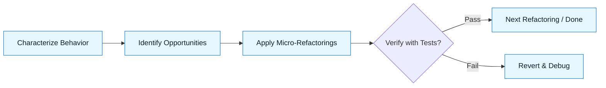

# Pattern: Refactor Safely

:::info[Value Proposition]
Use this pattern to perform significant code refactoring with confidence, ensuring that changes do not introduce new bugs or alter existing behavior. AI assists in identifying refactoring opportunities, generating safety nets (tests), and performing mechanical transformations.
:::

## Overview

Refactoring is essential for maintaining code health, improving readability, and reducing technical debt. However, it carries the risk of inadvertently changing system behavior. This pattern emphasizes a test-driven, incremental approach to refactoring, where AI is used to create robust characterization tests and apply refactoring techniques systematically, ensuring that each change maintains functional equivalence.

**Goal**: Transform existing code to improve its internal structure without changing its external behavior, backed by automated verification.
**Anti-pattern**: Large-scale, untest-backed refactorings based on intuition, leading to instability and regressions.

---

## When to Use

| ✅ Use This Pattern When...           | 🚫 Do Not Use When...                     |
| :------------------------------------ | :---------------------------------------- |
| Improving the design of existing code | The code is already perfectly clean and maintainable |
| Reducing complexity or duplicated logic | You are adding new features, not changing existing ones (use "Clean Slate") |
| Preparing code for new features       | The module is being completely replaced (consider "The Strangler") |

---

## Prerequisites

:::warning[Before you start]
The target code should have some level of existing test coverage, or you must be prepared to generate characterization tests.
:::

- **Artifacts**: Existing code to be refactored. Constraint Spec (coding standards, preferred refactoring techniques, test framework).
- **Context**: Understanding of the code's current behavior and desired future structure.

---

## The Pattern (Step-by-Step)

### Step 1: Characterization Tests

Before touching the code, ask the AI to generate a suite of tests that capture the *current* external behavior of the system or module, including its known quirks or bugs. These are your safety net.

> **Practical Insight**: Treat the current code, however messy, as the "source of truth." The tests generated here aren't for perfection, but for documenting current reality. "Generate characterization tests for `OrderProcessor.java` covering all public methods and known edge cases. Do not assume ideal behavior; test what it *actually* does."

### Step 2: Identify Refactoring Opportunities

Prompt the AI to analyze the code for smells, redundancies, or areas that violate design principles.

> "Analyze `LegacyService.ts`. Identify duplicate code, overly long methods, and areas with high cyclomatic complexity. Suggest specific refactoring patterns (e.g., Extract Method, Introduce Parameter Object)."

### Step 3: Apply Micro-Refactorings

Use the AI to perform small, isolated, and reversible code transformations. After each change, run the characterization tests.

> "Apply 'Extract Method' to the `calculateDiscount` logic within the `processOrder` method in `OrderProcessor.java`. Ensure all tests still pass."

### Step 4: Verify with Tests

Crucially, after *every* small refactoring step, run the full suite of characterization tests. If any fail, revert the last change.

> "After refactoring, execute the characterization test suite. If any test fails, revert the last change and identify the root cause."



### Practical Example: Refactoring a Complex Calculation Function

**Objective**: Refactor a monolithic `calculateFinalPrice` function to improve readability and maintainability, ensuring no change in output.

**Task Definition for AI (Iterative):**

1.  **Initial Characterization Test Prompt:**
    ```markdown
    "Given the following JavaScript function, `calculateFinalPrice`, write a comprehensive set of unit tests using Jest that covers all its current inputs and outputs, including edge cases and known behavior (even if it's currently buggy). Treat the function's existing behavior as the ground truth.

    ```javascript
    // Original function
    function calculateFinalPrice(basePrice, quantity, discountPercentage, taxRate, shippingCost, isPremiumMember) {
        let priceAfterDiscount = basePrice * quantity;
        if (discountPercentage > 0) {
            priceAfterDiscount = priceAfterDiscount * (1 - discountPercentage);
        }

        let taxAmount = priceAfterDiscount * taxRate;
        let finalPrice = priceAfterDiscount + taxAmount;

        if (isPremiumMember && finalPrice > 100) {
            finalPrice -= 10; // Premium member discount
        }

        finalPrice += shippingCost;
        return finalPrice;
    }
    ```
    "
    (AI generates tests. *Run tests*.)

2.  **Refactoring Step 1 Prompt (Extract Discount Calculation):**
    ```markdown
    "Refactor the `calculateFinalPrice` function. Extract the discount calculation logic into a new private helper function called `applyDiscount`. Ensure the original `calculateFinalPrice` calls this new helper, and all characterization tests still pass.

    ```javascript
    // Original function (after tests are generated)
    // ... (code provided to AI again) ...
    ```
    "
    (AI refactors. *Run tests*.)

3.  **Refactoring Step 2 Prompt (Extract Tax Calculation):**
    ```markdown
    "Refactor the `calculateFinalPrice` function again. Extract the tax calculation logic into a new private helper function called `applyTax`. Ensure the original `calculateFinalPrice` calls this new helper, and all characterization tests still pass.

    ```javascript
    // Original function (after previous refactoring, provided to AI again)
    // ... (code provided to AI again) ...
    ```
    "
    (AI refactors. *Run tests*.)

...and so on, until the function is well-structured.

---

## Common Pitfalls

| Pitfall                       | Impact                                   | Correction                                     |
| :---------------------------- | :--------------------------------------- | :--------------------------------------------- |
| **Insufficient Test Coverage** | Refactoring introduces silent bugs.      | Prioritize generating robust characterization tests. |
| **Too Large a Step**          | Difficult to pinpoint the cause of test failures. | Break down refactorings into the smallest possible changes. |
| **Refactoring and Adding Features** | Blurs the line between improving existing code and changing behavior. | Separate refactoring tasks from feature development tasks. |

:::danger[Critical Risk]
Never delete or significantly alter characterization tests during a refactoring cycle. They are your primary safeguard. If tests need to change, it's typically because a behavioral change is intended, which moves beyond pure refactoring.
:::