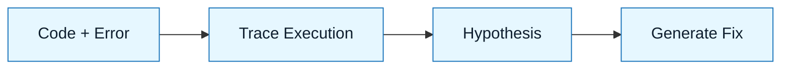

# Pattern: The Rubber Duck

:::info[Value Proposition]
Use this pattern to debug complex logic or understand legacy code. It forces the AI to explain the code's behavior step-by-step, often revealing the bug before you even ask for a fix.
:::

## Overview

"Rubber Ducking" is a classic debugging technique where you explain your code line-by-line to an inanimate object. Here, the AI acts as an **active** rubber duck.

**Goal**: Isolate the root cause of a bug or understand a complex flow.
**Anti-pattern**: "Fix this error." (Result: AI guesses blindly without understanding the state).

---

## When to Use

| ✅ Use This Pattern When...               | 🚫 Do Not Use When...                |
| :---------------------------------------- | :----------------------------------- |
| You have a stack trace but no idea why    | You need to write a new feature      |
| You are reading code you didn't write     | You are doing a large-scale refactor |
| You suspect a race condition or edge case | You know exactly what the fix is     |

---

## Prerequisites

:::warning[Before you start]
Do not paste the error log alone. You must provide the code that caused it.
:::

- **Input**: Source code + Error logs / Observed behavior.
- **Context**: What were you trying to do when it failed?

---

## The Pattern (Step-by-Step)

### Step 1: The Context Dump

Feed the code and the error to the model.

> "Here is `src/payment.ts` and the error log from the last run. Do not fix it yet."

### Step 2: The Walkthrough

Ask the AI to trace the execution path for the specific scenario that failed.

> "Trace the execution flow for a user with an expired card. Explain the state of the `transaction` object at each step."

_Why? This forces the model to build an internal representation of the logic flow._

### Step 3: The Interrogation

Ask specific "What if" questions to test hypotheses.

> "What happens if the API returns a 503 at line 42? Is the `catch` block reachable?"

### Step 4: The Fix

Once the logic gap is exposed, ask for the correction.

> "The error is that we don't check for `null` before accessing `transaction.id`. Generate the fix."



---

## Example Scenario

-   **Context**: A React component crashes only on the second render.
-   **Input**: Component code + `useEffect` logic.
-   **Process**: Asked AI to "Trace the dependency array changes between render 1 and 2."
-   **Outcome**: AI identified a stale closure in the event listener.

### Practical Example: Debugging a Stale Closure in React

Consider a React component that displays a counter and updates it every second, but has a bug where the `onClick` handler always logs the initial count.

**Problematic Code (`Counter.jsx`):**

```jsx
import React, { useState, useEffect } from 'react';

function Counter() {
  const [count, setCount] = useState(0);

  useEffect(() => {
    const intervalId = setInterval(() => {
      setCount(count + 1); // Bug: 'count' is always 0 here due to stale closure
    }, 1000);

    return () => clearInterval(intervalId);
  }, []); // Empty dependency array means 'count' is captured once

  const handleClick = () => {
    console.log('Button clicked, count:', count); // Stale closure: logs initial count
  };

  return (
    <div>
      <p>Count: {count}</p>
      <button onClick={handleClick}>Log Count</button>
    </div>
  );
}

export default Counter;
```

**Step 1: The Context Dump**

**User Prompt:**
> "I'm getting the following error in my React application. The page renders a `UserProfile` component.

    **Error Message:**
    ```
    TypeError: Cannot read property 'name' of undefined
        at UserProfile (UserProfile.jsx:15:27)
        at renderWithHooks (react-dom.development.js:16301:18)
        at mountIndeterminateComponent (react-dom.development.js:19240:13)
        ...
    ```

    **Relevant Code (UserProfile.jsx line 15-18):**
    ```javascript
    // UserProfile.jsx
    // ...
    function UserProfile({ user }) {
        // ...
        return (
            <div>
                <h1>Welcome, {user.name}!</h1> {/* Line 15 */}
                <p>Email: {user.email}</p>
            </div>
        );
    }
    // ...
    ```

    **Question**: What is the most likely cause of this error, and what's a simple diagnostic step I can take?"
    ```

    **AI Response (Example):**
    ```markdown
    **Most Likely Cause:**
    The `TypeError: Cannot read property 'name' of undefined` at `UserProfile.jsx:15` strongly suggests that the `user` prop passed to the `UserProfile` component is `undefined` when the component tries to access `user.name`. This often happens when data is being fetched asynchronously, and the component renders before the data is available.

    **Simple Diagnostic Step:**
    Add a `console.log` statement to inspect the `user` prop directly at the beginning of the `UserProfile` component.

    ```javascript
    // UserProfile.jsx
    function UserProfile({ user }) {
        console.log("User prop:", user); // Add this line
        // ...
        return (
            <div>
                <h1>Welcome, {user.name}!</h1>
                <p>Email: {user.email}</p>
            </div>
        );
    }
    ```
    ```
    *(Developer runs the app, observes `console.log("User prop:", undefined)`.)*

2.  **Proposed Fix (Prompt to AI):**
    ```markdown
    "The `console.log` confirmed that the `user` prop is `undefined` when `UserProfile` first renders. How can I fix `UserProfile.jsx` to prevent this error and show a loading state or a message if `user` is not yet available?"
    ```

    **AI Response (Example):**
    ```markdown
    **Proposed Fix:**
    You can add a conditional rendering check for the `user` prop. If `user` is `undefined` or `null`, you can render a loading indicator or a message.

    ```javascript
    // UserProfile.jsx
    import React from 'react'; // Ensure React is imported if JSX is used

    function UserProfile({ user }) {
        console.log("User prop:", user);

        if (!user) {
            return <div>Loading user profile...</div>; // Or render a spinner
        }

        return (
            <div>
                <h1>Welcome, {user.name}!</h1>
                <p>Email: {user.email}</p>
            </div>
        );
    }
    ```

    **Rationale:**
    This fix addresses the `TypeError` by ensuring that `user.name` is only accessed when `user` is a defined object. It gracefully handles the asynchronous nature of data loading, providing a better user experience by showing a loading state instead of crashing.

    **Potential Side Effects:**
    -   If the `user` data never resolves, the "Loading" message will persist indefinitely. Consider adding a timeout or error handling for the data fetching mechanism upstream.
    -   If `user` could potentially be an empty object `{}` but still `truthy`, you might need more specific checks (e.g., `if (!user || !user.name)`).
    ```

---

## Common Pitfalls

| Pitfall                   | Impact                                   | Correction                                     |
| :------------------------ | :--------------------------------------- | :--------------------------------------------- |
| **Premature Fixing**      | AI provides generic, unhelpful debugging advice. | Always provide full stack traces, relevant code, and exact error messages. |
| **Missing Context**       | AI assumes standard behavior.            | Explicitly state environment details, recent changes, and any known system quirks. |
| **Skipping Validation**   | Implementing AI's suggested fix without verifying the root cause. | Always confirm the hypothesis with further diagnostics before applying a fix. |

:::danger[Critical Risk]
Never apply AI-suggested fixes directly to production without thorough testing and understanding. Debugging AI is a partnership: you provide the evidence, AI provides hypotheses, but *you* are responsible for validation.
:::