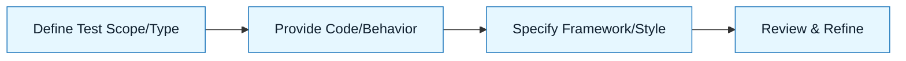

# Pattern: Write Tests

:::info[Value Proposition]
Use this pattern to leverage AI for generating comprehensive and effective tests. This accelerates the test-writing process, improves code coverage, and ensures functional correctness, especially when paired with AI-generated code or complex logic.
:::

## Overview

Automated tests are the bedrock of reliable software. AI can be a powerful co-pilot in writing various types of tests (unit, integration, end-to-end) by analyzing code, requirements, or even desired behavior. This pattern focuses on guiding the AI to produce high-quality, maintainable tests that act as living documentation and a safety net for future changes.

**Goal**: Generate effective and comprehensive test suites based on code or specifications.
**Anti-pattern**: Asking the AI to "write tests for this" without providing context, desired outcomes, or testing framework preferences, leading to generic and often inadequate tests.

---

## When to Use

| ✅ Use This Pattern When...           | 🚫 Do Not Use When...                     |
| :------------------------------------ | :---------------------------------------- |
| Developing new features (TDD approach) | You have no understanding of the code being tested |
| Fixing bugs (regression tests)        | The code is trivial and self-evidently correct |
| Increasing coverage for legacy code   | You are testing AI's creative output (use a human for final validation) |

---

## Prerequisites

:::warning[Before you start]
You must have a clear understanding of the functionality to be tested, the expected inputs and outputs, and the chosen testing framework.
:::

- **Artifacts**: Code to be tested, functional requirements/Intent Spec. Constraint Spec (testing framework, desired coverage metrics, mocking strategies).
- **Context**: Knowledge of the system's architecture and any external dependencies.

---

## The Pattern (Step-by-Step)

### Step 1: Define Test Scope and Type

Clearly specify what part of the system needs to be tested (unit, integration, E2E) and the specific behavior or functionality you want to verify.

> **Practical Insight**: Start small. For a unit test, isolate a single function or class method. For an integration test, focus on a small interaction between components.

### Step 2: Provide Code and Expected Behavior

Supply the AI with the code under test and a detailed description of the expected behavior for various inputs, including happy paths, edge cases, and error conditions.

> "Given the `calculateTax(amount, taxRate)` function, write unit tests.
> -   `calculateTax(100, 0.1)` should return `10`.
> -   `calculateTax(0, 0.05)` should return `0`.
> -   `calculateTax(50, 0)` should return `0`.
> -   It should throw an error for negative `amount` or `taxRate`."

### Step 3: Specify Testing Framework and Style

Inform the AI about the testing framework (e.g., Jest, Pytest, JUnit) and any preferred testing styles (e.g., BDD, TDD, given-when-then).

> "Generate Jest unit tests for the `TaxCalculator` class. Use `describe` and `it` blocks, and `expect` assertions. Implement mocking for any external dependencies."

### Step 4: Review and Refine

Critically review the AI-generated tests. Ensure they are readable, cover the specified scenarios, and adhere to best practices. Refine prompts to improve test quality.

> "Review these tests. Are there any missing edge cases for tax calculation, such as extremely large numbers or floating-point precision issues? Suggest additional test cases."



### Practical Example: Writing Unit Tests for a `ShoppingCart` Class

**Objective**: Write unit tests for a `ShoppingCart` class using Jest.

**Task Definition for AI:**

1.  **Initial Prompt (Code and Requirements):**
    ```markdown
    "I have the following TypeScript class for a shopping cart.
    ```typescript
    // shoppingCart.ts
    interface Product {
      id: string;
      name: string;
      price: number;
    }

    class ShoppingCart {
      private items: { product: Product; quantity: number }[] = [];

      addItem(product: Product, quantity: number): void {
        const existingItem = this.items.find(item => item.product.id === product.id);
        if (existingItem) {
          existingItem.quantity += quantity;
        } else {
          this.items.push({ product, quantity });
        }
      }

      removeItem(productId: string): void {
        this.items = this.items.filter(item => item.product.id !== productId);
      }

      getTotalItems(): number {
        return this.items.reduce((total, item) => total + item.quantity, 0);
      }

      getTotalPrice(): number {
        return this.items.reduce((total, item) => total + (item.product.price * item.quantity), 0);
      }

      getCartContents(): { product: Product; quantity: number }[] {
        return [...this.items]; // Return a copy to prevent external modification
      }
    }
    ```
    "Write Jest unit tests for the `ShoppingCart` class.
    Cover the following scenarios:
    -   Adding a single item.
    -   Adding multiple units of the same item.
    -   Adding different items.
    -   Removing an item.
    -   Attempting to remove a non-existent item.
    -   Calculating total number of items.
    -   Calculating total price.
    -   Empty cart behavior for `getTotalItems` and `getTotalPrice`.
    -   Ensure `getCartContents` returns a copy.
    "
    ```

2.  **AI Generated Tests (Example):**

    ```typescript
    // shoppingCart.test.ts
    import { ShoppingCart } from './shoppingCart'; // Assuming the class is exported

    describe('ShoppingCart', () => {
      let cart: ShoppingCart;
      const productA = { id: '1', name: 'Laptop', price: 1200 };
      const productB = { id: '2', name: 'Mouse', price: 25 };
      const productC = { id: '3', name: 'Keyboard', price: 75 };

      beforeEach(() => {
        cart = new ShoppingCart();
      });

      test('should add a single item to the cart', () => {
        cart.addItem(productA, 1);
        expect(cart.getTotalItems()).toBe(1);
        expect(cart.getTotalPrice()).toBe(1200);
        expect(cart.getCartContents()).toEqual([{ product: productA, quantity: 1 }]);
      });

      test('should add multiple units of the same item', () => {
        cart.addItem(productA, 1);
        cart.addItem(productA, 2);
        expect(cart.getTotalItems()).toBe(3);
        expect(cart.getTotalPrice()).toBe(1200 * 3);
        expect(cart.getCartContents()).toEqual([{ product: productA, quantity: 3 }]);
      });

      test('should add different items to the cart', () => {
        cart.addItem(productA, 1);
        cart.addItem(productB, 1);
        expect(cart.getTotalItems()).toBe(2);
        expect(cart.getTotalPrice()).toBe(1200 + 25);
        expect(cart.getCartContents()).toEqual([
          { product: productA, quantity: 1 },
          { product: productB, quantity: 1 },
        ]);
      });

      test('should remove an item from the cart', () => {
        cart.addItem(productA, 2);
        cart.addItem(productB, 1);
        cart.removeItem('1'); // Remove productA
        expect(cart.getTotalItems()).toBe(1);
        expect(cart.getTotalPrice()).toBe(25);
        expect(cart.getCartContents()).toEqual([{ product: productB, quantity: 1 }]);
      });

      test('should do nothing when attempting to remove a non-existent item', () => {
        cart.addItem(productA, 1);
        cart.removeItem('999'); // Non-existent ID
        expect(cart.getTotalItems()).toBe(1);
        expect(cart.getTotalPrice()).toBe(1200);
        expect(cart.getCartContents()).toEqual([{ product: productA, quantity: 1 }]);
      });

      test('should return 0 for total items in an empty cart', () => {
        expect(cart.getTotalItems()).toBe(0);
      });

      test('should return 0 for total price in an empty cart', () => {
        expect(cart.getTotalPrice()).toBe(0);
      });

      test('should ensure getCartContents returns a copy', () => {
        cart.addItem(productA, 1);
        const contents = cart.getCartContents();
        contents.pop(); // Modify the returned copy
        expect(cart.getTotalItems()).toBe(1); // Original cart should be unchanged
      });
    });
    ```

---

## Common Pitfalls

| Pitfall                   | Impact                                   | Correction                                     |
| :------------------------ | :--------------------------------------- | :--------------------------------------------- |
| **Testing Implementation Details** | Tests break with minor refactorings, making them brittle. | Focus on external behavior and public APIs. |
| **Lack of Edge Case Coverage** | Bugs sneak into production in unusual scenarios. | Explicitly prompt for edge cases (null inputs, empty collections, boundary values). |
| **Over-Mocking/Under-Mocking** | Tests are either too isolated to be useful or too coupled to dependencies. | Clearly define what should be mocked and what should be integrated. |

:::danger[Critical Risk]
Always manually review AI-generated tests, especially their assertions and setup. AI might miss subtle requirements or generate tests that pass incorrectly due to misinterpretations. Consider AI as a test *generator*, not a test *verifier*.
:::
