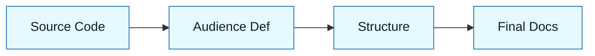

# Pattern: The Doc-Smith

:::info[Value Proposition]
Use this pattern to generate accurate, maintainable documentation from code. It prevents the "docs drift" where documentation lags behind reality.
:::

## Overview

AI is excellent at explaining code, but it tends to be verbose and salesy.

**Goal**: Create concise, technical documentation that matches the code exactly.
**Anti-pattern**: "Write docs for this." (Result: Marketing fluff).

---

## When to Use

| ✅ Use This Pattern When...    | 🚫 Do Not Use When...         |
| :----------------------------- | :---------------------------- |
| Documenting a new API endpoint | Writing a marketing blog post |
| Creating a README for a tool   | Writing a legal disclaimer    |
| Explaining a complex regex     | Documenting unwritten code    |

---

## Prerequisites

:::warning[Before you start]
The code must be stable. Do not document code that is about to change.
:::

- **Input**: The actual source code files.
- **Style Guide**: A brief definition of tone (e.g., "Terse, professional").

---

## The Pattern (Step-by-Step)

### Step 1: Context Injection

Feed the code to the model.

> "Read `src/utils/auth.ts`. Do not summarize it yet."

### Step 2: Define the Audience

Tell the AI who is reading.

> "You are writing for a Senior DevOps Engineer. Assume they know what OAuth is. Do not explain basic concepts."

### Step 3: The Structure First

Ask for the Table of Contents.

> "Propose a structure for the README. It must include: Overview, Configuration, and Troubleshooting."

### Step 4: Generation

> "Write the content. Use code blocks for examples. Keep paragraphs under 3 sentences."



---

## Common Pitfalls

| Pitfall                   | Impact                                 | Correction                                          |
| :------------------------ | :------------------------------------- | :-------------------------------------------------- |
| **Hallucinated Features** | Docs describe features you don't have. | Explicitly say "Only document what is in the code." |
| **Marketing Tone**        | "This amazing tool..."                 | Add constraint: "No hype. No adjectives."           |

:::tip[Pro Tip]
Ask the AI to generate a "Troubleshooting" section based on the error handling logic it sees in the code.
:::

### Practical Example: Generating API Documentation for a `auth.ts` Module

**Objective**: Generate clear, concise technical documentation for a TypeScript authentication utility module.

**Sample Code (`src/utils/auth.ts`):**

```typescript
// src/utils/auth.ts
import jwt from 'jsonwebtoken';
import bcrypt from 'bcryptjs';

const JWT_SECRET = process.env.JWT_SECRET || 'supersecretjwtkey';
const BCRYPT_SALT_ROUNDS = 10;

/**
 * Hashes a plain-text password using bcrypt.
 * @param password - The plain-text password to hash.
 * @returns A promise that resolves to the hashed password string.
 */
export async function hashPassword(password: string): Promise<string> {
  const salt = await bcrypt.genSalt(BCRYPT_SALT_ROUNDS);
  return bcrypt.hash(password, salt);
}

/**
 * Compares a plain-text password with a hashed password.
 * @param password - The plain-text password.
 * @param hashedPassword - The hashed password to compare against.
 * @returns A promise that resolves to true if passwords match, false otherwise.
 */
export async function comparePassword(password: string, hashedPassword: string): Promise<boolean> {
  return bcrypt.compare(password, hashedPassword);
}

/**
 * Generates a JSON Web Token (JWT) for a given user ID.
 * @param userId - The ID of the user.
 * @returns A signed JWT string.
 */
export function generateToken(userId: string): string {
  return jwt.sign({ userId }, JWT_SECRET, { expiresIn: '1h' });
}

/**
 * Verifies a JWT token and returns the decoded payload.
 * @param token - The JWT token string.
 * @returns The decoded token payload if valid, otherwise throws an error.
 * @throws {JsonWebTokenError} If the token is invalid or expired.
 */
export function verifyToken(token: string): { userId: string } {
  return jwt.verify(token, JWT_SECRET) as { userId: string };
}
```

**AI Prompt Following "The Doc-Smith" Pattern:**

```markdown
"Given the TypeScript file `src/utils/auth.ts`:

1.  **Context Injection**: Read the entire file content.
2.  **Define the Audience**: Generate documentation for a backend developer who is integrating this module. Assume familiarity with basic security concepts like hashing and JWTs.
3.  **The Structure First**: Propose a README-like structure. It must include:
    -   Overview
    -   Installation (brief, assumes npm/yarn)
    -   Usage (for each exported function)
    -   Configuration (JWT_SECRET, BCRYPT_SALT_ROUNDS)
    -   Error Handling
4.  **Generation**: Write the content for each section. Keep it concise, professional, and directly derived from the code. Use TypeScript code blocks for usage examples. Ensure `JWT_SECRET` is mentioned as an environment variable. Do not include any marketing fluff or superlatives.
"
```

**Expected AI-Generated Documentation (Example):**

```markdown
# `auth.ts` Module Documentation

## Overview

This module provides utility functions for user authentication, including password hashing, comparison, and JSON Web Token (JWT) generation and verification.

## Installation

This module is part of a Node.js project. Ensure `bcryptjs` and `jsonwebtoken` are installed as dependencies.

```bash
npm install bcryptjs jsonwebtoken
# or
yarn add bcryptjs jsonwebtoken
```

## Usage

### `hashPassword(password: string): Promise<string>`

Hashes a plain-text password using `bcrypt`.

```typescript
import { hashPassword } from './src/utils/auth';

async function registerUser(plainTextPassword: string) {
  const hashedPassword = await hashPassword(plainTextPassword);
  console.log('Hashed Password:', hashedPassword);
  // Store hashedPassword in database
}
```

### `comparePassword(password: string, hashedPassword: string): Promise<boolean>`

Compar es a plain-text password with a hashed password.

```typescript
import { comparePassword } from './src/utils/auth';

async function loginUser(plainTextPassword: string, storedHashedPassword: string) {
  const isMatch = await comparePassword(plainTextPassword, storedHashedPassword);
  if (isMatch) {
    console.log('Passwords match!');
  } else {
    console.log('Passwords do not match.');
  }
}
```

### `generateToken(userId: string): string`

Generates a signed JSON Web Token (JWT) for a given user ID. The token expires in 1 hour.

```typescript
import { generateToken } from './src/utils/auth';

const userId = 'some-user-id-123';
const token = generateToken(userId);
console.log('Generated JWT:', token);
```

### `verifyToken(token: string): { userId: string }`

Verifies a JWT token and returns the decoded payload.

```typescript
import { verifyToken } from './src/utils/auth';

const token = 'your.jwt.token.here';
try {
  const decoded = verifyToken(token);
  console.log('Decoded User ID:', decoded.userId);
} catch (error) {
  console.error('Token verification failed:', error.message);
  // Handle JsonWebTokenError (e.g., TokenExpiredError, JsonWebTokenError)
}
```

## Configuration

-   `JWT_SECRET`: The secret key used for signing and verifying JWTs. This **must** be set as an environment variable (`process.env.JWT_SECRET`). A default value is used if not provided, which is **not recommended for production**.
-   `BCRYPT_SALT_ROUNDS`: The number of salt rounds for bcrypt hashing. Currently set to `10`.

## Error Handling

-   `verifyToken` will throw a `JsonWebTokenError` if the provided token is invalid (e.g., malformed, expired, invalid signature). Callers should wrap `verifyToken` in a `try-catch` block to handle these errors.
```