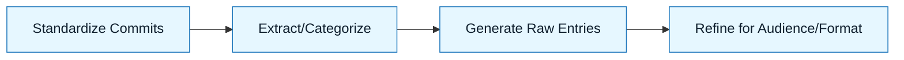

# Pattern: Release and Changelog

:::info[Value Proposition]
Use this pattern to automate the generation of release notes and changelogs, ensuring consistent, accurate, and timely communication about software changes. AI can parse commit messages, identify feature types, and synthesize concise summaries for various audiences.
:::

## Overview

Releasing software and communicating changes effectively are crucial for user adoption and team alignment. Manually compiling changelogs is tedious and error-prone. This pattern leverages AI to process structured commit messages or feature flags, generating release artifacts that cater to different stakeholders (e.g., developers, product managers, end-users), thereby streamlining the release process.

**Goal**: Automatically generate clear, categorized release notes and changelogs.
**Anti-pattern**: Manually writing release notes at the last minute, leading to omissions, inconsistencies, and delays.

---

## When to Use

| ✅ Use This Pattern When...           | 🚫 Do Not Use When...                     |
| :------------------------------------ | :---------------------------------------- |
| Frequent software releases            | The project has no version control or structured commit messages |
| Managing multiple product lines or modules | Releases are extremely infrequent and changes are minimal |
| Needing tailored release notes for different audiences | The team prefers entirely manual, ad-hoc release communication |

---

## Prerequisites

:::warning[Before you start]
You must have a disciplined approach to commit messages (e.g., Conventional Commits) or a system for tagging features/bugs.
:::

- **Artifacts**: Structured Git commit history, feature flags (optional). Constraint Spec (release note format, categorization rules, desired tone for different audiences).
- **Context**: Understanding of the project's versioning strategy (e.g., SemVer) and release cadence.

---

## The Pattern (Step-by-Step)

### Step 1: Standardize Commit Messages

Enforce a clear standard for Git commit messages. This is the primary input for AI.

> **Practical Insight**: Adopt Conventional Commits (e.g., `feat: add user authentication`, `fix: correct typo in README`). This provides structured data that AI can easily parse.

### Step 2: Extract Relevant Commits

Use AI or a script to filter and categorize commit messages relevant to the current release scope.

> "From the Git log between `v1.2.0` and `HEAD`, identify commits of type `feat`, `fix`, and `chore`. Group them by type."

### Step 3: Generate Raw Changelog Entries

For each categorized commit, ask the AI to summarize its impact into a concise changelog entry.

> "For each commit message of type `feat`, generate a one-sentence user-facing description. Example: `feat: add user profile page` -> `Added: User profile page to view and edit personal information.`"

### Step 4: Refine for Audience and Format

Transform the raw entries into a polished changelog or release note document, adhering to specific formatting and tone requirements for different target audiences.

> "Compile a release note for developers, listing all `feat`, `fix`, `refactor` commits with their original message. Then, generate a separate, high-level marketing-friendly release announcement for end-users, focusing on benefits rather than technical details."



### Practical Example: Generating a Changelog from Conventional Commits

**Objective**: Automatically generate a `CHANGELOG.md` entry for a new version using Conventional Commits.

**Task Definition for AI:**

1.  **Input Commit Messages:**
    ```
    feat: add user registration endpoint
    fix(auth): correct password comparison logic
    docs: update API documentation for /users
    chore: update dependencies
    feat: implement dark mode toggle
    fix: resolve critical login redirect bug
    refactor(UI): improve button styling
    ```

2.  **Prompt to AI:**

    ```markdown
    "Generate a changelog entry for version `1.0.0` from the following Conventional Commit messages. Categorize changes into 'Features', 'Bug Fixes', 'Documentation', and 'Refactorings'. Ignore 'chore' commits for the changelog.

    **Commit Messages:**
    ```
    feat: add user registration endpoint
    fix(auth): correct password comparison logic
    docs: update API documentation for /users
    chore: update dependencies
    feat: implement dark mode toggle
    fix: resolve critical login redirect bug
    refactor(UI): improve button styling
    ```

    **Desired Output Format:**
    ```markdown
    ## 1.0.0 (YYYY-MM-DD)

    ### Features

    *   ...
    ### Bug Fixes

    *   ...
    ### Documentation

    *   ...
    ### Refactorings

    *   ...
    ```
    "
    ```

3.  **Expected AI-Generated Changelog Entry (Example):**

    ```markdown
    ## 1.0.0 (2025-12-28)

    ### Features

    *   Added user registration endpoint.
    *   Implemented dark mode toggle.

    ### Bug Fixes

    *   (auth): Corrected password comparison logic.
    *   Resolved critical login redirect bug.

    ### Documentation

    *   Updated API documentation for `/users` endpoint.

    ### Refactorings

    *   (UI): Improved button styling.
    ```

---

## Common Pitfalls

| Pitfall                       | Impact                                   | Correction                                     |
| :---------------------------- | :--------------------------------------- | :--------------------------------------------- |
| **Inconsistent Commit Messages** | AI struggles to parse and categorize changes. | Enforce a strict commit message guideline (e.g., Conventional Commits) via Git hooks or CI checks. |
| **Over-reliance on AI for Semantic Versioning** | AI may misinterpret impact and suggest incorrect version bumps. | Human oversight is critical for determining semantic versioning (major, minor, patch). |
| **Lack of Customization**     | Generic changelogs don't meet specific audience needs. | Provide detailed instructions for tone, level of detail, and categorization for each target audience. |

:::danger[Critical Risk]
Always manually verify AI-generated release notes for accuracy and completeness before public distribution. Ensure no sensitive information or internal details are accidentally exposed.
:::
