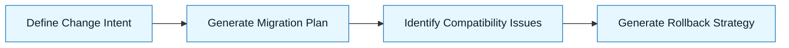

# Pattern: Migrations and Upgrades

:::info[Value Proposition]
Use this pattern to manage database schema changes, data transformations, or dependency upgrades systematically. AI can assist in generating migration scripts, identifying compatibility issues, and suggesting upgrade paths, reducing downtime and data loss risks.
:::

## Overview

Software systems evolve, and with them, their underlying data structures and dependencies. Migrations and upgrades are often complex, requiring careful planning to avoid breaking changes or data corruption. This pattern guides the use of AI to generate, analyze, and validate migration scripts, making the process more predictable and less error-prone.

**Goal**: Execute controlled, safe changes to database schemas or software dependencies.
**Anti-pattern**: Manually altering production databases or performing "big-bang" upgrades without thorough testing.

---

## When to Use

| ✅ Use This Pattern When...           | 🚫 Do Not Use When...                     |
| :------------------------------------ | :---------------------------------------- |
| Changing database schema (DDL)        | You are performing simple data entry or deletion |
| Transforming data (DML)               | The system is offline for an extended period anyway |
| Upgrading major versions of frameworks/libraries | The change is purely cosmetic and has no functional impact |

---

## Prerequisites

:::warning[Before you start]
You must have a robust backup strategy and a testing environment that mirrors production.
:::

- **Artifacts**: Current schema, desired new schema or data transformation rules. Constraint Spec (database type, migration tool, acceptable downtime, rollback strategy).
- **Context**: Deep understanding of data dependencies, application behavior, and potential impact on downstream systems.

---

## The Pattern (Step-by-Step)

### Step 1: Define Change Intent

Clearly articulate the desired change: what needs to be added, modified, or removed, and how data should be transformed.

> **Practical Insight**: Describe the change in business terms first, then translate to technical terms. "We need to add a `shipping_address` field to the `orders` table, and populate it from the `user_addresses` table for existing orders where applicable."

### Step 2: Generate Migration Plan

Ask the AI to propose a step-by-step migration plan, including both schema changes (DDL) and data changes (DML), and consider forward/backward compatibility.

> "Given the current `orders` table and the new requirement for `shipping_address`, generate a Flyway migration script for PostgreSQL that adds the column and populates it from `user_addresses`. Ensure the column is nullable initially and becomes NOT NULL after population."

### Step 3: Identify Compatibility Issues

Prompt the AI to analyze the proposed changes against existing code or data for potential breaking changes or performance regressions.

> "Review the generated migration script. Will this migration impact existing application queries to the `orders` table? Are there any potential deadlocks during data population? Suggest ways to mitigate these."

### Step 4: Generate Rollback Strategy

For critical migrations, ask the AI to generate a corresponding rollback script.

> "Generate a rollback script for the `orders` table migration. This script should safely revert the schema change and data modification, assuming the application has not yet started using the new column."



### Practical Example: Database Schema Migration (PostgreSQL)

**Objective**: Add a new `last_login` timestamp column to the `users` table and populate it.

**Task Definition for AI:**

1.  **Initial Prompt (Current State & Desired Change):**
    ```markdown
    "I have an existing `users` table in PostgreSQL:
    ```sql
    CREATE TABLE users (
        id UUID PRIMARY KEY DEFAULT gen_random_uuid(),
        username VARCHAR(255) UNIQUE NOT NULL,
        email VARCHAR(255) UNIQUE NOT NULL,
        password_hash VARCHAR(255) NOT NULL,
        created_at TIMESTAMP WITH TIME ZONE DEFAULT NOW()
    );
    ```
    "I need to add a new column `last_login` of type `TIMESTAMP WITH TIME ZONE` to this table. This column should be nullable initially. After adding, I need to set its value to `created_at` for all existing users. Then, it should be updated to be `NOT NULL` with a default of `NOW()`. Finally, the application will update this field on subsequent logins.

    Generate the Flyway migration scripts (one for adding and populating, another for making it NOT NULL and setting default) and a corresponding rollback script.
    "
    ```

2.  **Expected AI-Generated Flyway Migration Scripts (Example):**

    ```sql
    -- V1__add_last_login_to_users_table.sql
    ALTER TABLE users ADD COLUMN last_login TIMESTAMP WITH TIME ZONE;

    -- Populate for existing users
    UPDATE users SET last_login = created_at WHERE last_login IS NULL;
    ```

    ```sql
    -- V2__make_last_login_not_null.sql
    ALTER TABLE users ALTER COLUMN last_login SET NOT NULL;
    ALTER TABLE users ALTER COLUMN last_login SET DEFAULT NOW();
    ```

3.  **Expected AI-Generated Rollback Scripts (Example):**

    ```sql
    -- U2__make_last_login_not_null.sql (Rollback for V2)
    ALTER TABLE users ALTER COLUMN last_login DROP DEFAULT;
    ALTER TABLE users ALTER COLUMN last_login DROP NOT NULL;
    ```

    ```sql
    -- U1__add_last_login_to_users_table.sql (Rollback for V1)
    ALTER TABLE users DROP COLUMN last_login;
    ```

---

## Common Pitfalls

| Pitfall                       | Impact                                   | Correction                                     |
| :---------------------------- | :--------------------------------------- | :--------------------------------------------- |
| **Directly Modifying Production** | High risk of data loss or application downtime. | Always test migrations in a staging environment; use automated migration tools. |
| **Lack of Rollback Strategy** | Unable to recover from failed migrations. | Always plan and, if possible, test rollback procedures. |
| **Ignoring Application Impact** | Migrations break application logic.       | Analyze code dependencies on the affected schema; communicate changes to development teams. |

:::danger[Critical Risk]
Never run AI-generated migration scripts directly on a production database without thorough review, testing in a non-production environment, and a verified backup. Data loss can be irreversible.
:::
