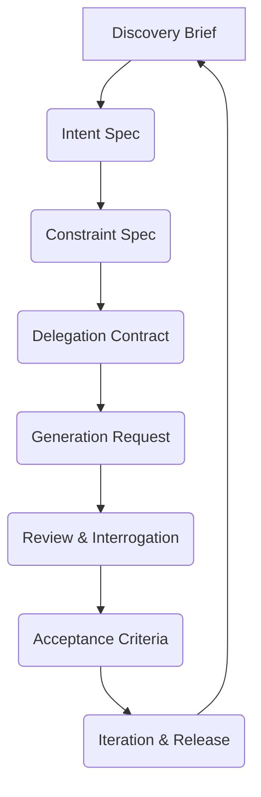

# GenAI & LLM Documentation Loop: Normative Process Model

:::info[Value Proposition]
Define the required GenAI & LLM Documentation workflow so teams can adopt it consistently. This ensures repeatable, auditable execution from problem definition to acceptance.
:::

## Overview

The GenAI & LLM Documentation Loop is an 8-step iterative process designed to make AI-assisted work predictable and accountable. Each step focuses on producing a specific, reviewable artifact. This document outlines the normative requirements for each stage of the loop.

**Goal**: Standardize the workflow for using GenAI and LLMs in professional software development.
**Anti-pattern**: Ad-hoc prompting and review, leading to inconsistent quality and unpredictable outcomes.

---

## When to Use

| ✅ Use This Pattern When...           | 🚫 Do Not Use When...                     |
| :------------------------------------ | :---------------------------------------- |
| Structuring any AI-assisted development task | You are only experimenting and learning basic prompt engineering |
| Ensuring team consistency in AI adoption | The task is purely informational and has no measurable outcome |
| Building auditable AI-driven workflows | The work requires highly subjective or creative output without objective criteria |

---

## Prerequisites

:::warning[Before you start]
A basic understanding of the GenAI & LLM Documentation core skills (Logic, Language, Systems, Sentences) is highly recommended.
:::

- **Artifacts**: Understanding of the core GenAI & LLM Documentation artifacts (Intent Spec, Constraint Spec, Delegation Contract, etc.).
- **Context**: Awareness of your organization's compliance and governance requirements.

---

## The GenAI & LLM Documentation Loop (8 Steps)

Each step has a clear input, output, and purpose.

### 1. Discovery Brief

-   **Purpose**: Clarify the problem space without prescribing solutions.
-   **Input**: High-level problem statement, business need.
-   **Output**: Discovery Brief artifact (`discovery-brief-template.md`).

### 2. Intent Spec

-   **Purpose**: Define the desired outcome and success criteria.
-   **Input**: Discovery Brief.
-   **Output**: Intent Spec artifact (`intent-spec-template.md`).

### 3. Constraint Spec

-   **Purpose**: Encode non-negotiable boundaries, technical requirements, and guardrails.
-   **Input**: Intent Spec.
-   **Output**: Constraint Spec artifact (`constraint-spec-template.md`).

### 4. Delegation Contract

-   **Purpose**: Define what the AI is allowed (and not allowed) to do.
-   **Input**: Intent Spec, Constraint Spec.
-   **Output**: Delegation Contract artifact (`delegation-contract-template.md`).

### 5. Generation Request

-   **Purpose**: Formulate a precise, structured prompt to the AI.
-   **Input**: Intent Spec, Constraint Spec, Delegation Contract.
-   **Output**: Generation Request artifact (`generation-request-template.md`), AI draft output.

### 6. Review and Interrogation

-   **Purpose**: Systematically verify AI output against specifications.
-   **Input**: AI draft output, Intent Spec, Constraint Spec.
-   **Output**: Review findings, potential revisions for AI.

### 7. Acceptance Criteria

-   **Purpose**: Define objective conditions for accepting the AI's work.
-   **Input**: Review findings.
-   **Output**: Acceptance Criteria artifact (`acceptance-criteria-template.md`).

### 8. Iteration and Release

-   **Purpose**: Incorporate feedback, iterate on the loop, and release accepted artifacts.
-   **Input**: Accepted artifact, new requirements/feedback.
-   **Output**: Released artifact, updated templates/patterns.

---

## Normative Requirements for Conformance

To claim adherence to the GenAI & LLM Documentation Standard, a workflow **MUST** demonstrate:

1.  **Explicit Intent**: Work **MUST** begin with a clear, documented Intent Spec.
2.  **Explicit Constraints**: All non-negotiable technical, security, and operational boundaries **MUST** be documented in a Constraint Spec.
3.  **Controlled Delegation**: The scope of AI's actions **MUST** be defined and limited by a Delegation Contract.
4.  **Evidence-Based Review**: All AI-generated outputs **MUST** be systematically reviewed, and verification evidence **MUST** be produced.
5.  **Human Accountability**: A human **MUST** explicitly accept the work, taking full accountability for its outcomes.

---

## Key Principles

-   **Human in Command**: AI is a tool; humans retain full accountability.
-   **Transparency**: Every decision and step should be auditable.
-   **Evidence-Driven**: Reliance on measurable facts, not assumptions.
-   **Iterative Improvement**: The loop is designed for continuous learning and refinement.

---

## Last Reviewed / Last Updated

- Last reviewed: 2025-12-28
- Version: 0.1.0