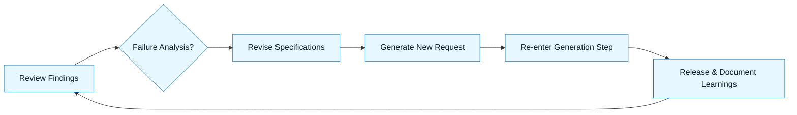

# Iteration and Release

:::info[Value Proposition]
Integrate feedback, iterate on AI-generated outputs, and systematically release accepted artifacts. This step emphasizes continuous improvement of both the AI-assisted work and the GenAI & LLM Documentation process itself, ensuring lessons learned are fed back into the loop.
:::

## Overview

The GenAI & LLM Documentation Loop is rarely a straight line. You will hit the **Acceptance** gate and fail. Failure is a data point, not a dead end. How you react to failure determines whether you are practicing GenAI & LLM Documentation or just "chatting with a bot." This final stage focuses on learning from those failures, iterating on your specifications (not just the AI's output), and ultimately releasing high-quality, verified artifacts.

**Goal**: Successfully release AI-assisted work, learn from failures, and continuously improve the GenAI & LLM Documentation process.
**Anti-pattern**: Blindly regenerating AI output after a failure without analyzing why the previous attempt failed, or releasing unverified outputs.

---

## When to Use

| ✅ Use This Pattern When...           | 🚫 Do Not Use When...                     |
| :------------------------------------ | :---------------------------------------- |
| An AI-generated artifact fails acceptance criteria | You have no Acceptance Criteria defined   |
| Incorporating feedback on AI outputs  | You are releasing an artifact without any prior review or testing |
| Preparing AI-assisted work for deployment | The failure is purely due to a technical bug in the AI tool itself (report it) |

---

## Prerequisites

:::warning[Before you start]
A clear understanding of the **Review & Interrogation** and **Acceptance Criteria** stages is essential.
:::

-   **Artifacts**: AI-generated output, Review Findings, Acceptance Criteria.
-   **Context**: Tools for version control, CI/CD, and monitoring.

---

## The Pattern (Step-by-Step)

### Step 1: Analyze Review Findings

If an artifact fails acceptance, identify the root cause of the failure. Was it due to a flawed Intent Spec, a missing Constraint, a poor Generation Request, or an AI hallucination?

> **Practical Insight**: This is where you apply "Debug with Evidence" to your own GenAI & LLM Documentation process.

### Step 2: Revise Specifications (Not Just AI Output)

Update the Intent Spec, Constraint Spec, or Delegation Contract based on the analysis. Do not just tweak the AI's prompt without addressing the underlying specification flaw.

> "The previous Constraint Spec didn't explicitly forbid external API calls. I need to add that prohibition."

### Step 3: Iterate (Re-enter the Loop)

With revised specifications, generate a new Generation Request and re-enter the GenAI & LLM Documentation Loop from Step 5 (Generation).

> "Re-generate the component using the updated Constraint Spec."

### Step 4: Release and Document Learnings

Once an artifact passes acceptance criteria, integrate it into the codebase and deploy. Document any significant learnings, new patterns, or updates to existing templates.

> "The `UserProfile` component has passed all acceptance criteria and is ready for merge. Learning: always add accessibility requirements to the Constraint Spec."

---

## Practical Example: Iterating on a Flawed API Endpoint Generation

**Objective**: An AI-generated API endpoint failed acceptance due to a security vulnerability.

**Scenario**:
1.  **Generation Request**: Prompted AI to create a user profile endpoint.
2.  **AI Output**: Generated code for `/api/users/{id}`.
3.  **Review & Interrogation**: Identified that the endpoint exposed sensitive user data (password hash) in the response.
4.  **Acceptance Criteria**: Failed (violated security constraint).

**Iteration Steps:**

1.  **Analyze Review Findings**: The failure was due to an insufficiently strict Constraint Spec regarding data exposure. The Intent Spec only said "public profile info," which the AI interpreted broadly.

2.  **Revise Specifications**:
    -   **Update Intent Spec**: Clarify "public profile info" to explicitly list allowed fields (e.g., "username, email, avatarUrl").
    -   **Update Constraint Spec**: Add an explicit prohibition: "The API response for `/api/users/{id}` **MUST NOT** include `password_hash`, `api_key`, or any other sensitive internal fields."

3.  **Iterate (Re-enter Generation Step)**:
    -   **Generation Request**: "Re-generate the Express.js router and controller code for the `/api/users/{id}` endpoint based on the attached **updated** Intent Spec and Constraint Spec."

4.  **Release and Document Learnings**:
    -   After successful re-generation, review, and acceptance, the endpoint is deployed.
    -   **Learning**: Added a new "Security: Data Exposure" checklist item to the Constraint Spec template to prevent future occurrences.

---

## Common Pitfalls

| Pitfall                   | Impact                                   | Correction                                     |
| :------------------------ | :--------------------------------------- | :--------------------------------------------- |
| **Fixing AI Output Directly** | Ignoring the root cause (flawed spec), leading to recurring issues. | Always revise the *specifications* first, then regenerate. |
| **Skipping Review/Acceptance** | Releasing flawed AI-generated code.      | Every artifact, every iteration, must pass review and acceptance. |
| **Failing to Document Learnings** | Repeating the same mistakes in future AI-assisted tasks. | Maintain an iteration log and update patterns/templates with new insights. |

---

## Last Reviewed / Last Updated

- Last reviewed: 2025-12-28
- Version: 0.1.0