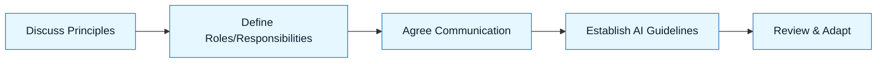

# Working Agreements for Teams

:::info[Value Proposition]
Establish clear, shared rules for how a team will collaborate with AI. These agreements foster a culture of accountability, trust, and effective AI integration, preventing friction and maximizing the benefits of GenAI & LLM Documentation.
:::

## Overview

Integrating AI into a team's workflow isn't just a technical challenge; it's a cultural one. Without explicit agreements, individuals may develop inconsistent practices, leading to misunderstandings, duplicated effort, and a breakdown in trust. This document provides a template for creating working agreements tailored to GenAI & LLM Documentation, ensuring everyone on the team operates with a shared understanding of roles, responsibilities, and best practices.

**Goal**: Define clear team expectations for AI-assisted work, promoting consistency and collaboration.
**Anti-pattern**: Each team member developing their own ad-hoc AI workflow, leading to siloed knowledge and unpredictable outcomes.

---

## When to Use

| ✅ Use This Pattern When...           | 🚫 Do Not Use When...                     |
| :------------------------------------ | :---------------------------------------- |
| Onboarding new team members to AI-assisted workflows | You are a solo developer (though some principles still apply) |
| Starting a new project with AI integration | The team has already established and consistently follows GenAI & LLM Documentation practices |
| Diagnosing team-wide inefficiencies in AI-assisted work | The issues are purely technical and not related to workflow or collaboration |

---

## Prerequisites

:::warning[Before you start]
Team members should have a basic understanding of the GenAI & LLM Documentation Loop and core artifacts.
:::

-   **Artifacts**: Basic understanding of team roles and existing collaboration tools.
-   **Context**: A willingness from all team members to openly discuss and agree upon new ways of working.

---

## The Pattern (Step-by-Step)

### Step 1: Discuss Core Principles

Facilitate a discussion on the foundational principles of GenAI & LLM Documentation: Human in Command, Transparency, Evidence-Driven. Ensure everyone understands and agrees.

> **Practical Insight**: Start with "Why are we doing this?" Frame AI as a tool to amplify human capability, not replace it.

### Step 2: Define Roles and Responsibilities for AI-Assisted Tasks

Clarify who is responsible for each step of the GenAI & LLM Documentation Loop. Who writes the Intent Spec? Who reviews? Who accepts?

> "The Product Manager is responsible for the Intent Spec. The Engineer is responsible for the Constraint Spec and Generation Request. Code Owners are responsible for Review and Acceptance."

### Step 3: Agree on Communication and Collaboration Standards

How will AI-assisted work be communicated? Where will artifacts live? How will feedback be given?

> "All Intent Specs and Constraint Specs will be documented in Markdown files linked from the project's documentation. AI-generated code will always be submitted as a pull request for human review."

### Step 4: Establish Guidelines for AI Interaction

Set expectations for how team members interact with AI tools.

> "All prompts for code generation **MUST** include references to an Intent Spec and Constraint Spec. AI-generated responses **MUST** be treated as drafts, not final solutions."

### Step 5: Regular Review and Adaptation

Periodically review the working agreements and adapt them based on team experience and new learnings.

> "We will review these working agreements monthly in our team retrospective to discuss what's working and what needs adjustment."



---

## Practical Example: Working Agreements for a Development Team

**Objective**: Establish working agreements for a development team integrating GenAI into their daily workflow.

**Agreements:**

```markdown
**1. Human Accountability is Paramount:**
-   **We agree that** the human developer is always fully accountable for any code, documentation, or design produced with AI assistance.
-   **We will not** blame the AI for errors or sub-optimal outputs. We own the outcome.

**2. Intent and Constraints First:**
-   **We agree that** every AI-assisted task will start with a clear Intent Spec and Constraint Spec.
-   **We will not** ask the AI to generate code or docs without first defining _what_ we want (Intent) and _how_ it must behave (Constraints).

**3. AI Outputs are Drafts:**
-   **We agree that** all AI-generated code and documentation are considered drafts and require human review.
-   **We will not** commit AI-generated code directly to `main` without thorough testing and peer review.

**4. Evidence-Based Review:**
-   **We agree that** review of AI-generated artifacts will be evidence-based, using tests, diffs, and explicit acceptance criteria.
-   **We will not** accept AI output based on a "gut feeling" or because it "looks good."

**5. Continuous Learning and Sharing:**
-   **We agree to** share successful prompts, patterns, and learnings related to AI-assisted development.
-   **We will actively** contribute new patterns, scenarios, and templates to our GenAI & LLM Documentation repository.

**6. Feedback Loop:**
-   **We agree to** provide constructive feedback on AI outputs and the clarity of our own prompts. This feedback will be used to refine our specs and improve future AI interactions.
-   **We will use** our team retrospectives to discuss our GenAI & LLM Documentation practices and identify areas for improvement.
```

---

## Common Pitfalls

| Pitfall                   | Impact                                   | Correction                                     |
| :------------------------ | :--------------------------------------- | :--------------------------------------------- |
| **Lack of Buy-in**        | Agreements are ignored, inconsistent practices persist. | Involve the entire team in creating and refining agreements; ensure leadership support. |
| **Agreements are Static** | Practices become outdated, new friction emerges. | Regularly review and adapt agreements based on experience and evolving AI capabilities. |
| **Focusing Only on Rules**| Agreements feel restrictive, stifling innovation. | Balance rules with principles that encourage safe experimentation and learning. |

---

## Last Reviewed / Last Updated

- Last reviewed: 2025-12-28
- Version: 0.1.0