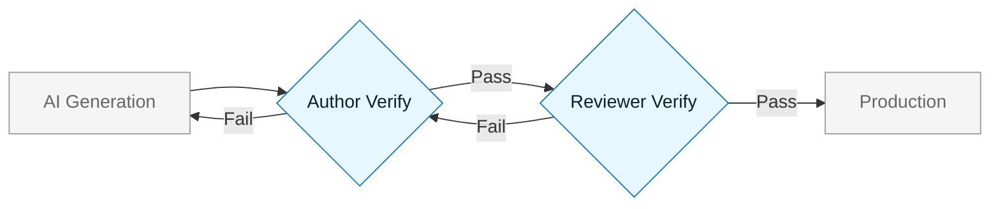

# Accountability Model

:::info[Core Principle]
AI is a tool, not a colleague. It cannot be fired, sued, or held responsible. Therefore, a human must own every output.
:::

## Overview

Speed is dangerous without ownership. As we adopt AI, we must clarify who is responsible for the code, text, and decisions it generates.

This document defines the **Chain of Accountability**.

---

## The Roles

### 1. The Author (The Prompter)

The person who initiated the AI generation.

- **Responsibility**: 100%.
- **Duty**: You must read, understand, and verify every line the AI generates.
- **Rule**: "The AI wrote it" is not a valid excuse for bugs or security holes.

### 2. The Reviewer

The person reviewing the Pull Request or document.

- **Responsibility**: Gatekeeper.
- **Duty**: Treat AI-generated code with _higher_ skepticism than human code.
- **Rule**: If the Author cannot explain the code, the Reviewer must reject it.

### 3. The Platform Owner

The team managing the AI tooling (e.g., DevEx, Security).

- **Responsibility**: Guardrails.
- **Duty**: Ensure tools default to safety (e.g., data privacy settings are on).

---

## The Accountability Matrix (RACI)

| Activity                | Author      | Reviewer    | AI Model                | Platform Team |
| :---------------------- | :---------- | :---------- | :---------------------- | :------------ |
| **Drafting Code**       | Accountable | Consulted   | Responsible (Execution) | Informed      |
| **Verifying Logic**     | Accountable | Responsible | -                       | -             |
| **Security Check**      | Accountable | Responsible | -                       | Consulted     |
| **Production Incident** | Accountable | Informed    | -                       | Informed      |

:::warning[Note]
The AI Model is never "Accountable." It is only a mechanism for execution.
:::

---

## Visual: The Human Firewall

The Author and Reviewer act as a double firewall. Unverified AI code should never reach Production.

---

## Last Reviewed / Last Updated

- Last reviewed: 2025-12-20
- Version: 0.1.0
