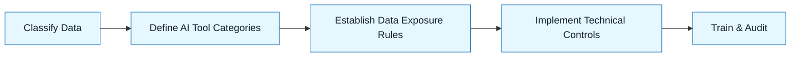

# Data Boundaries

:::info[Value Proposition]
Explicitly define what data types can (and cannot) be exposed to AI tools. This guardrail is critical for protecting sensitive information, ensuring compliance with data privacy regulations, and preventing data leakage in AI-assisted workflows.
:::

## Overview

In the rush to integrate AI, the temptation to feed it all available data for "better context" is strong. However, this often violates data privacy principles, exposes sensitive information, and creates compliance risks. The Data Boundaries guardrail mandates a strict, intentional approach to data exposure for AI. It requires categorizing data sensitivity and defining clear rules for which categories can interact with which AI tools under what conditions.

**Goal**: Prevent unauthorized access, processing, or leakage of sensitive data via AI tools.
**Anti-pattern**: Copy-pasting production data or proprietary code into public LLMs without careful sanitization.

---

## When to Use

| ✅ Use This Pattern When...           | 🚫 Do Not Use When...                     |
| :------------------------------------ | :---------------------------------------- |
| Working with PII, PHI, or other sensitive data | The data is entirely public and non-sensitive |
| Ensuring compliance with regulations (GDPR, HIPAA) | The AI tool is operating in a fully isolated, air-gapped environment |
| Preventing intellectual property leakage | The AI task is purely theoretical and involves no actual data processing |

---

## Prerequisites

:::warning[Before you start]
You must have a clear understanding of your organization's data classification policies and legal obligations regarding data privacy.
:::

-   **Artifacts**: Data Classification Policy.
-   **Context**: Knowledge of the specific AI tools being used and their data handling policies.

---

## The Pattern (Step-by-Step)

### Step 1: Classify Your Data

Categorize all data that might interact with AI tools based on its sensitivity (e.g., Public, Internal, Confidential, Restricted).

> **Practical Insight**: Align with your organization's existing data classification scheme. If none exists, define one.

### Step 2: Define AI Tool Categories

Classify your AI tools based on their data handling and processing environment (e.g., Public Cloud LLM, Private Cloud LLM, Local LLM, Fine-tuned Model).

> "Public Cloud LLMs (ChatGPT, Claude) are 'Red Zone' tools. Our internal private cloud LLM is a 'Yellow Zone' tool. Our local Ollama instance is a 'Green Zone' tool."

### Step 3: Establish Data Exposure Rules

For each data category, define which AI tool categories it is permitted to interact with.

> "Restricted data **MUST NEVER** be exposed to Public Cloud LLMs. Confidential data **MAY** be exposed to Private Cloud LLMs after anonymization."

### Step 4: Implement Technical Controls

Use technical measures to enforce data boundaries (e.g., data anonymization, local inference, API proxies).

> "Implement an API gateway that redacts PII from requests before forwarding them to Public Cloud LLMs."

### Step 5: Train and Audit

Educate users on data boundaries and regularly audit AI usage to ensure compliance.

> "Conduct mandatory training for all developers on data boundary policies. Implement logging for all AI API calls and review for policy violations."



---

## Practical Example: Data Boundary Rules for a Codebase

**Objective**: Define data boundary rules for AI assistance within a software development team.

**Data Classification:**
-   **Green Zone (Public/Non-sensitive)**: Open-source code, public documentation, anonymized code snippets.
-   **Yellow Zone (Internal/Proprietary)**: Internal business logic, proprietary algorithms, non-PII customer data models (e.g., schema definitions).
-   **Red Zone (Confidential/PII/PHI)**: Production PII, PHI, API keys, secrets, database connection strings.

**AI Tool Categories:**
-   **Public Cloud LLM**: ChatGPT, Claude, Gemini.
-   **Private Cloud LLM**: Organization's self-hosted LLM instance.
-   **Local LLM**: Ollama, Llama.cpp running on developer workstation.

**Data Exposure Rules:**

```markdown
**Green Zone Data:**
-   **Permitted**: Can be used with Public Cloud LLMs, Private Cloud LLMs, and Local LLMs.
-   **Recommendation**: No anonymization required.

**Yellow Zone Data:**
-   **Permitted**: Can be used with Private Cloud LLMs and Local LLMs.
-   **Prohibited**: **MUST NOT** be used with Public Cloud LLMs without explicit, case-by-case anonymization/sanitization and management approval.
-   **Recommendation**: Review and sanitize before using with Public Cloud LLMs.

**Red Zone Data:**
-   **Permitted**: Can **ONLY** be used with Local LLMs, and only if the LLM is running in a secure, isolated environment.
-   **Prohibited**: **MUST NEVER** be exposed to Public Cloud LLMs or Private Cloud LLMs.
-   **Recommendation**: Implement automated redaction/masking tools for local processing. Manual inspection required before any AI interaction.
```

---

## Common Pitfalls

| Pitfall                   | Impact                                   | Correction                                     |
| :------------------------ | :--------------------------------------- | :--------------------------------------------- |
| **Ambiguous Data Classification** | Confusion, accidental leakage.           | Establish clear, unambiguous data categories and policies. |
| **Lack of Enforcement**   | Policies are ignored in practice.        | Implement technical controls (DLP, network policies) and regular audits. |
| **Human Error**           | Developers inadvertently expose sensitive data. | Continuous training, awareness campaigns, and tooling that guides safe usage. |

:::danger[Critical Risk]
Data breaches due to AI interaction can have severe legal, financial, and reputational consequences. This guardrail is non-negotiable for professional environments.
:::