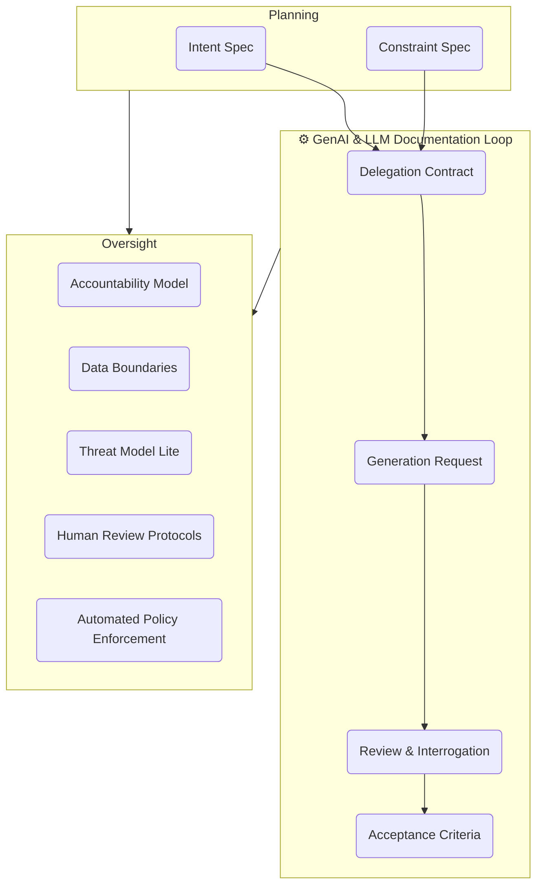

# Guardrails and Governance Index

:::info[Value Proposition]
Guardrails and Governance define the protective measures and policies necessary to ensure AI is used safely, ethically, and in compliance with organizational and regulatory standards. These are critical for managing the risks inherent in AI-assisted development.
:::

## Overview

In GenAI & LLM Documentation, we do not treat AI as a magic box. We treat it as a **junior employee with infinite speed and zero judgment**. Without proper guardrails and governance, this "junior employee" can inadvertently introduce significant risks, from security vulnerabilities and data leakage to compliance violations and brand damage. This section provides a framework for establishing the necessary controls to manage AI-assisted development effectively.

**Goal**: Establish clear policies, processes, and technical controls to ensure responsible and reliable AI integration.
**Anti-pattern**: Allowing ad-hoc AI usage without any oversight, leading to unpredictable risks and inconsistent quality.

---

## When to Use

| ✅ Use This Pattern When...           | 🚫 Do Not Use When...                     |
| :------------------------------------ | :---------------------------------------- |
| Integrating AI into any production workflow | You are purely experimenting in a sandboxed, isolated environment |
| Handling sensitive data with AI       | The AI functionality is purely passive (e.g., simple text summarization of public data) |
| Ensuring legal and ethical compliance for AI outputs | You want to delegate responsibility for safety and compliance solely to the AI tool provider |

---

## Prerequisites

:::warning[Before you start]
A clear understanding of your organization's risk appetite, compliance obligations, and ethical guidelines for AI use is essential.
:::

-   **Artifacts**: Organizational AI policies (if available).
-   **Context**: Awareness of the specific risks associated with your industry and data.

---

## Key Guardrail Categories

### 1. Data Boundaries

-   **Focus**: Controlling what data (code, PII, proprietary information) can be exposed to which AI tools.
-   **Mitigates**: Data leakage, privacy violations, IP theft.
-   **See**: `docs/07-guardrails/data-boundaries.md`

### 2. Accountability Model

-   **Focus**: Clearly defining human roles, responsibilities, and ownership for AI-assisted work.
-   **Mitigates**: Blaming the AI, lack of ownership for AI-generated errors.
-   **See**: `docs/07-guardrails/accountability-model.md`

### 3. Threat Modeling

-   **Focus**: Proactively identifying AI-specific security vulnerabilities (e.g., prompt injection, data poisoning).
-   **Mitigates**: Security breaches, exploitation of AI-generated code.
-   **See**: `docs/07-guardrails/threat-model-lite.md`

### 4. Human Review Protocols

-   **Focus**: Standardized processes for reviewing and interrogating AI outputs for correctness, safety, and compliance.
-   **Mitigates**: Accidental deployment of flawed or harmful AI outputs.
-   **See**: `docs/08-evaluation/03-human-review-protocols.md`

### 5. Automated Policy Enforcement

-   **Focus**: Using automated tools (linters, static analysis, CI/CD checks) to enforce rules and detect violations in AI-generated code.
-   **Mitigates**: Compliance drift, introduction of unidiomatic or insecure code.
-   **See**: `docs/08-evaluation/02-automated-evaluation.md`

### 6. Transparency and Explainability

-   **Focus**: Documenting AI decisions and outputs, understanding AI rationale.
-   **Mitigates**: "Black box" AI behavior, difficulty in auditing.

---

## Visual Summary of Guardrails in the GenAI & LLM Documentation Loop

---

## Common Pitfalls

| Pitfall                   | Impact                                   | Correction                                     |
| :------------------------ | :--------------------------------------- | :--------------------------------------------- |
| **Over-engineering Guardrails** | Slows down development, stifles AI adoption. | Start with lightweight, high-impact guardrails and iterate. |
| **"Set It and Forget It"** | Guardrails become outdated as AI evolves. | Regularly review and adapt guardrails based on new risks and tool capabilities. |
| **Ignoring Human Factors** | Policies are not adopted by the team.    | Involve team members in developing guardrails and ensure clear communication. |

:::danger[Critical Risk]
Guardrails are living documents. Without continuous review and adaptation, they can provide a false sense of security.
:::

---

## Last Reviewed / Last Updated

- Last reviewed: 2025-12-28
- Version: 0.1.0