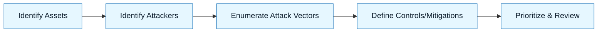

# Threat Model Lite

:::info[Value Proposition]
Quickly identify and mitigate security risks associated with AI-assisted development. This lightweight threat modeling approach focuses on AI-specific vulnerabilities and ensures that security considerations are embedded early in the GenAI & LLM Documentation Loop.
:::

## Overview

Traditional threat modeling can be resource-intensive. For AI-assisted development, a "Threat Model Lite" approach allows teams to rapidly assess and address common AI-related security risks without extensive overhead. This guardrail integrates security thinking directly into the GenAI & LLM Documentation workflow, focusing on identifying potential malicious inputs, unintended behaviors, and data exposures.

**Goal**: Identify and prioritize AI-specific security threats and propose mitigations efficiently.
**Anti-pattern**: Relying solely on general application security practices, which often miss AI-specific attack vectors, or ignoring security until late in the development cycle.

---

## When to Use

| ✅ Use This Pattern When...           | 🚫 Do Not Use When...                     |
| :------------------------------------ | :---------------------------------------- |
| Delegating code generation to AI      | You are developing a simple, non-sensitive internal tool without external access |
| Handling sensitive data with AI       | A full, comprehensive threat model is already in progress by a dedicated security team |
| Integrating third-party AI APIs       | The AI functionality is purely passive (e.g., simple text summarization of public data) |

---

## Prerequisites

:::warning[Before you start]
A basic understanding of common application security concepts (e.g., OWASP Top 10) and the principles of data boundaries is essential.
:::

-   **Artifacts**: Intent Spec, Constraint Spec, Delegation Contract.
-   **Context**: Understanding of the AI tool's capabilities, data handling, and deployment environment.

---

## The Pattern (Step-by-Step)

### Step 1: Identify Assets

What are the valuable things (data, systems, user trust) that the AI-assisted component interacts with or could impact?

> **Practical Insight**: Focus on assets that, if compromised, would cause significant harm (e.g., production database, user PII, intellectual property).

### Step 2: Identify Attackers

Who would want to harm these assets, and what are their motivations and capabilities? Consider internal and external threats.

> "Attackers could be malicious external users, disgruntled employees, or a compromised third-party AI provider."

### Step 3: Enumerate Attack Vectors

How could an attacker exploit the AI-assisted system? Think about prompt injection, data poisoning, model stealing, and denial of service.

> "A malicious user could try prompt injection to make the AI generate harmful code or bypass security checks."

### Step 4: Define Controls & Mitigations

For each identified threat, propose specific actions or controls to reduce the risk. These should feed directly into your Constraint Spec and Delegation Contract.

> "Mitigation: Implement strict input sanitization. Use a Delegation Contract to prohibit the AI from modifying authentication logic. Ensure all AI-generated code is reviewed for prompt injection vulnerabilities."

### Step 5: Prioritize & Review

Prioritize threats based on likelihood and impact. Review the threat model with security stakeholders.

> "High priority: Prompt injection leading to data exfiltration. Mitigation: Enhanced input validation and output filtering."

---

## Practical Example: Threat Modeling a Code Generation Agent

**Objective**: Threat model an AI agent generating a new API endpoint based on a user prompt.

**Threat Model Lite Analysis:**

1.  **Assets:**
    -   Source code repository (integrity, confidentiality).
    -   API endpoint (availability, data integrity, user authentication).
    -   User data (confidentiality, integrity).

2.  **Attackers:**
    -   External malicious actor (e.g., attempting to exploit the generated API).
    -   Internal developer (e.g., accidentally introducing vulnerabilities with an AI-generated change).
    -   Compromised AI model (e.g., fine-tuned on malicious data).

3.  **Attack Vectors:**
    -   **Prompt Injection**: Malicious instructions in the prompt make the AI generate vulnerable code (e.g., SQL injection, XSS).
    -   **Data Leakage**: AI accidentally includes sensitive data from its training or context in the generated code/docs.
    -   **Supply Chain Attack**: AI introduces malicious dependencies or unapproved libraries.
    -   **Denial of Service**: AI generates inefficient code that degrades API performance.

4.  **Controls & Mitigations:**
    -   **Prompt Injection**: Implement strict input validation on the user's prompt (Constraint Spec). Use Delegation Contract to forbid direct database access. Rigorous human review of generated code.
    -   **Data Leakage**: Implement Data Boundaries. Prohibit AI from accessing "Red Zone" data. Review all AI outputs for accidental PII/secret exposure.
    -   **Supply Chain**: Delegation Contract to prohibit new dependencies. Automated dependency scanning.
    -   **DoS**: Constraint Spec to define performance requirements. Automated performance testing of generated code.

5.  **Prioritization**:
    -   Prompt injection and data leakage are high priority due to direct impact on security and data.

---

## Common Pitfalls

| Pitfall                   | Impact                                   | Correction                                     |
| :------------------------ | :--------------------------------------- | :--------------------------------------------- |
| **Ignoring AI-specific Threats** | Traditional threats models miss prompt injection, data poisoning, etc. | Explicitly consider AI-specific attack vectors. |
| **Over-Abstracting Threats** | Threats remain theoretical, hard to mitigate. | Focus on concrete, actionable attack scenarios. |
| **Treating Threats as Static** | New vulnerabilities emerge with new AI capabilities. | Regularly revisit and update the threat model as AI tools evolve. |

:::danger[Critical Risk]
Never assume your AI is inherently secure. Proactively threat model all AI-assisted components, especially those handling sensitive data or operating in critical paths.
:::