# Human Review Protocols

:::info[The Principle]
You cannot automate accountability. While tools can check syntax, only a human can verify **intent**. This document defines how to review AI code professionally.
:::

## Overview

Reviewing AI code is harder than reviewing human code.

- **Human code** usually has a logical flow, even if buggy.
- **AI code** can be syntactically perfect but logically incoherent (hallucination).

We use specific protocols to counter the "LGTM" (Looks Good To Me) fatigue that comes with fast generation.

---

## Protocol 1: The "Explain It" Rule

**Rule**: If you cannot explain _why_ the code works, you must reject it.

AI often uses obscure methods or regexes it "memorized" from training data.

- **Action**: Ask the AI: "Explain this regex step by step."
- **Decision**: If the explanation reveals it's a hallucination or over-engineered, delete it.

---

## Protocol 2: The 10-Second Glare

**Rule**: Spend 10 seconds staring at the _imports_ and _types_ before reading the logic.

AI bugs often hide in:

- Importing a library that doesn't exist.
- Importing a heavy library for a simple function.
- Using `any` types to bypass checks.

:::warning[Red Flag]
If you see an import you don't recognize, stop. Verify it exists on npm/pypi immediately.
:::

---

## Protocol 3: The "Interrogation"

Don't just read. **Attack** the code.

Ask these questions explicitly:

1. "Where is the error handling?"
2. "What happens if the network times out?"
3. "Does this variable explicitly handle `null`?"

If the code assumes the "Happy Path" only, send it back.

---

## Visual: The Review Decision Tree

```mermaid
flowchart TD
    Start[Review Start] --> Imports{Imports Safe?}
    Imports -->|No| Reject[🛑 Reject]
    Imports -->|Yes| Logic{Logic Understood?}

    Logic -->|No| Explain[Ask AI to Explain]
    Explain -->|Still Unclear| Reject
    Explain -->|Clear| Edge{Edge Cases Handled?}

    Logic -->|Yes| Edge
    Edge -->|No| Request[Request Error Handling]
    Edge -->|Yes| Approve[✅ Approve]

    classDef step fill:#E6F7FF,stroke:#1B75BB,color:#0F1F2E;
    classDef stop fill:#FFE6E6,stroke:#D32F2F,color:#0F1F2E;
    class Start,Imports,Logic,Explain,Edge,Request,Approve step;
    class Reject stop;
```

---

## Last Reviewed / Last Updated

- Last reviewed: 2025-12-20
- Version: 0.1.0
