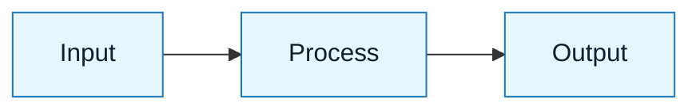

# Pattern: [Pattern Name]

:::info[Value Proposition]
One sentence explaining why this pattern exists and what problem it solves.
:::

## Overview

Brief description of the pattern.
Explain the context in which this pattern applies.

- **Goal**: What are we trying to achieve?
- **Anti-pattern**: What happens if we don't use this?

---

## When to Use

| ✅ Use This Pattern When... | 🚫 Do Not Use When...              |
| :-------------------------- | :--------------------------------- |
| **Condition A** is true     | _Condition B_ is present           |
| You need **Outcome X**      | You are optimizing for _Outcome Y_ |

---

## Prerequisites

:::warning[Before you start]
List 1-3 things that must be true or exist before applying this pattern.
:::

- **Skill Level**: [e.g., Novice / Intermediate]
- **Required Artifacts**: [e.g., Intent Spec]

---

## The Pattern (Step-by-Step)

### Step 1: [Action Name]

Description of the step. Use active voice.

1. Instruction one
2. Instruction two

:::tip[Pro tip]
A specific tactical tip for this step.
:::

### Step 2: [Action Name]

Description.

---

## Example Scenario

Describe a concrete example of this pattern in action.

- **Context**: [Brief context]
- **Input**: [What went in]
- **Output**: [What came out]

---

## Common Pitfalls

| Pitfall       | Impact              | Correction      |
| :------------ | :------------------ | :-------------- |
| **Mistake 1** | _Bad thing happens_ | Do this instead |

:::danger[Critical Risk]
The one thing that will definitely break this pattern.
:::

---

## Last Reviewed / Last Updated

- Last reviewed: YYYY-MM-DD
- Version: 0.1.0
