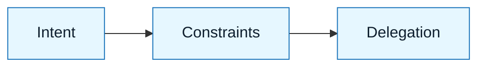

# Scenario: [Scenario Name]

:::info[Scenario Goal]
Demonstrate how to apply GenAI & LLM Documentation to [specific task] to achieve [specific outcome] while mitigating [specific risk].
:::

## Context

- **Role**: [e.g., Senior Backend Engineer]
- **Task**: [e.g., Refactor a legacy authentication module]
- **Constraints**: [e.g., Zero downtime, no API contract changes]
- **Tools Used**: [e.g., Claude 3.5 Sonnet, VS Code]

---

## The Challenge

Why is this hard?

| Challenge      | Traditional Risk              | GenAI & LLM Documentation Mitigation        |
| :------------- | :---------------------------- | :--------------------- |
| **Ambiguity**  | _Misinterpreted requirements_ | Intent Spec            |
| **Complexity** | _Regression in edge cases_    | Constraint Spec        |
| **Safety**     | _Security vulnerabilities_    | Review & Interrogation |

---

## The Execution Loop

### 1. Discovery & Intent

We started by defining what "done" looks like.

> **Artifact**: `[link-to-intent-spec]`

:::tip[Key Insight]
We explicitly excluded [X] from the scope to prevent the model from hallucinating unnecessary changes.
:::

### 2. Constraints & Delegation

We set hard boundaries.

- **Must**: Maintain backward compatibility.
- **Must Not**: Modify the database schema.

### 3. Generation & Review

We ran the generation loop [N] times.

- **Attempt 1**: Failed because [reason].
- **Correction**: Updated the [Constraint Spec] to clarify [detail].
- **Attempt 2**: Succeeded.

:::warning[Review Find]
The model initially tried to [bad action]. The Delegation Contract prevented this from being accepted.
:::

---

## Outcome

| Metric           | Before             | After           |
| :--------------- | :----------------- | :-------------- |
| **Code Quality** | _Legacy / Brittle_ | Modern / Tested |
| **Time Spent**   | _X Hours_          | Y Hours         |
| **Confidence**   | _Low_              | High            |

---

## Retrospective

### What Went Well

- The **Constraint Spec** caught [specific bug] early.
- The **Review Checklist** ensured we didn't miss [edge case].

### What We Learned

- **Lesson 1**: [Lesson detail]
- **Lesson 2**: [Lesson detail]

---

## Last Reviewed / Last Updated

- Last reviewed: YYYY-MM-DD
- Version: 0.1.0
