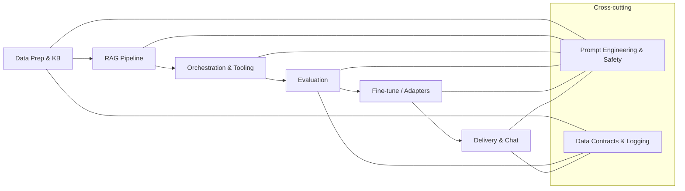

## Overview

:::info[Value Proposition]
Hands-on recipes with runnable code to build and test GenAI/LLM patterns locally (RAG, vector stores, knowledge graphs). Each experiment is a self-contained project with a README, code, and quick validation steps.
:::

### Principles

- **Local & OSS-first**: No hosted dependencies by default; you can swap components as needed.
- **Explain choices**: Each experiment lists model/vector store options and why you might pick them.
- **Test quickly**: Include a minimal validation so you know it works before scaling.

## How to Use

1) Pick an experiment below.
2) Open the corresponding `/experiments/<slug>/README.md` for setup, code, and commands.
3) Keep secrets out of the repo; use `.env` locally.
4) Run the quick validation steps; adjust to your data.

## Experiments

- **01 · Build a Knowledge Base for RAG**  
  - Ingest: text/markdown → chunk → embed → store.  
  - Stack: any embedding model + a vector DB (e.g., Chroma/Faiss/Weaviate).  
  - Path: `/experiments/01-rag-knowledge-base/`

<!-- Add more here as you add experiments, in chronological order -->

### GenAI Delivery Flow (universal)

Use this flow to orient each experiment; we start with Data Prep & KB, then build up through RAG, orchestration, eval, fine-tune, and delivery.

### Picking Models & Stores (at a glance)

- **Embeddings**: Start with `all-MiniLM-L6-v2` (fast, small). Upgrade to `all-mpnet-base-v2` for quality, or Instructor models for domain-aware embeddings.
- **Vector stores**: Chroma (dead simple, local), Faiss (fast, in-memory), Weaviate/PGVector (if you already run them). Stay local unless you truly need managed hosting.

## Safety & Data

- Do not commit secrets or private data. Use `.env` locally.
- Prefer local-first models for sensitive content.
- Verify outputs against source documents; do not trust unchecked generations.

## Quick Links

- Templates: [Code Change Request](/docs/06-templates/code-change-request-template), [Test Request](/docs/06-templates/test-request-template)
- Prompt Safety: [Add-ons](/docs/06-templates/prompt-safety-addons)
- RAG Method: [Handbook](/docs/01-handbook-method/05-rag)

## Next Step

Open `/experiments/01-rag-knowledge-base/README.md`, copy the commands, and run the quick validation to confirm your KB and retrieval are working.
