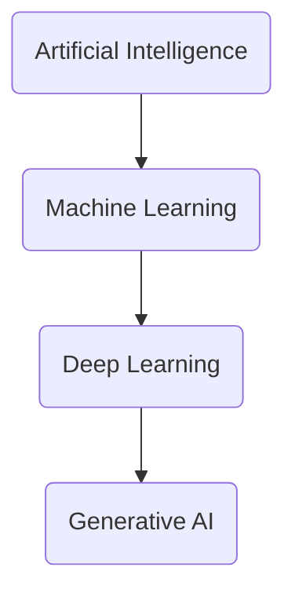

# AI, ML, DL, GenAI: Distinguishing the Terms

The field of artificial intelligence is rich with terminology that can often be confusing due to overlapping concepts and rapid evolution. Understanding the hierarchical relationship and specific contributions of Artificial Intelligence (AI), Machine Learning (ML), Deep Learning (DL), and Generative AI (GenAI) is crucial for clear communication and grasping the landscape of modern AI.

## 1. Artificial Intelligence (AI) - The Broad Vision

*   **Definition**: The broadest concept, encompassing any technique that enables computers to mimic human intelligence. AI aims to create machines that can reason, learn, perceive, understand language, and solve problems.
*   **Timeframe**: Coined in 1956.
*   **Scope**: Includes everything from simple rule-based expert systems to complex neural networks. It's the overarching goal of making machines smart.
*   **Example**: A chess-playing program (even a rule-based one), a robotic vacuum cleaner, a navigation system.

## 2. Machine Learning (ML) - AI Through Learning from Data

*   **Definition**: A subset of AI that focuses on building systems that can learn from data without being explicitly programmed. Instead of hard-coding rules, ML algorithms discover patterns and make predictions or decisions based on data.
*   **Timeframe**: Gained significant traction from the 1980s onwards.
*   **Scope**: Statistical methods, decision trees, support vector machines, clustering algorithms, traditional neural networks.
*   **How it Works**: An ML model is trained on a dataset, where it learns a function to map inputs to outputs (e.g., given features of a house, predict its price).
*   **Example**: Email spam filters, recommendation systems, fraud detection.

## 3. Deep Learning (DL) - ML with Multi-Layered Neural Networks

*   **Definition**: A subset of Machine Learning that uses artificial neural networks with multiple layers (deep neural networks) to learn complex patterns from large amounts of data. The "deep" refers to the number of layers in the network.
*   **Timeframe**: Emerged in the 2000s, gaining prominence from the early 2010s.
*   **Scope**: Multi-layer perceptrons, Convolutional Neural Networks (CNNs), Recurrent Neural Networks (RNNs), and the [Transformer Architecture](../05-attention-and-transformers/transformer-model-architecture.md).
*   **How it Works**: Deep learning models automatically extract features from raw data, often performing end-to-end learning. The multiple layers allow for learning hierarchical representations of data.
*   **Example**: Image recognition (identifying objects in photos), speech recognition (transcribing audio), natural language understanding.

## 4. Generative AI (GenAI) - DL that Creates

*   **Definition**: A cutting-edge subset of Deep Learning (and thus ML and AI) that focuses on models capable of generating novel data (text, images, audio, video, code, etc.) that resembles the training data but is not an exact copy.
*   **Timeframe**: Rose to prominence from the mid-2010s, accelerating rapidly in the early 2020s.
*   **Scope**: Generative Adversarial Networks (GANs), Variational Autoencoders (VAEs), [Transformer-based Large Language Models (LLMs)](/docs/foundations/02-llm-deep-dive), Diffusion Models.
*   **How it Works**: These models learn the underlying probability distribution of their training data, enabling them to sample from this distribution to produce new instances.
*   **Example**: ChatGPT generating essays, Midjourney creating images from text prompts, AlphaFold predicting protein structures.

## Hierarchical Relationship

The relationship between these terms is hierarchical, with each successive term being a more specialized subset of the previous one.

**Visual Suggestion**: A Venn diagram or nested boxes diagram showing the hierarchical relationship.

**Actionable Insight**: When discussing AI, be precise. While all GenAI is AI, not all AI is GenAI. Understanding these distinctions helps in accurately describing a system's capabilities and limitations.

## Next Steps

With a clear understanding of the terminology, we'll explore different approaches to AI in **[Discriminative vs. Generative Models](./discriminative-vs-generative.md)**.
---
