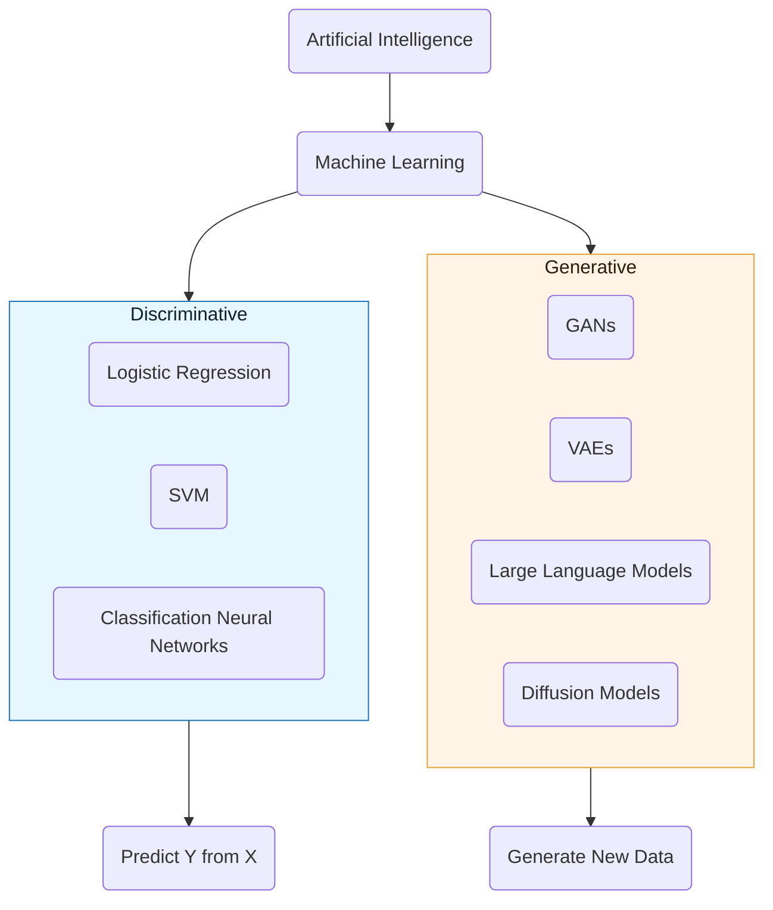

# Discriminative vs. Generative Models

In machine learning, models are broadly categorized into two types based on their approach to solving problems: **discriminative** and **generative**. Understanding this distinction is crucial for grasping how different AI systems function, including where modern Generative AI (GenAI) and Large Language Models (LLMs) fit into the landscape.

## Discriminative Models

*   **Goal**: To learn a direct mapping from inputs ($X$) to outputs ($Y$) by modeling the conditional probability $P(Y|X)$. They aim to find a decision boundary that best separates different classes or predicts a continuous value.
*   **How they work**: They focus on identifying features that best distinguish between classes or predict a target. They don't model the underlying distribution of the data itself.
*   **Strengths**:
    *   Typically simpler and computationally less expensive to train than generative models.
    *   Often achieve high performance on classification and regression tasks.
    *   Require less training data compared to generative models for similar performance on discriminative tasks.
*   **Limitations**:
    *   Cannot "generate" new data points from scratch.
    *   Do not have an explicit model of the data's underlying distribution.
*   **Common Algorithms**:
    *   Logistic Regression
    *   Support Vector Machines (SVMs)
    *   Decision Trees
    *   Random Forests
    *   Most Neural Networks used for classification (e.g., ImageNet classifiers, BERT for classification tasks)
*   **Example**: Given an image of a cat or a dog, predict whether it's a "cat" or a "dog." Given a sentence, predict its sentiment (positive/negative).

## Generative Models

*   **Goal**: To learn the underlying joint probability distribution of the inputs ($X$) and outputs ($Y$), or just the inputs $P(X)$. By understanding how the data is generated, they can then perform various tasks, including generating new data samples. They model $P(X, Y)$ or $P(X)$.
*   **How they work**: They learn the patterns and structures of the training data so deeply that they can create new, unseen data points that resemble the original data.
*   **Strengths**:
    *   Can "generate" new, realistic data points from scratch (e.g., text, images, audio).
    *   Can handle missing data more robustly.
    *   Can be used for a wider range of tasks, including unsupervised learning, anomaly detection, and transfer learning.
*   **Limitations**:
    *   Often more complex and computationally expensive to train.
    *   Typically require very large amounts of data to learn complex distributions effectively.
*   **Common Algorithms**:
    *   Naive Bayes (a classical example)
    *   Generative Adversarial Networks (GANs)
    *   Variational Autoencoders (VAEs)
    *   **Large Language Models (LLMs)** (e.g., GPT, Llama)
    *   Diffusion Models (e.g., Midjourney, DALL-E)
*   **Example**: Generate a new image of a cat or a dog. Generate a coherent and grammatically correct sentence or paragraph on a given topic.

## Generative AI and LLMs in this Context

Current Generative AI systems, including Large Language Models ([LLMs](/docs/foundations/02-llm-deep-dive)), are prominent examples of generative models. They learn the complex probability distribution of human language (or images, etc.) to generate new text (or images) that are indistinguishable from human-created content.

However, it's important to note that many modern generative models can also be adapted for discriminative tasks through fine-tuning. For instance, an LLM pre-trained generatively can then be fine-tuned to perform sentiment analysis (a discriminative task) by predicting a sentiment label based on the input text.

**Actionable Insight**: When choosing a model, consider its primary objective. If you only need to classify or predict based on existing data, a discriminative model might be sufficient. If you need to create new data, synthesize content, or handle complex, open-ended tasks, a generative model is necessary.

## Visual Suggestion: Model Types Venn Diagram

## Next Steps

Having differentiated between model types, we'll now delve into a core concept that underpins the success of deep learning and generative models: **[Core Principle: Representation Learning](./core-principle-representation-learning.md)**.
---
