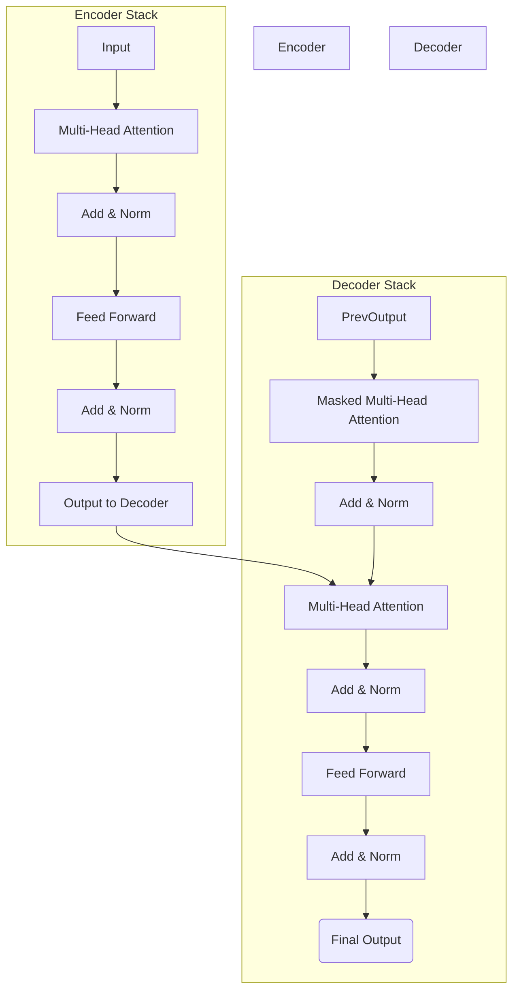

# The Attention Mechanism and the Transformer Architecture

The limitations of sequential models like LSTMs and GRUs, particularly their difficulty in handling very long-range dependencies and their sequential nature preventing parallelization, led to the development of a new and revolutionary architecture: the Transformer.

At the heart of the Transformer is the **attention mechanism**.

## What is Attention?

In a broad sense, attention is a mechanism that allows a neural network to focus on specific parts of the input when producing an output. Instead of relying on a single hidden state (like an RNN), the model can look at all parts of the input sequence simultaneously and decide which parts are most important for the current step.

Imagine translating the sentence: "The cat, which was chasing a mouse, sat on the mat."

When translating the word "sat," an attention mechanism would allow the model to pay more "attention" to the words "cat" and "sat," recognizing "cat" as the subject performing the action, even though there are other words in between.

### Self-Attention

The specific type of attention used in Transformers is called **self-attention**. This is where the model weighs the importance of all other words *in the same sequence* when encoding a specific word. It allows the model to build rich, context-aware representations of each token by looking at the entire input.

## The Transformer Architecture

In 2017, a paper from Google titled "Attention Is All You Need" introduced the Transformer architecture, which completely abandoned recurrence and relied solely on attention mechanisms.

:::note[Encoder vs. Decoder Roles]

- **The Encoder's job** is to read the entire input sequence (like a sentence to be translated) and build a rich, contextual understanding of it.

- **The Decoder's job** is to generate the output sequence word by word, while paying attention to the encoder's understanding and the words it has already generated.

:::

Key components of the Transformer include:

1.  **Encoder-Decoder Structure:** The original Transformer was designed for machine translation and had an encoder (to process the input sequence) and a decoder (to generate the output sequence). Many modern LLMs use only the decoder part of the architecture.

2.  **Multi-Head Attention:** Instead of calculating attention just once, the Transformer uses multiple "attention heads." Each head can learn to focus on different types of relationships between words (e.g., one head might track subject-verb agreement, while another tracks pronoun references).

3.  **Positional Encodings:** Since the model doesn't process words sequentially, it needs another way to know the order of the words. Positional encodings are vectors added to the input embeddings to give the model information about the position of each word in the sequence.

## Why Transformers are a Breakthrough

-   **Parallelization:** Because they don't rely on a sequential hidden state, Transformers can process all tokens in a sequence at the same time, which is significantly faster and more efficient on modern hardware (GPUs/TPUs).

-   **Long-Range Dependencies:** Self-attention provides a direct connection between any two words in the sequence, making it much easier to model long-range dependencies compared to RNNs.

-   **Scalability:** The architecture is highly scalable, allowing researchers to train increasingly massive models (like GPT-3 and its successors) that have demonstrated remarkable capabilities.

## Next Steps

Understanding the Transformer is the key that unlocks the rest of modern AI.

- **[LLM Model Architectures](../02-llm-deep-dive/model-architectures.md):** See how the full Transformer, or just its decoder part, is used to create today's leading models.

