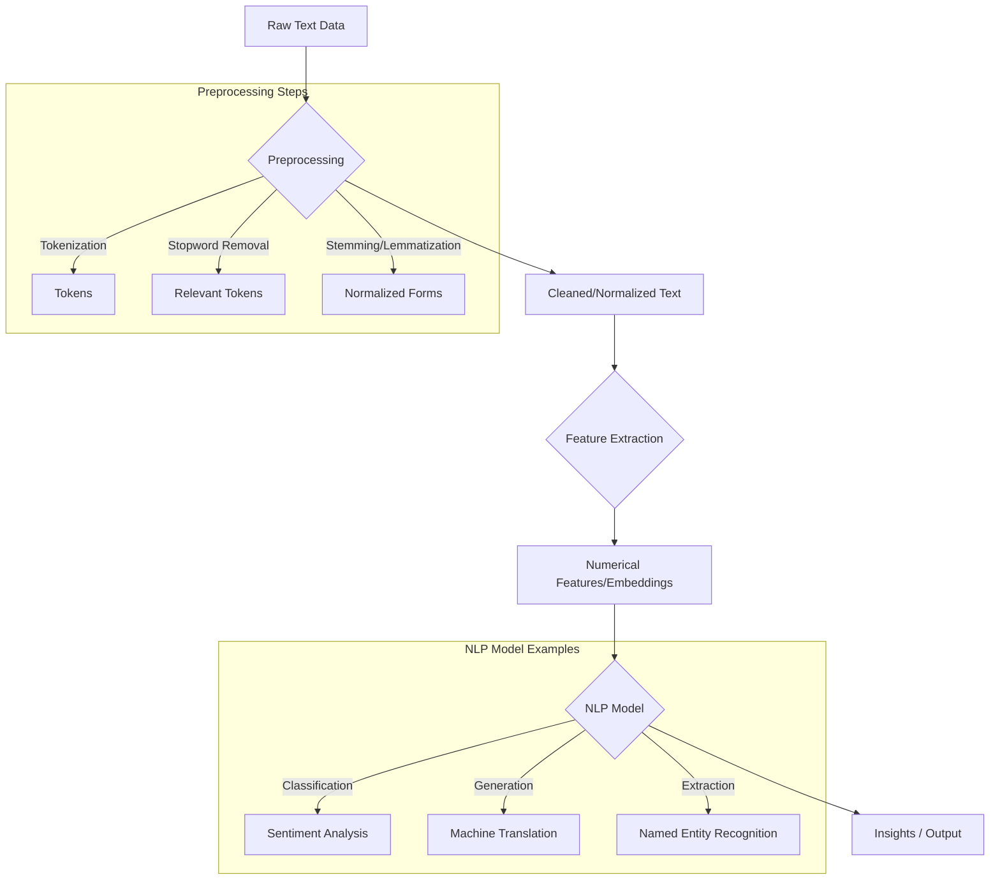

# NLP Overview

:::info[Purpose]
Provide a foundational understanding of Natural Language Processing (NLP), its core concepts, common tasks, and importance in building intelligent language-aware systems.
:::

## Quick Model

- **Language as Data**: NLP treats human language as a form of data that can be analyzed, understood, and generated by machines.
- **Preprocessing is Key**: Raw text requires significant cleaning, tokenization, and normalization before it can be effectively processed.
- **Statistical & Neural Approaches**: From traditional rule-based and statistical methods to modern deep learning (neural networks, transformers), NLP has evolved significantly.
- **Context Matters**: Understanding meaning often requires more than just individual words; context, syntax, and semantics are crucial.

### Conceptual NLP Pipeline

Let's visualize a general flow of an NLP task:

## What to Remember

- **Ambiguity is Inherent**: Human language is highly ambiguous, making accurate interpretation a significant challenge for machines.
- **Data Dependency**: The performance of NLP models heavily relies on the quality, quantity, and representativeness of the training data.
- **Ethical Considerations**: NLP systems can reflect and amplify biases present in their training data, necessitating careful consideration of fairness and ethics.
- **Task-Specific**: While general models exist, optimal performance often requires fine-tuning or specialized models for specific NLP tasks.

## How to Apply This Knowledge

- Begin with thorough data preprocessing to ensure clean and consistent input for NLP models.
- Choose NLP techniques appropriate for the complexity and scale of the problem, from simpler rule-based systems to advanced neural models.
- Always evaluate NLP system performance using relevant metrics and consider potential biases.
- Understand the limitations of current NLP technology and manage expectations regarding human-like language understanding.

## Anti-Patterns

- Assuming raw text can be fed directly into models without proper preprocessing.
- Ignoring the inherent ambiguity of language and expecting perfect machine understanding.
- Deploying NLP systems without testing for biases or unintended social impacts.
- Overlooking the importance of domain-specific data for specialized NLP tasks.
