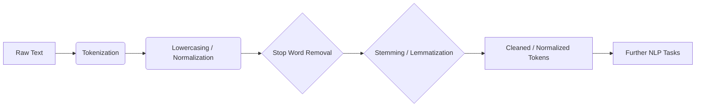

# NLP Basics: Core Concepts

:::info[Purpose]
Introduce fundamental concepts and essential preprocessing steps in Natural Language Processing.
:::

## Introduction to Text Preprocessing

Before any meaningful analysis or modeling can occur in NLP, raw text data typically undergoes several preprocessing steps. These steps aim to clean the data, normalize it, and transform it into a format suitable for machine consumption.

### Text Preprocessing Flow



## Key Preprocessing Steps

## Key Preprocessing Steps

:::tip[Prerequisites]
The code examples below utilize the `NLTK` (Natural Language Toolkit) library. If you don't have it installed, you can do so using pip:

```bash
pip install nltk
```

You'll also need to download specific NLTK data packages once:

```python
import nltk
nltk.download('punkt')        # For tokenization
nltk.download('stopwords')    # For stop word list
nltk.download('wordnet')      # For lemmatization
nltk.download('omw-1.4')      # Open Multilingual Wordnet for lemmatization
```
:::

### 1. Tokenization

**What it is**: The process of breaking down a stream of text into smaller units called tokens. Tokens can be words, subwords, or even characters.

**Why it's important**: It's the first step in converting unstructured text into a structured format that machines can process. It allows for the analysis of individual units of meaning.

**Examples**:
- Sentence: "The quick brown fox jumps over the lazy dog."
- Word tokens: ["The", "quick", "brown", "fox", "jumps", "over", "the", "lazy", "dog", "."]

```python
from nltk.tokenize import word_tokenize

text = "Hello there! How are you doing today?"
tokens = word_tokenize(text)
print(tokens)
# Expected output: ['Hello', 'there', '!', 'How', 'are', 'you', 'doing', 'today', '?']
```

### 2. Stop Word Removal

**What it is**: Eliminating common words (like "the", "a", "is", "and") that carry little semantic meaning and often don't contribute to the core understanding of a text.

**Why it's important**: Reduces noise and dimensionality, speeding up processing and potentially improving model performance by focusing on more significant terms.

```python
from nltk.corpus import stopwords

text = "This is an example sentence, demonstrating stop word removal."
tokens = word_tokenize(text.lower()) # Tokenize and lowercase first

stop_words = set(stopwords.words('english'))
filtered_tokens = [word for word in tokens if word not in stop_words]
print(filtered_tokens)
# Expected output: ['example', 'sentence', ',', 'demonstrating', 'stop', 'word', 'removal', '.']
```

### 3. Stemming

**What it is**: The process of reducing inflected (or sometimes derived) words to their word stem, base or root form. This root form may not be a grammatically correct word itself.

**Why it's important**: Groups together words that have similar meanings but different grammatical forms, reducing redundancy and complexity.

**Examples**:
- "running", "runs", "ran" -> "run"
- "connection", "connected", "connecting" -> "connect"

```python
from nltk.stem import PorterStemmer

stemmer = PorterStemmer()
words = ["running", "runs", "runner", "easily", "fairly"]
stemmed_words = [stemmer.stem(word) for word in words]
print(stemmed_words)
# Expected output: ['run', 'run', 'runner', 'easili', 'fairli']
```

### 4. Lemmatization

**What it is**: Similar to stemming, but it reduces words to their base or dictionary form (lemma), which is a grammatically correct word. It uses vocabulary and morphological analysis.

**Why it's important**: Provides a more accurate base form than stemming, which can be crucial for tasks requiring precise semantic understanding.

**Examples**:
- "better", "best" -> "good"
- "car", "cars" -> "car"
- "am", "are", "is" -> "be"

```python
from nltk.stem import WordNetLemmatizer

lemmatizer = WordNetLemmatizer()
words = ["running", "runs", "ran", "better", "best", "cars", "mice"]
lemmatized_words = [lemmatizer.lemmatize(word, pos='v') if word in ["running", "runs", "ran"] else lemmatizer.lemmatize(word) for word in words]
print(lemmatized_words)
# Expected output: ['run', 'run', 'run', 'better', 'best', 'car', 'mouse']
```

## Other Important Concepts

### Corpus

A large and structured set of texts (e.g., documents, books, conversations) used for linguistic research or training NLP models.

### N-grams

Contiguous sequences of N items (words, characters) from a given sample of text or speech. Useful for capturing local context.
- **Bigram (N=2)**: "quick brown", "brown fox"
- **Trigram (N=3)**: "the quick brown", "quick brown fox"
